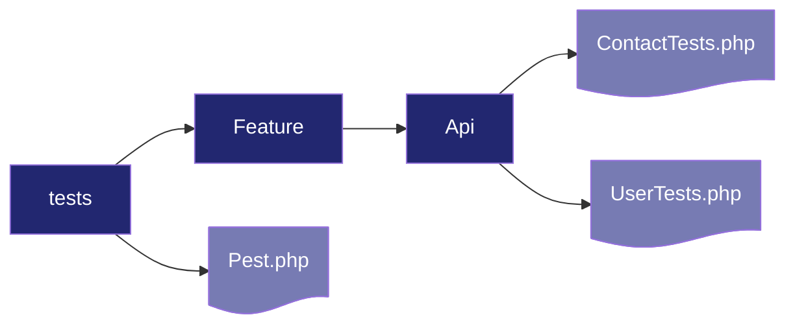

# Session 03: API Tests

## SaaS 1 – Cloud Application Development (Front-End Dev)

### PEST, Postman, and HTTP Correctness

<div @click="$slidev.nav.next" 
     class="mt-12 -mx-4 p-4" 
     hover:bg="white op-10">
  <p>Press <kbd>Space</kbd> or <kbd>RIGHT</kbd> for next slide/step <fa7-solid-arrow-right /></p>
</div>

<div class="abs-br m-6 text-xl">
  <a href="https://github.com/adygcode/SaaS-FED-Notes" target="_blank" class="slidev-icon-btn">
    <fa7-brands-github class="text-zinc-300 text-3xl -mr-2"/>
  </a>
</div>


<!--
The last comment block of each slide will be treated as slide notes. It will be visible and editable in Presenter Mode along with the slide. [Read more in the docs](https://sli.dev/guide/syntax.html#notes)
-->


---
layout: default
level: 2
---

# Navigating Slides

Hover over the bottom-left corner to see the navigation's controls panel.

## Keyboard Shortcuts

|                                                     |                             |
|-----------------------------------------------------|-----------------------------|
| <kbd>right</kbd> / <kbd>space</kbd>                 | next animation or slide     |
| <kbd>left</kbd>  / <kbd>shift</kbd><kbd>space</kbd> | previous animation or slide |
| <kbd>up</kbd>                                       | previous slide              |
| <kbd>down</kbd>                                     | next slide                  |

---
layout: section
---

# Objectives

---
layout: default
level: 1
class: text-left
---

# Objectives

- PEST tests for APIs
- Postman collections for endpoints
- Status codes & headers correctness

::right::

<!-- Speaker notes:
Intro the toolbox: PEST for fast, fluent PHP tests in Laravel 12;

Postman for manual/automated collections 

Reliability layer: 
- correct HTTP status codes, 
- headers (Content-Type, Cache-Control, ETag, Location, Authorization),
- JSON shapes. 

Emphasize - test-first where possible.
-->

---
level: 2
---

# Contents

<Toc minDepth="1" maxDepth="1" />

---
class: text-left
layout: two-cols
---

# PEST

::left::

## About

- Default Laravel testing is Pest
- Extends PHPUnit

<br>

## Installation

- Added during project creation
- Ensure added using

```bash
composer require pestphp/pest --dev
```

::right::

## What if...?

- If no `tests/Pest.php` file, execute

```shell
php artisan pest:init
```

<br>

## Run tests...

- Execute tests using:

```bash
php artisan test
```

<!-- Speaker notes:

Laravel 12 ships with PEST-ready scaffolding.

Keep API tests in tests/Feature/Api. 

-->

---
layout: two-cols
level: 2
---

# PEST (2)

::left::

## Suggested Folder Structure



::right::

## `.env.testing`

- Specify how Pest uses databases for testing

<br>

### Change `.env.testing` settings

- Run tests on an in-memory SQLite database

```ini
APP_ENV = testing
DB_CONNECTION = sqlite
DB_DATABASE = :memory:
```

<!-- Speaker notes:
Use an in-memory SQLite DB for speed and isolation. 

Run with `php artisan test`. 

Use factories and seeders for deterministic data.
-->

---
layout: two-cols
---

# PEST Test File Options

::left::

## One File Per Feature

**Advantages:**

- All tests for a feature in one file
- `index`, `store`, `update`, `show` and `delete` together

**Disadvantages:**

- All tests per feature in one file
- File becomes very large
- Hard to find individual tests

::right::

## One File Per Action

**Advantages:**

- One file per feature action
- `index`, `store`, `update`, `show` and `delete` separated
- Each file dedicated to action and edge cases

**Disadvantages:**

- Tests split up
- Many smaller files
- May be hard to find individual tests

---
layout: section
---

# Writing a PEST API Test

---
level: 2
---

# PEST API Test: Create tests

```shell
php artisan pest:test <FOLDER>/<NAMEOFTEST>
```

| Placeholder | Example          |
|-------------|------------------|
| FOLDER      | Api              |
| NAMEOFTEST  | ContactIndexTest |

---
level: 2
layout: two-cols
---

# PEST API Test (2)

::left::

## Example: File per Feature

Filename:

- `tests/Feature/Api/CourseIndexTest.php`

Created using:

```shell
php artisan pest:test Api/CourseIndexTest
```

::right::

## Example: All in One File

Filename:

- `tests/Feature/Api/CourseTest.php`

Created using:

```shell
php artisan pest:test Api/CourseTest
```

---
level: 2
---

# PEST API Test (3): GET index

## Option 1

- Using `use function`
- Call `getJson` without `$this`

```php
use App\Models\Course;
use function Pest\Laravel\getJson;

it('lists courses as JSON', function () {
    Course::factory()->count(3)->create();

   $this->getJson('/api/v1/courses')
        ->assertOk()                    // 200
        ->assertHeader('content-type', 'application/json')
        ->assertJsonStructure([
            'data' => [ ['id', 'code', 'title', 'credits'] ],
            'links', 'meta'
        ]);
});
```

<!-- Speaker notes:
Use$this->getJson/postJson/putJson/deleteJson. 
Assert status via
->assertOk(), 
->assertCreated(), etc. 

Validate headers and JSON shape with assertHeader and assertJsonStructure. 

For paginated resources, check data/links/meta.
-->


---
level: 2
---

# PEST API Test (4): GET index

## Option 2

- Call `getJson` with `$this`
- `assertOK()` === `assertStatus(200)`

```php
use App\Models\Course;

it('lists courses as JSON', function () {
    Course::factory()->count(3)->create();

    $this->getJson('/api/v1/courses')
        ->assertOk()
        ->assertHeader('content-type', 'application/json')
        ->assertJsonStructure([
            'data' => [ ['id', 'code', 'title', 'credits'] ],
            'links', 'meta'
        ]);
});
```

<!-- Speaker notes:
Removing the `use function` and add a `$this` whyen calling `get...` etc
-->


---
level: 2
---

# PEST API Test (5): POST store

## Including validation + 201 status code

Filename: ` tests/Feature/Api/CourseStoreTest.php`

````md magic-move

```php [PHP] {all|1,3}
it('creates a course and returns 201', function () {
    // Test here
});

// Validation test code here

```

```php [PHP] {1,10|2,6|3-5|all|1,8-10}
it('creates a course and returns 201', function () {
    $payload = [
        'code' => 'CPT101',
        'title' => 'Computing Fundamentals',
        'credits' => 3,
    ];

    // More test code...

});

// Validation test code here
```

```php [PHP] {1-2,8-10|4-7|all|10}
it('creates a course and returns 201', function () {
    // Payload code here

    $this->postJson('/api/v1/courses', $payload)
        ->assertCreated()               // 201
        ->assertHeader('content-type', 'application/json')
        ->assertJsonPath('code', 'CPT101');
});

// Validation test code here
```

```php [PHP] {1-3,7|4-6|all}
// Create and 201 status test code

it('rejects invalid payload with 422', function () {
    postJson('/api/v1/courses', [])
        ->assertStatus(422)
        ->assertJsonValidationErrors(['code', 'title', 'credits']);
});
```

````

<!-- Speaker notes:
Cover both happy-path and failure-path. 

Use assertCreated() for 201. 

For validation errors 
- expect 422 and 
- assertJsonValidationErrors listing required fields.

-->

---
layout: image
level: 2
image: public/test-run-example-small.png
---

# Example Test Run


---
layout: section
---

# PEST Test: Auth & Headers (Bearer)

---
level: 2
---

# PEST Test: Auth & Headers (Bearer)

Filename: ` tests/Feature/Api/CourseAuthTest.php`

````md magic-move

```php [PHP] {all}
use App\Models\User;

// Auth header test

// data and valid token test

```

```php [PHP] {1,3,9|4,7|5-6|all}
use App\Models\User;

// Auth header test
it('requires auth header', function () {
   $this->getJson('/api/v1/courses')
        ->assertUnauthorized();         // 401
});

// data and valid token test

```

```php [PHP] {1-5|6,14|7-8|10-13|all}
use App\Models\User;

// Auth header test

// data and valid token test
it('returns data with valid token', function () {
    $user = User::factory()->create();
    $token = $user->createToken('api')->plainTextToken; // e.g., Sanctum

   $this->getJson('/api/v1/courses', [
        'Authorization' => 'Bearer '.$token,
        'Accept' => 'application/json'
    ])->assertOk();
});
```


````

<!-- Speaker notes:
Demonstrate header-driven auth (Sanctum/Passport). 

- 401 when missing/invalid token; 
- 403 for forbidden if policy denies. 

Always send Accept: 
- application/json for API tests.
-->

---

# PEST Test: ETags, Cache, and Pagination

> The sample code below demonstrated ETag & Caching tests.
> More detail on ETags and Caching in a separate presentation

Filename: ` tests/Feature/Api/CourseCacheTest.php`

```php
it('supports ETag conditional requests', function () {
    $first =$this->getJson('/api/v1/courses')->assertOk();
    $etag = $first->headers->get('ETag');

   $this->getJson('/api/v1/courses', ['If-None-Match' => $etag])
        ->assertStatus(304);            // Not Modified
});

it('returns proper pagination headers', function () {
   $this->getJson('/api/v1/courses')
        ->assertOk()
        ->assertHeader('X-RateLimit-Remaining')
        ->assertJsonStructure(['links', 'meta']);
});
```

<!-- Speaker notes:
If your API implements ETags, test 304 flow. 

Laravel doesn’t add ETag by default; 
you can via middleware. 

Also assert rate-limit headers when using `throttle:api` middleware and JSON pagination meta.
-->


---
layout: section
---

# Postman: API Testing 

## With Authorisation and Headers

---
level: 2
---

# Postman: API Testing (2)

## Creating a Collection

1. **Create Collection** → *New > Collection* → "Laravel API V1".
2. **Auth**: Add collection-level `Authorization: Bearer {{token}}`.
3. **Variables**: `{{base_url}}`, `{{token}}` in *Variables* tab.
4. **Folders**: `Courses`, `Users`, etc.
5. **Environments**: *local*, *staging*, *prod* with base_url differences.

<!-- Speaker notes:
Keep reusable variables at the collection or environment level. Helps switch hosts and tokens quickly. Organize endpoints by resource. Prefer descriptive names and comments for team sharing.
-->
---
level: 2
---

# Postman: Example Requests

**GET Courses**

```http
GET {{base_url}}/api/v1/courses
Headers: Accept: application/json
```

**POST Course**

```http
POST {{base_url}}/api/v1/courses
Headers: Accept: application/json; Authorization: Bearer {{token}}
Body (JSON): {"code":"CPT101","title":"Computing Fundamentals","credits":3}
```

**PUT Course**

```http
PUT {{base_url}}/api/v1/courses/{{id}}
Headers: Accept: application/json; Authorization: Bearer {{token}}
Body (JSON): {"title":"Comp Fundamentals","credits":4}
```

<!-- Speaker notes:
Mirror your PEST tests in Postman. Keep Accept and Authorization headers consistent. Use path variables and saved examples for regression comparison.
-->
---
level: 2
---

# Postman Tests - Status & Headers

## Tests (JavaScript) example

```js
pm.test('Status is 200', () => pm.response.to.have.status(200));
pm.test('JSON content-type', () => pm.response.to.have.header('content-type'));
pm.test('Has data array', () => {
    const json = pm.response.json();
    pm.expect(json).to.have.property('data');
});
```

**Save as example** for documentation.

<!-- Speaker notes:
Use the Tests tab to assert status codes, headers, and JSON shape. 

Save successful responses as Examples for reference docs. 

This complements server-side PEST tests.
-->
---
level: 2
---

## Exporting & Automating Postman

**Export collection** → Share with team or CI.

**Run in CLI (Newman)**

```bash
pnpm i -g newman
newman run Laravel_API_V1.postman_collection.json \
  -e local.postman_environment.json \
  --reporters cli,junit --reporter-junit-export newman.xml
```

<!-- Speaker notes:
Automate Postman with Newman in CI to catch regressions. Export JUnit to integrate with CI test reports. Keep env files out of source control if they contain secrets.
-->
---
level: 2
---

## Ensuring Correct Status Codes

| Code        | Meaning      | Description                         |
|-------------|--------------|-------------------------------------|
| `200`       | OK           | Successful GET                      |
| `201`       | Created      | Successful POST creating a resource |
| `204`       | No Content   | Successful DELETE/PUT with no body  |
| `400`/`422` | Bad input    | Bad input / validation failure      |
| `401`/`403` | Unauthorized | Unauthenticated / Unauthorized      |
| `404`       | Not found    | Not found                           |

<!-- Speaker notes:
Choose codes by action semantics. 

201 should include Location header (URL of new resource). 

204 must have empty body. 

Prefer 422 for validation errors in APIs.
-->

---
level: 2
---

## Ensuring Correct Headers

- `Content-Type: application/json`
- `Accept: application/json`
- `Authorization: Bearer <token>`
- `Cache-Control`, `ETag` (if caching)
- `Location` on 201
- `X-RateLimit-*` (if throttled)

<!-- Speaker notes:
APIs are contract-first: headers matter. 

On resource creation, return Location to canonical URL. 

If you implement caching, validate ETag/If-None-Match tests. 

Rate-limit headers help clients handle backoff.
-->
---
level: 2
---

## Sample Controller Responses (Laravel 12)

```php
// store()
return response()->json($course, 201)
    ->header('Location', route('api.v1.courses.show', $course));

// destroy()
return response()->noContent(); // 204

// index() with pagination
return CourseResource::collection(Course::paginate(15))
    ->response()
    ->header('Cache-Control', 'no-store');
```

<!-- Speaker notes:
Use response helpers for explicit codes. Add Location on create. For resources, prefer API Resources for consistent shapes. Consider global middleware to set Cache-Control defaults for APIs.
-->
---
layout: section
---

# Development Workflow

## Test Driven Development

---
level: 2
---

# What is Test Driven Development (TDD)?

<br>

An approach to software development where you:

- First write tests, then 
- Use those tests to drive the development.

---
level: 2
---

# Red, Green, Refactor

> Helps compartmentalise focus into three phases:

- <strong style="background:#990000; padding:0.25rem 1rem;  
  display:inline-block; width:10rem; text-align: center;">Red</strong> 
  -  think about   what you  want to  develop

- <strong style="background:#009900; padding:0.25rem 1rem;  
  display:inline-block; width:10rem; text-align: center;">Green</strong> 
  - think  about how to make your tests pass

- <strong style="background:#000099; padding:0.25rem 1rem;  
  display:inline-block; width:10rem; text-align: center;">Refactor</strong> 
  - think about how to improve your existing implementation

---
level: 2
---

# Test Driven Development (TDD) Workflow

## Useful Resources

- Acadea.io. (2026). Test Driven Development (TDD) - Laravel API.
  Youtube.com. https://www.youtube.com/watch?v=1Ur_znd5SNI

- Dev Tools Made Simple. (2026). Why devs fail at Test Driven Development (
  TDD). Youtube.com. https://www.youtube.com/watch?v=tL89VP3nuwc

- Laravel Daily. (2026). Bro, Do you even TDD?
  Youtube.com. https://www.youtube.com/watch?v=9IV91Qr0V7Q

- Laravel Daily. (2026). Laravel TDD in “Live” Mode: Checkout Code Review.
  Youtube.com. https://www.youtube.com/watch?v=5XywKLjCD3g&t=489s

Watch these videos as part of your out of class learning and practice.


---
layout: image-right
level: 2
image: public/TDD-Cycle.png
---

# Quick Workflow: Red–Green–Refactor

<br>

1. **Write PEST test** (red)

2. **Implement controller** (green)

3. **Add Postman tests**

4. **Check headers/codes**

5. **Refactor & commit**


<!-- Speaker notes:
Keep tight feedback loops: code → test → Postman verification. Commit small. Use CI to run both PHPUnit/PEST and Newman collections for defense-in-depth.
-->

---
layout: two-cols
---

# Recap Checklist (Part 1)

::left::

- [ ] PEST
    - Use$this->getJson/postJson
    - Assert status codes & headers
    - Validate JSON shape
    - Test auth flows

::right::

- [ ] HTTP Correctness
    - 200/201/204 usage
    - 401 vs 403
    - 404 for missing
    - 422 validation errors
    - Location on 201

<!-- Speaker notes:
Short, actionable reminders that map to the hands-on steps: write PEST first, mirror in Postman, and verify correct HTTP semantics.
-->

---
layout: two-cols
---

# Recap Checklist (Part 2)

::left::

- [ ] Postman
    - Collection variables
    - Environment files
    - Tests tab assertions
    - Save examples
    - Newman in CI

::right::

- [ ] Headers
    - Content-Type JSON
    - Accept JSON
    - Authorization Bearer
    - Cache-Control/ETag
    - Rate-limit headers

<!-- Speaker notes:
Short, actionable reminders that map to the hands-on steps: write PEST first, mirror in Postman, and verify correct HTTP semantics.
-->

---
level: 2
---

# Exit Ticket

<br>

1) **What will you change?**

- One improvement to your API testing flow (PEST, Postman, headers/codes) 
  and why.

<br>

2) **Where is your blind spot?**

- One area (auth, validation, caching) you’ll explore next to increase API
  reliability.

<!-- Speaker notes:
Prompt students to internalize changes to their workflow and identify learning priorities. 

Encourage concrete next actions (e.g., add 201 Location header everywhere; set up Newman in CI).
-->

---

# Acknowledgements

- Acadea.io. (2026). Test Driven Development (TDD) - Laravel API.
  Youtube.com. https://www.youtube.com/watch?v=1Ur_znd5SNI

- Dev Tools Made Simple. (2026). Why devs fail at Test Driven Development (
  TDD). Youtube.com. https://www.youtube.com/watch?v=tL89VP3nuwc

- Laravel Daily. (2026). Bro, Do you even TDD?
  Youtube.com. https://www.youtube.com/watch?v=9IV91Qr0V7Q

- Laravel Daily. (2026). Laravel TDD in “Live” Mode: Checkout Code Review.
  Youtube.com. https://www.youtube.com/watch?v=5XywKLjCD3g&t=489s

> Slide template by Adrian Gould

<br>

> Some content was generated with the assistance of Microsoft Copilot
