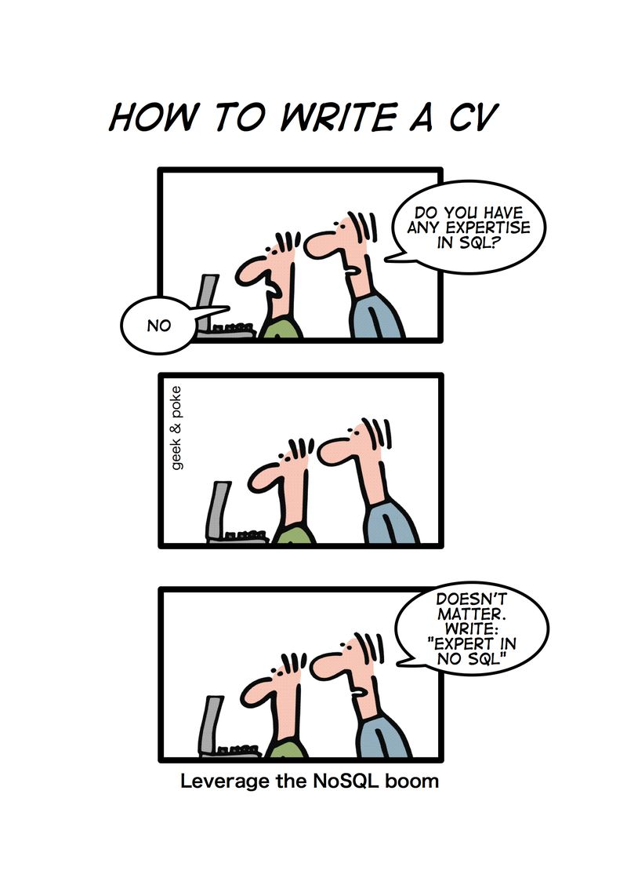

# Session 10/2 - DB Generations & DB Terminology

## Software as a Service - Back-End Development

#### ICT50120 Diploma of Information Technology (Advanced Programming)

#### ICT50120 Diploma of Information Technology (Back-End Development)

<div @click="$slidev.nav.next" class="mt-12 -mx-4 p-4" hover:bg="white op-10">
<p>Press <kbd>Space</kbd> or <kbd>RIGHT</kbd> for next slide/step <fa7-solid-arrow-right /></p>
</div>

<div class="abs-br m-6 text-xl">
  <a href="https://github.com/adygcode/SaaS-FED-Notes" target="_blank" class="slidev-icon-btn">
    <fa7-brands-github class="text-zinc-300 text-3xl -mr-2"/>
  </a>
</div>


<!--
The last comment block of each slide will be treated as slide notes. It will be visible and editable in Presenter Mode along with the slide. [Read more in the docs](https://sli.dev/guide/syntax.html#notes)
-->


---
layout: default
level: 2
---

# Navigating Slides

Hover over the bottom-left corner to see the navigation's controls panel.

## Keyboard Shortcuts

|                                                     |                             |
|-----------------------------------------------------|-----------------------------|
| <kbd>right</kbd> / <kbd>space</kbd>                 | next animation or slide     |
| <kbd>left</kbd>  / <kbd>shift</kbd><kbd>space</kbd> | previous animation or slide |
| <kbd>up</kbd>                                       | previous slide              |
| <kbd>down</kbd>                                     | next slide                  |

---
layout: section
---

# Objectives

---
layout: two-cols
level: 1
class: text-left
---

# Objectives

::left::

-

::right::

-

---
level: 2
---

# Contents

<Toc minDepth="1" maxDepth="1" columns="2" />

---
class: text-left
layout: section
---

# Warm up!

## ...

---
level: 2
---

# ... warmup details

<Announcement type="brainstorm">
<ol>
<li>...</li>
</ol>
</Announcement>

<!--

-->

---
layout: section
---

# SQL, NoSQL and NewSQL

## The Generations of Database Systems

---
level: 2
layout: grid
---

# SQL, NoSQL and NewSQL

::tl::

## Wave 1

- Flat File based
- Hierarchical
- Network

::bl::

## Wave 2

- SQL Based
- Relational

::tr::

## Wave 3

- NoSQL
- Document
- Graph
- Column
- Key-Value

::br::

## Wave 4

- NewSQL
- Blending SQL and NoSQL

---
level: 2
layout: two-cols
---

# Database Type: SQL

::left::

## General Facts

- Relational Databases
- **S**tructured **Q**uery **L**anguage
- Tables with relationships
- Very Structural
- Key concepts such as ACID
- Consistency is the greatest good

---
level: 2
---

# Database Type: SQL

## Example SQL Databases

<div style="font-size: 1rem; line-height: 0.3rem;">

| DBMS                 | Notes                            | License                        |
|----------------------|----------------------------------|--------------------------------|
| MySQL                | Popular open RDBMS               | Open Source (GPL) + Commercial |
| PostgreSQL           | Advanced SQL + JSON              | Open Source                    |
| MariaDB              | MySQL fork                       | Open Source                    |
| SQLite               | Embedded SQL DB                  | Open Source (Public Domain)    |
| Oracle Database      | Enterprise RDBMS                 | Commercial                     |
| Microsoft SQL Server | Enterprise SQL DB                | Commercial (Express edition)   |
| IBM Db2              | Enterprise data platform         | Commercial                     |
| Firebird             | Lightweight relational SQL       | Open Source                    |
| TiDB                 | Distributed MySQL‑compatible SQL | Open Source (Apache 2.0)       |
| SingleStore          | Distributed high‑performance SQL | Commercial                     |
| NuoDB                | Cloud‑native distributed SQL     | Commercial                     |

<!-- Presenter Notes
- Emphasise that “SQL” refers to the relational model and structured schema.
- Point out that some newer SQL systems are distributed by design.
-->

</div>

---
level: 2
layout: two-cols
---

# Database Type: NoSQL

::left::

## General Details

- **N**ot **O**nly **SQL**
- Large Volumes of Data
- Persistence
- Based on CAP theory
- Four main types

<!-- Presenter Notes:

CAP:
	- Consistency  
	- Availability  
	- Partition Tolerance

Types:
	- Graph DB
	- Document DB
	- Key-Value DB
	- Wide-Column DB
-->

---
level: 2
---

# Database Type: NoSQL

## Example NoSQL Databases

<div style="font-size: 1rem; line-height: 0.4rem;">

| DBMS             | Type                 | License  Type                                     |
|------------------|----------------------|---------------------------------------------------|
| MongoDB          | Document             | Source‑available (SSPL – not OSI‑approved)        | 
| CouchDB          | Document             | Open Source (Apache 2.0)                          | 
| Redis            | Key‑Value            | Open Source (BSD / RSAL + SSPL for newer modules) | 
| Apache Cassandra | Wide‑column          | Open Source (Apache 2.0)                          | 
| Amazon DynamoDB  | Key‑Value            | Commercial (cloud service)                        | 
| Neo4j            | Graph                | Community (GPL) + Commercial Enterprise           | 
| ArangoDB         | Multi‑model NoSQL    | Open Source + Commercial                          | 
| Couchbase        | Document / Key‑Value | JSON + KV engine                                  | Open Source + Commercial |
| RavenDB          | Document             | ACID document DB                                  | Commercial (free tier) |
| TigerGraph       | Graph                | High‑performance graph DB                         | Commercial (free dev) |

</div>

---
level: 2
layout: two-cols
---

# Database Type: Hybrid DBMS

::left::

## General Details

- Also known as "NewSQL"
- Merging of NoSQL and SQL
    - Multiple database models
- Two development avenues
    - Extending current systems
        - MariaDB, PostgreSQL
    - New developments
        - Google Spanner, Amazon Aurora, Azure CosmosDB, CockroachDB

---
level: 2
---

# Database Type: Hybrid DBMS

## Example Hybrid Databases

<div style="font-size: 1rem; line-height: 0.4rem;">

| DBMS            | Models Supported          | Notes                    | License                  |
|-----------------|---------------------------|--------------------------|--------------------------|
| PostgreSQL      | Relational + JSON         | “Relational‑plus”        | Open Source              |
| Oracle Database | Relational + JSON + Graph | Enterprise hybrid        | Commercial               |
| SQL Server      | Relational + JSON + Graph | Graph via T‑SQL          | Commercial               |
| ArangoDB        | Document + Graph + KV     | Native multi‑model       | Open Source + Commercial |
| Azure Cosmos DB | Multiple APIs             | Cloud multi‑model        | Commercial               |
| CockroachDB     | Distributed SQL + JSON    | Horizontally scalable    | Source‑available (BSL)   |
| TiDB            | SQL + KV internals        | SQL on NoSQL foundations | Open Source              |
| Couchbase       | Document + Key‑Value      | Often classed as hybrid  | Open Source + Commercial |
| SingleStore     | Relational + JSON         | Unified SQL engine       | Commercial               |

</div>

<!-- Presenter Notes:
- Hybrid usually means “more than one data model in one system”.
- This is increasingly common in modern databases.
-->

---
level: 2
layout: two-cols
---

# Writing a CV...

::left::

<div style="max-width: 62%">



</div>

::right::

Original cartoon from Geek and Poke.

<span style="font-size: 0.75rem">
https://geekandpoke.typepad.com/geekandpoke/2011/01/nosql.html  
</span>

---
layout: section
---

# Terminology (T-99)

---
level: 2
---

# Terminology (T-99)

## MongoDB v MySQL/MariaDB Term Comparison


<div style="font-size: 1rem; line-height: 1rem;">

| MongoDB                    | MariaDB/MySQL                   |
|----------------------------|---------------------------------|
| Database                   | Database / Schema               |
| Collection                 | Table                           |
| Field                      | Field / Column / Attribute      |
| Document                   | Record / Row                    |
| MQL (Mongo Query Language) | SQL (Structured Query Language) |

</div>

---
level: 2
---

# Terminology (T-99)

## General Terms


<div style="font-size: 1rem; line-height: 0.75rem;">

| Term     | Meaning                                                |
|----------|--------------------------------------------------------|
| DBMS     | Database Management System                             |
| Database | An organised collection of items of interrelated data  |
| API      | A general term to represent the ‘type’ of the data     |
| ACID     | Atomicity, Consistency, Isolation, and Durability      |
| CAP      | Consistency, Availability, Partition-Tolerance         |
| BASE     | Basically-Available, Soft-State, Eventually-Consistent |
| RDBMS    | Relational Database Management System                  |

</div>

---
level: 2
---

# Terminology (T-99) 
## RDBMS/SQL Terms


<div style="line-height: 1.5rem;">

| Term           | Meaning                                                                                                                    | Notes                                                                                           |
|----------------|----------------------------------------------------------------------------------------------------------------------------|-------------------------------------------------------------------------------------------------|
| SQL            | Structured Query Language | May be seen as two general components DDL & DML. These may be split into smaller sections. |
| DDL            | Data Definition Language | Definition of Databases    and Tables                                                           |
| DML            | Data Manipulation Language | Data operations:  Create,   Edit, Retrieve and Delete                                           |
| Normalisation  | The formal process of designing a relational database   | Reduces redundancy, errors and other inconsistencies                                            |

</div>

---
level: 2
---

# Terminology (T-99) 
## RDBMS/SQL Terms

<div style="line-height: 1.5rem;">

| Term           | Meaning                                                                                                                    | Notes                                                                                         |
|----------------|----------------------------------------------------------------------------------------------------------------------------|-----------------------------------------------------------------------------------------------|
| Schema         | Another name for database | Databases are made up  of   tables                                                            |
| Table          | A collection of columns and rows | Blueprint for    items that contain similarly structured data                                 |
| Column / Field | A single property of an ‘object’    |                                                                                               |
| Row / Record   | All row data relates directly to the same item | One   datum per column in the table                                                           |

</div>

---
level: 2
---

# Terminology (T-99) 
## RDBMS/SQL Terms


<div style="line-height: 1.5rem;">

| Term           | Meaning                                                                                                                    | Notes                                                                                         |
|----------------|----------------------------------------------------------------------------------------------------------------------------|-----------------------------------------------------------------------------------------------|
| Relationship   | When two or more tables are ‘joined’ using primary and foreign keys      |                                                                                               |
| Candidate Key  | A field that could be used as a primary key | Each    item of data in this field is unique                                                  |
| Primary Key    | An identifier that is unique for each record in the table     |                                                                                               |
| Foreign Key    | A field that is the primary key in another table  | Used to create ‘relationships’ between tables                                                 |

</div>

---
level: 2
---

# Terminology (T-99) 
## NoSQL Terms


<div style="line-height: 1.35rem;">

| Term           | Meaning                                                                                                                             |
|----------------|-------------------------------------------------------------------------------------------------------------------------------------|
| NoSQL          | Not Only SQL                                                                                                                        |
| Graph DB       | Designed to store and navigate relationships between data                                                                           |
| Document DB    | Manage semi-structured data<br>No fixed structure to data                                                                           |
| Key-Value DB   | Stores data in a simple key and value method<br>In programming known as an "associative array", "dictionary" or  "hash"             |
| Wide-Column DB | Use a concept of "keyspace"<br>Keyspace is similar to a relational database’s schema<br>Organise data storage into flexible columns |

</div>

---
level: 2
---
# Terminology (T-99) 
## Other Terms

<div style="font-size: 0.9rem; line-height: 1.5rem;">

| Term        | Meaning                                                           | Notes                                                                                                                      |
|-------------|-------------------------------------------------------------------|----------------------------------------------------------------------------------------------------------------------------|
| Server Side | Running on a server | Servers may be web server, cloud server or serverless system                                                               |                                                                                                                                  |
| Client Side | Runs on the user's local hardware                                 | May be   Browser, Mobile or Desktop based                                                                                  |
| GraphQL     | This is NOT a type of DB                                          | Developed from work by   Facebook <br> GraphQL may be viewed as an alternative to a REST API                               |
| JavaScript  | Language                                                          | Originally for web page   interactivity<br>Now used Server and Client side<br>  JavaScript is NOT Java  Type-less language |
| JSON        | JavaScript Object Notation                                        | A way of describing   ‘objects’  Extensively used in JavaScript                                                            |

</div>


---
layout: section
---

# MongoDB Resources

What you'll need to complete this unit/cluster.

---
level: 2
---

# MongoDB Resources

## What you'll need

- MongoDB Atlas Account
- MongoDB (Community) Server
- MongoDB Tools
- MongoDB Shell
- MongoDB Compass (or equivalent UI)

### See MongoDB installation presentations for details


---
layout: section
---

# MongoDB Important Notes

---
level: 2
layout: two-cols
---

# MongoDB Important Notes

These are important items to remember.

::left::

### Commands
- <strong style="background:rgba(240, 107, 5, 0.2); padding: 0.25rem; 
      border-radius: 0.5rem;">
CASE SENSITIVE</strong>

- Will <span style="background:rgba(240, 107, 5, 0.2); padding: 0.25rem; border-radius: 0.5rem;">
NOT</span>   pick up  typos in the names of:
    - Databases
    - Collections
    - Documents or
    - Fields


---
level: 2
layout: two-cols
---

# MongoDB Important Notes

::left::
### Naming 

Databases, collections, attributes, et al.

- Case Sensitive
- May use any UTF-8 characters
- Must not be blank or null

::right::

### Recommendations:

- Use standard characters:
  - upper case letters `A`-`Z`, 
  - lower case letters `a`-`z`, 
  - numbers `0`-`9`, 
  - underscore (`_`)

- Other **UTF-8** characters may be hard or impossible to enter
- Examples:  `Über`, `ålpha`, `Français`

---
layout: section
---

# MongoDB: Data Types & Documents

---
layout: two-cols
level: 2
---

# MongoDB: Data Types & Documents

::left::

## Documents

- Key-Value Pairs
- Stored as:
    - Binary JSON
    - Aka BSON
    - Pronounced BiSON

::right::


https://www.deviantart.com/arseniic/art/What-did-the-buffalo-say-to-his-son-when-he-left-287766727style.visibilitystyle.visibility

---
layout: two-cols
level: 2
---

# MongoDB: Data Types & Documents

::left::
## Data Types for Values

- Text (Strings)
- Numbers: Integer, Double, Boolean
- Null
- Timestamp
- ObjectId (Unique 'document' identifier)
- Arrays
- Documents
- Binary data format
- Regular expression


---
layout: two-cols
level: 2
---

# MongoDB: Data Types & Documents

::left::

### Documents: Example

````md magic-move

```json
{
  "title": "Apple Pie",
  "directions": [
    "Roll the pie crust",
    "Make the filling",
    "Bake"
  ],
  "ingredients": [
    ...
  ]
}
```

```json
{
  "title": "Apple Pie",
  "directions": [
    ...
  ],
  "ingredients": [
    {
      "name": "pie crusts",
      "amount": {
        "quantity": 2,
        "unit": null
      }
    },
    ...
  ]
}
```

```json
{
  ...
  "ingredients": [
    ...
    {
      "amount": {
        "quantity": 1,
        "unit": "tbsp"
      },
      "name": "cinnamon"
    }
  ]
}
```

````

<small>... shows where additional code (JSON) is added</small>

::right::

### Types for fields 

| Key         | Content Type                          |
|-------------|---------------------------------------|
| title       | String                                |
| directions  | Array<br>ordered from first to last   |
| ingredients | Array of Objects / Array of documents |
| quantity    | Number (integer)                      |
| amount      | document: containing key-value pairs  |


---
level: 2
---

# MongoDB: Data Types & Documents


## MongoDB Structure Waterfall

- MongoDB
  - has <strong style="background:rgba(0,128,255,0.3);padding:0.125rem 0.5rem;border-radius: 0.5rem;">Databases</strong>
    - which have <strong style="background:rgba(0,128,255,0.3);padding:0.125rem 0.5rem;border-radius: 0.5rem;">Collections</strong>
      - which have <strong style="background:rgba(0,128,255,0.3);padding:0.125rem 0.5rem;border-radius: 0.5rem;">Documents</strong>
        - made up of <strong style="background:rgba(0,128,255,0.3);padding:0.125rem 0.5rem;border-radius: 0.5rem;">Key-Value pairs</strong>
          - with <strong style="background:rgba(0,128,255,0.3);padding:0.125rem 0.5rem;border-radius: 0.5rem;">values</strong> 
            having data <strong style="background:rgba(0,128,255,0.3);padding:0.125rem 0.5rem;border-radius: 0.5rem;">types</strong>

---

# Recap Checklist

- [ ] 
- [ ] 
- [ ] 
- [ ] 
- [ ] 

---
level: 2
---

# Exit Ticket

> Pose a question about the content


---

# Acknowledgements

- Fu, A. (2020). Slidev. Sli.dev. https://sli.dev/
- Font Awesome. (2026). Font Awesome. Fontawesome.com; Font
  Awesome. https://fontawesome.com/
- Mermaid Chart. (2026). Mermaid.ai. https://mermaid.ai/

> Slide template by Adrian Gould

<br>

> - Mermaid syntax used for some diagrams
> - Some content was generated with the assistance of Microsoft CoPilot
