# Installing MongoDB: Windows

## Software as a Service - Back-End Development

#### ICT50120 Diploma of Information Technology (Advanced Programming)<br>
#### ICT50120 Diploma of Information Technology (Back-End Development)

<div @click="$slidev.nav.next" class="mt-12 -mx-4 p-4" hover:bg="white op-10">
<p>Press <kbd>Space</kbd> or <kbd>RIGHT</kbd> for next slide/step <fa7-solid-arrow-right /></p>
</div>

<div class="abs-br m-6 text-xl">
  <a href="https://github.com/adygcode/SaaS-FED-Notes" target="_blank" class="slidev-icon-btn">
    <fa7-brands-github class="text-zinc-300 text-3xl -mr-2"/>
  </a>
</div>


<!--
The last comment block of each slide will be treated as slide notes. It will be visible and editable in Presenter Mode along with the slide. [Read more in the docs](https://sli.dev/guide/syntax.html#notes)
-->


---
layout: default
level: 2
---

# Navigating Slides

Hover over the bottom-left corner to see the navigation's controls panel.

## Keyboard Shortcuts

|                                                     |                             |
|-----------------------------------------------------|-----------------------------|
| <kbd>right</kbd> / <kbd>space</kbd>                 | next animation or slide     |
| <kbd>left</kbd>  / <kbd>shift</kbd><kbd>space</kbd> | previous animation or slide |
| <kbd>up</kbd>                                       | previous slide              |
| <kbd>down</kbd>                                     | next slide                  |

---
layout: section
---

# Objectives

---
layout: two-cols
level: 2
class: text-left
---

# Objectives

::left::
By the end of this session, you will be able to:

- Explain what MongoDB is and when to use it
- Describe local vs Atlas MongoDB installations
- Install MongoDB on Windows using Laragon
- Manually install MongoDB, Shell, and Tools
- Start and stop MongoDB services
- Verify MongoDB via CLI and Compass

::right::
You will demonstrate learning by:

- Completing a local MongoDB setup  
- Starting MongoDB successfully  
- Accessing MongoDB via Compass  
- Running MongoDB CLI tools

---
level: 2
---

# Contents

<Toc minDepth="1" maxDepth="1" columns="2" />

---
class: text-left
layout: section
---

# Warm up!

## Think 🧠<br>Pair 👯<br>Share 🎁

---
level: 2
layout: two-cols
---

## Think · Pair · Share (~5 minutes)

::left::

<Announcement type="brainstorm" title="Individually (2 min)" style="font-size: 1.5rem; line-height: 1.75rem">
<ol>
<li>What databases have you used before?</li>
<li>Were they SQL or NoSQL?</li>
</ol>
</Announcement>

::right::

<Announcement type="brainstorm" title="With a partner (2 min)" style="font-size: 1.5rem; line-height: 1.75rem">
<ol>
<li>What problems could a NoSQL database solve?</li>
<li>Why might developers choose MongoDB?</li>
</ol>
</Announcement>

<br>

<Announcement type="idea" title="Class discussion (1 min)" style="font-size: 1.5rem; line-height: 1.75rem">
<ol>
<li>Where might MongoDB be used in web apps?</li>
</ol>
</Announcement>

---
layout: section
---

# Installing MongoDB

---
level: 2
---

# Installing MongoDB: Any Platform
## MongoDB on local Computer

<Announcement type="important" class="text-left">
<h3>Local installations</h3>
<ul style="padding-left:2rem;">
<li>no have data replication</li>
<li>missing Atlas specific features</li>
</ul>

<h3>It is possible to:</h3>
<ul style="padding-left:2rem;">
<li>Install multiple copies of MongoDB on the local machine</li>
<li>Configure multiple instances to provide data replication and 
other features</li> 
</ul>

<p>These notes take you through a <strong>single</strong> MongoDB instance.</p>

</Announcement>

---
layout: section
---

# Installing MongoDB: Windows

---
level: 2
---

# Installing MongoDB: Windows

## The Process

- Download MongoDB Zip
- Download MongoDB Shell
- Download MongoDB Tools
- Un-compress Files
- Move into the required location within Laragon
- Activate MongoDB
- Update the Laragon paths
- Start MongoDB


---
layout: section
---

# Installing MongoDB: Windows + Laragon

---
level: 2
layout: two-cols
---

# Installing MongoDB: Windows
## Laragon & MongoDB

::left::

### Laragon
- Fast, powerful, easy-to-use portable dev environment for PHP, Node.js, 
  and more.
- A local server environment for web development.
- Includes DB management tools for:
  - MySQL/MariaDB,
  - PostgreSQL,
  - MongoDB.

::right::

### MongoDB installed via:
- Menu
  - -> Tools
    - -> Quick Add 
      - Select MongoDB option.

<Announcement type="info">
In Laragon version 6, MongoDB 4 or 5 may be 
available
In Laragon version 7+, at least MongoDB 6, and usually MongoDB 7 or later is available.
</Announcement>

The easiest way to begin is to install MongoDB using this method.

<!-- Presenter notes:

- Then we can update it to a later version after the installation is complete.
- Alternatively you install without this step and follow the "install/upgrade" details that follow.

-->


---
layout: section
---

# Install/Upgrade MongoDB: Windows + Manually

---
level: 2
layout: two-cols
---

# Install MongoDB: Windows
## Manual installation/upgrade

::left::

### MongoDB Downloads

Open the following link: <span style="font-size: 1rem">
https://www.mongodb.com/try/download/community 
</span>

<div style="max-width: 75%; margin: 0 auto;">

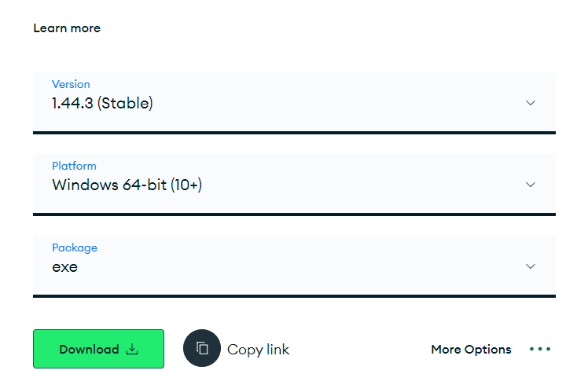

</div>

::right::

### Download the Community Server

Scroll down until the Server Download is visible:

<div style="max-width: 75%; margin: 0 auto;">

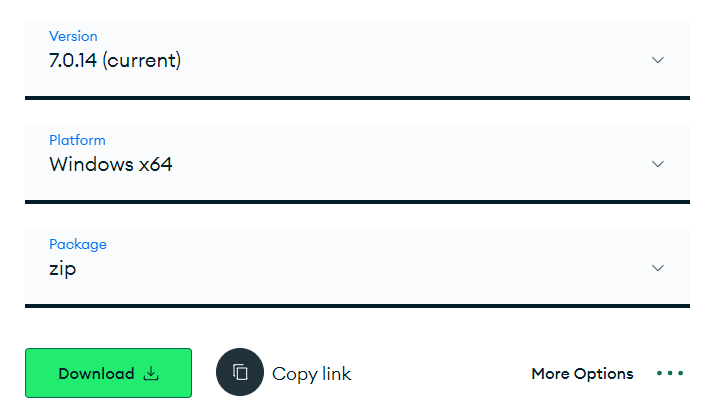

</div>

- Change the Package to ZIP!
- Click download for latest version.

---
level: 2
layout: two-cols
---

# Install MongoDB: Windows
## Manual installation/upgrade

We are able to also download other utilities whilst we wait...
::left::

## Download: MongoDB Shell
- Locate Tools on left hand menu
- Scroll down to MongoDB Shell
- Download latest version (ZIP)

<div style="max-width: 75%; margin: 0 auto;">

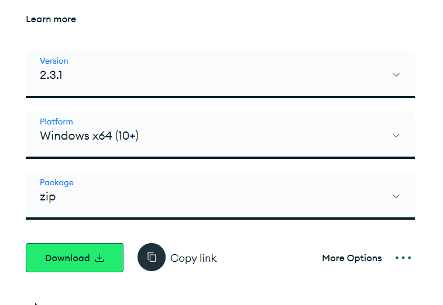

</div>

::right::

## Download: MongoDB Tools

- Locate Tools on left hand menu
- Scroll down to MongoDB Tools
- Download latest version (ZIP)

<div style="max-width: 75%; margin: 0 auto;">

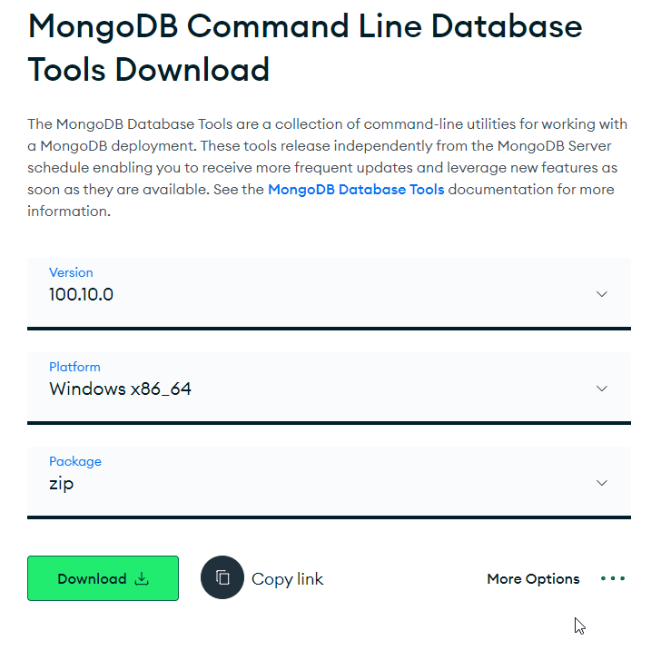

</div>

---
level: 2
layout: two-cols
---

# Install MongoDB: Windows
## Manual installation/upgrade

::left::

### Uncompress Files

Once the downloads are complete you will want to uncompress the ZIPs into folders.

::right::

### Animation of uncompressing files

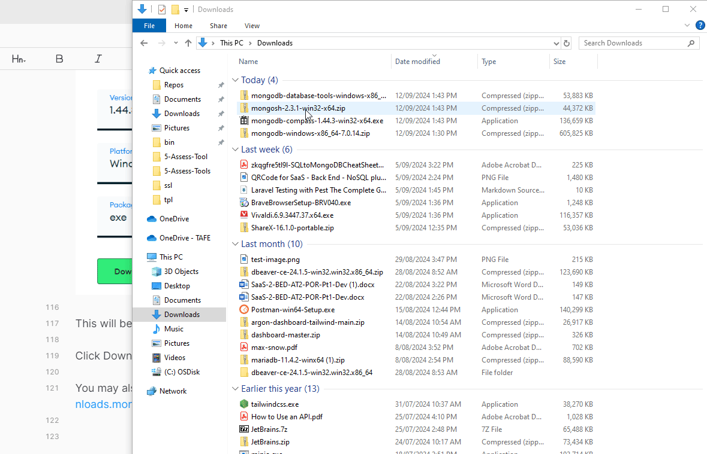

---
level: 2
---

# Install MongoDB: Windows
## Manual installation/upgrade

### Move Files to Correct Location

- Need a new `MongoDB` folder
- Created in Laragon binaries (`bin`) folder
- and then move the files to the correct location.

This may be achieved using the CLI or the Windows File Explorer.

---
level: 2
---


# Install MongoDB: Windows
## Manual installation/upgrade


### Via CLI

<Announcement type="info" title="Current folder">
<p>We presume current folder: <code>/c/Users/USERNAME/</code></p>
<p>Use <code>cd /c/Users/USERNAME</code> if not.</p>
</Announcement>

<Announcement type="info" title="Who am I">
<p>The <code>USERNAME</code> is your 'login name'.</p>
<p>Use <code>whoami</code> to find out your username.</p>
</Announcement>


---
level: 2
---
# Install MongoDB: Windows
## Manual installation/upgrade

### Home/TAFE Rm 3-06 (using BASH):

```shell
cd Downloads
mkdir /c/Laragon/bin/MongoDB
mv mongodb-windows-x86_64-x.x.x /c/Laragon/bin/MongoDB/
```

### Other TAFE Labs (using Bash):

```shell
cd Downloads
mkdir /c/ProgramData/Laragon/bin/MongoDB
mv mongodb-windows-x86_64-x.x.x /c/ProgramData/Laragon/bin/MongoDB
```

<Announcement type="warning" title="Folder Name">
Update the folder name as required to match the version you downloaded.
</Announcement>

---
level: 2
layout: two-cols
---

# Install MongoDB: Windows
## Manual installation/upgrade

::left::

### Via Windows File Explorer

Move the files to a new folder `MongoDB` inside `Laragon\bin` folder.

- Open the Windows File Explorer <kbd>WIN</kbd>+<kbd>E</kbd>.
- In File Explorer Address bar enter:
  - TAFE General PCs: `%programdata%\Laragon\bin`
  - Home/TAFE Rm 3-06: `C:\Laragon\bin`

::right::
### Animation: Navigate to folder

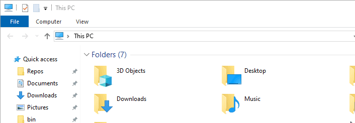

---
level: 2
layout: two-cols
---

# Install MongoDB: Windows
## Manual installation/upgrade

::left::

### Create MongoDB Folder

- Click anywhere in bin folder
- Create new folkder using: 
  <kbd>CTRL</kbd>+<kbd>SHIFT</kbd>+<kbd>N</kbd>
- Enter `MongoDB` as folder name
- Double click to open this folder.

::right::
### Animation: Create MongoDB Folder

<div style="max-width: 65%; margin: 0 auto;">

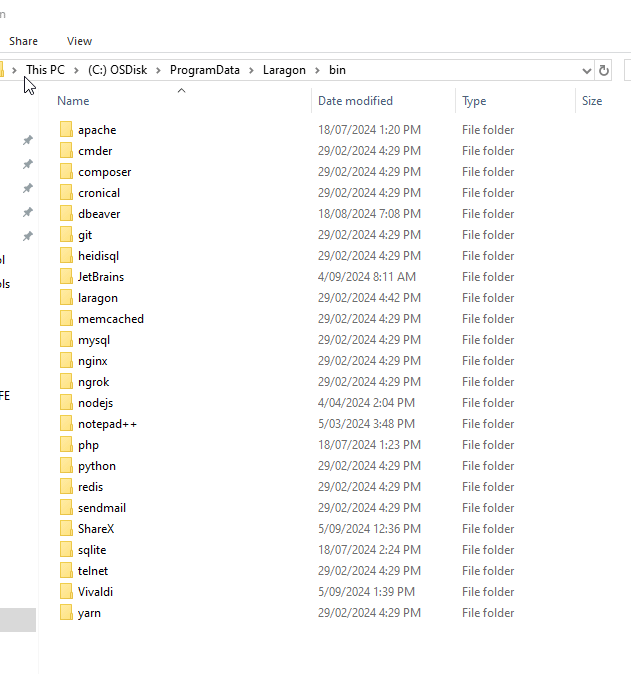

</div>

---
level: 2
layout: two-cols
---

# Install MongoDB: Windows
## Manual installation/upgrade

::left::

### Dual File Explorer Windows

- Open a second Windows File Explorer window (<kbd>WIN</kbd>+<kbd>E</kbd>)
- Arrange windows side by side 
  - Click on first window, press <kbd>WIN</kbd>+<kbd style="font-size: 1rem">➡️</kbd>
  - Click on second window, press <kbd>WIN</kbd>+<kbd style="font-size: 1rem">⬅️</kbd>
- Second File Explorer (downloads)
  - Open the MongoDB folder
  - Drag and drop the folder to MongoDB folder in the other File Explorer

::right::
### Animation: Moving Files/Folders

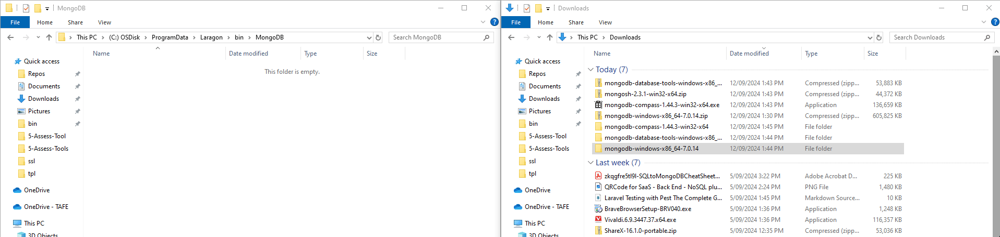


---
level: 2
---

# Install MongoDB: Windows
## Manual installation/upgrade

### Rename the MongoDB folder

We will remove the `x86_64` part of the name for simplicity.

In the windows file explorer:
- Select the `mongodb-windows-x86_64-x.x.x` folder.
- Press <kbd>F2</kbd>
- Rename the folder to: `mongodb-windows-x.x.x`.


<br>
<Announcement type="info" title="Folder Name">
Update the folder name as required to match the version you downloaded.
</Announcement> 


---
level: 2
---

# Install MongoDB: Windows
## Manual installation/upgrade

<br>
<Announcement type="important" title="Configuration">
Update mongodb.conf file
</Announcement> 
 
Laragon's auto-generated MongoDB Configuration will not 
  work on MongoDB v6 and above

[Download the file](./public/mongod.conf) and then move it into the `MongoDB/mongodb-windows-x.x.x` folder.

Steps:
- Download a replacement configuration file
- Move it into the `MongoDB/mongodb-windows-x.x.x` folder

File Download Link: [MongoDB Configuration File (mongod.conf)](./public/mongod.conf)


---
level: 2
layout: two-cols
---

# Install MongoDB: Windows
## Manual installation/upgrade

- Copy the MongoDB Tools and MongoDB Shell files to 
`mongodb-windows-x.x.x\bin` folder.

::left::
### Extract Files
- If you have not done so extract the files from the compressed files

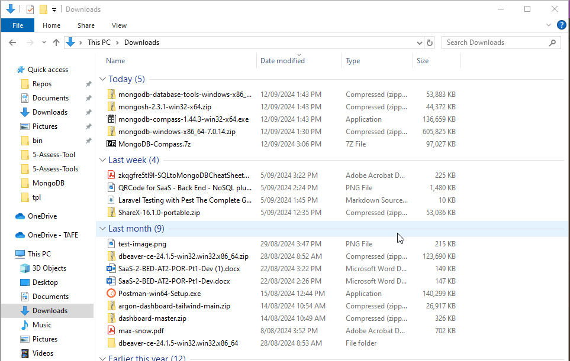

::right::

### Locate MongoDB bin Folder

- Second File Explorer:
- Locate & open `MongoDB-Windows-x.x.x\bin`

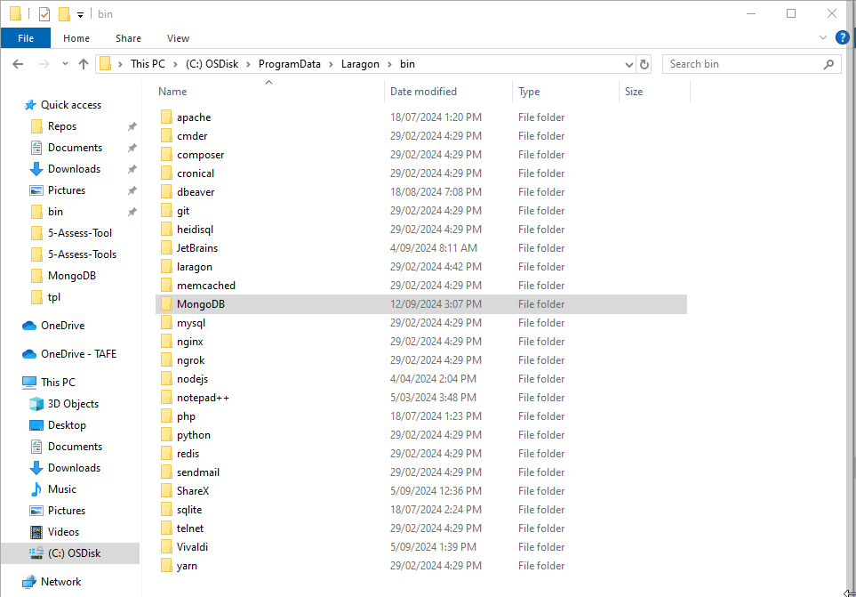

---
level: 2
layout: two-cols
---

# Install MongoDB: Windows
## Manual installation/upgrade

Second File Explorer (Downlaods folder):
- Open the MongoDB Shell folder (or MongoDB Tools)
- Navigate into the `bin` folder
- Select all the files (<kbd>CTRL</kbd>+<kbd>A</kbd>)
- Drag and drop them into `Laragon\bin\MongoDB\mongodb-windows-x.x.x\bin` folder.

Repeat the steps for the second set of files (eg. the MongoDB Tools).

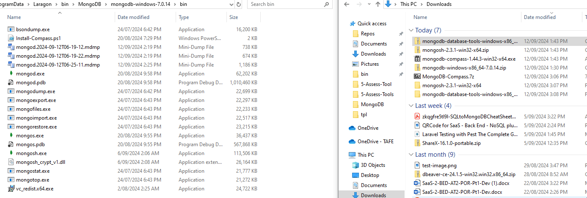


---
level: 2
layout: two-cols
---

# Install MongoDB: Windows
## Manual installation/upgrade

::left::
### MongoDB Compass UI

We need to do things slightly differently here.

Follow the appropriate steps

::right::
### Options for MongoDB Compass

- TAFE (any TAFE PC): 
  - Use provided 7z file
- Home, either:
  - use the 7z file, or 
  - download the EXE from MongoDB website

---
level: 2
layout: two-cols
---

# Install MongoDB: Windows
## Manual installation/upgrade

::left::

### MongoDB Compass EXE

Steps:
- Scroll and locate MongoDB Compass downloads
- Ensure EXE Package
- Click Download to get the latest version
- Open Downloads folder in file explorer
- Double click the EXE to install Compass

MongoDB Compass now in Start Menu.

::right::

### Download Details


---
level: 2
layout: two-cols
---

# Install MongoDB: Windows
## Manual installation/upgrade

::left::

### MongoDB Compass - TAFE

- Download 7Z Compressed version
- Extract the files/folders in the 7z
- Move the newly extracted folder to the `Laragon/bin/` folder.

(Animation shows `Laragon/bin/MongoDB`)

::right::

### Animation: Extract and Move MongoDB Compass

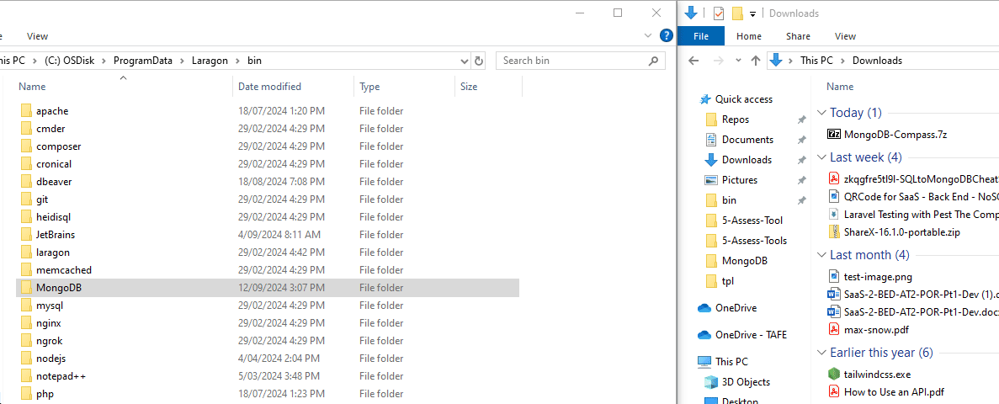


---
level: 2
layout: two-cols
---

# Install MongoDB: Windows
## Manual installation/upgrade

::left::
### Add Compass to Start Menu

At college, add the Compass to the start menu.

Steps:
- Open `Laragon/bin/MongoDB-Compass/` folder
- Locate the `MongoDBCompass.exe` file
- Right Mouse Click and select Pin to Start

YOu may now run MongoDB Compass from the Start Menu

::right::

### Animation: Adding to Start Menu

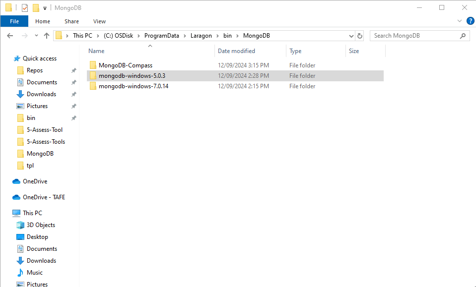

---
layout: section
---

# Starting MongoDB 

---
level: 2
layout: two-cols
---
# Starting MongoDB 

We may start MongoDB in several ways:
- From Laragon
- From CLI (stand alone or daemon/service)

---
layout: section
---

# Starting MongoDB: Laragon 

---
level: 2
layout: two-cols
---

# Starting MongoDB: Laragon

::left::

### Starting MongoDB in Laragon

To run MongoDB from Laragon:
- Open the Laragon UI
- Click the settings Cog
- Navigate to the Services and Ports tab
- Ensure MongoDB option is ticked
- Close the Settings dialog

::right::
### Animation: Selecting & Starting MongoDB

On first "enable", Laragon restarts all services

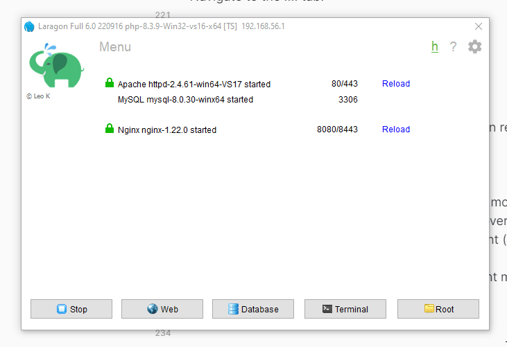

---
level: 2
layout: two-cols
---
# Starting MongoDB: Laragon
## Starting MongoDB in Laragon

::left::

### What if it does not start?

If Laragon does not start MongoDB...

- Right mouse click main Laragon window
- Locate & Hover over MongoDB
- Hover over MongoDB version
- Click latest version

<br>

### Starting/Stopping MongoDB:
- Right Click & hover on MongoDB
- Click Stop (or Start)

::right::

### Animation: Check MongoDB Version

<div style="max-width: 90%; margin: 0 auto;">

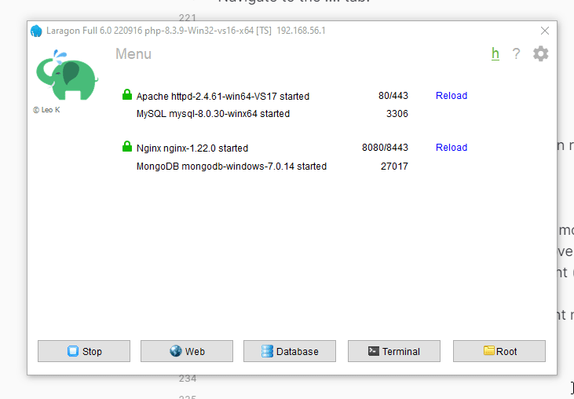

</div>

---
layout: section
---

# CLI & System Paths

---
level: 2
layout: two-cols
---

# CLI & System Paths
## Update Laragon Paths

- CLI Tools will not be available by default
- Need to add Laragon specific Paths

::left::

#### Remove Laragon Paths

- Right Mouse button on the Laragon interface
- Hover over Tools
- Path
- Click "Remove Laragon from Path"

<br>

#### Add Laragon Paths

As above, but click "Add Laragon to Path"

::right::
#### Animation: Update Laragon Paths

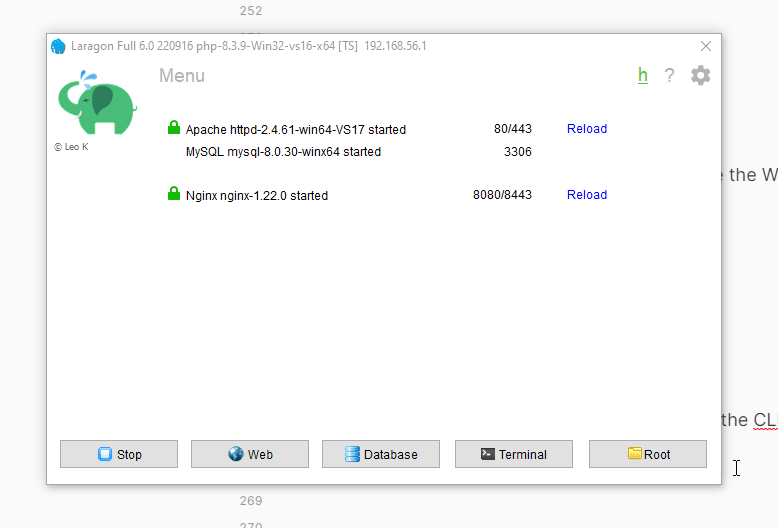

---
level: 2
layout: two-cols
---

# CLI & System Paths
## CLI Tools

::left::

You may now open the Windows Terminal and use the CLI tools...


::right::

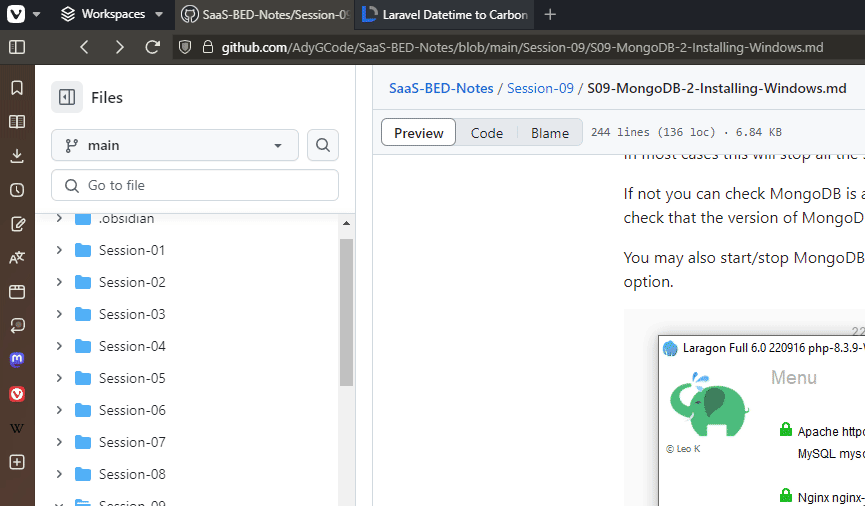


---
layout: section
---

# Starting MongoDB: CLI **- TODO**


---
level: 2
---

Instructions on starting MongoDB at the CLI are to be written

TODO: Starting at the CLI
TODO: Setting up a replication cluster
TODO: Running a replication cluster


---
layout: section
---

# Reminder: Windows & Bash Terminal

---
level: 2
---

# Reminder: Setting Up Bash in Windows Terminal


## Set Up Windows Terminal

Please see the ScreenCraft SQuASH helpdesk FAQS:
- Open [SQuASH https://help.screencraft.net.au](https://help.screencraft.net.au)
- Click **FAQs**
- Type `bash` in search box, & press <kbd>ENTER</kbd>
- Articles on Bash are shown
  - [Direct Link](https://help.screencraft.net.au/hc/1299211922/search?q=bash)
- Click the "Add Git Bash to Microsoft Terminal" article
  - [Direct Link](https://help.screencraft.net.au/hc/1299211922/65/add-git-bash-to-microsoft-terminal?category_id=35)

#### Bash Aliases
We provide CLI aliases in the article [Add or Update Bash Command Line Aliases for Git, Laravel, and more](https://help.screencraft.net.au/hc/1299211922/66/add-bash-command-line-aliases-for-git)


---
layout: section
---

## Guided Practice Questions & Exercises

---
level: 2
---
## Exercise: Installation Checkpoint

✔ Answer the following:

1. Why do we download MongoDB as a ZIP instead of MSI?
2. Where must MongoDB be placed inside Laragon?
3. What extra tools must be installed for full MongoDB usage?

📝 Write answers in your notebook or LMS.


---
level: 2
---
## Exercise: Folder Validation

Open File Explorer and confirm:

- [ ] `Laragon/bin/MongoDB/` exists  
- [ ] MongoDB version folder is correctly renamed  
- [ ] `bin/` contains:
  - `mongod`
  - `mongosh`
  - tools binaries

Raise your hand if **any item is missing**.


---
level: 2
---
## Exercise: CLI Test

Open **Windows Terminal (Bash)** and run:

```bash
mongod --version
mongosh --version
```

✅ Success criteria:

Both commands return version numbers
No “command not found” errors

---
level: 2
---
## Guided Practice Question
## Quick Reflection

Discuss with a partner:

- What went wrong (if anything)?
- What fixed the issue?
- Why is PATH configuration critical?


---
layout: section
---
# Recap 🧢


---
level: 2
---

# Recap 🧢


Before leaving, ensure you can:

- [ ] Explain what MongoDB is
- [ ] Compare local vs Atlas MongoDB
- [ ] Install MongoDB using Laragon
- [ ] Perform a manual MongoDB install
- [ ] Start/Stop MongoDB services
- [ ] Access MongoDB via Compass
- [ ] Run MongoDB CLI tools


---
layout: section
---

# Exit Ticket 🚪 

---
level: 2
---

# Exit Ticket 🚪 

Answer **ONE** of the following:

1. What was the most confusing step today?
2. Why does MongoDB require extra tools?
3. What's one benefit of using Laragon?
4. How would you verify MongoDB is running?

Submit via LMS or verbally before leaving.

---
layout: section
---

# Fast Finishers

---
level: 2
---

# Fast Finishers

Fast finishers:

- Open MongoDB Compass
- Connect using the default local connection
- Explore:
  - Databases
  - Collections
  - Sample documents


---

# Acknowledgements

- Fu, A. (2020). Slidev. Sli.dev. https://sli.dev/
- Font Awesome. (2026). Font Awesome. Fontawesome.com; Font
  Awesome. https://fontawesome.com/
- Mermaid Chart. (2026). Mermaid.ai. https://mermaid.ai/

> Slide template by Adrian Gould

<br>

> - Mermaid syntax used for some diagrams
> - Some content was generated with the assistance of Microsoft CoPilot
