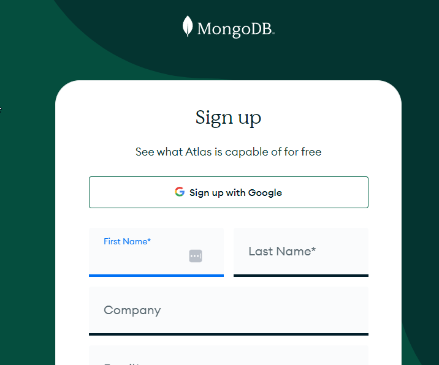
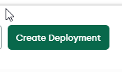
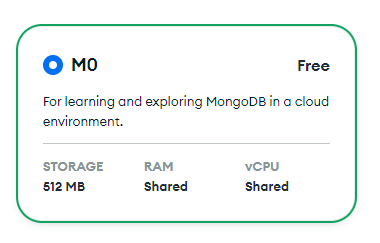
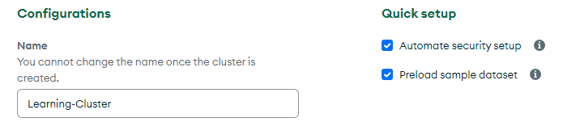
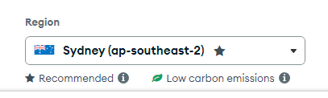
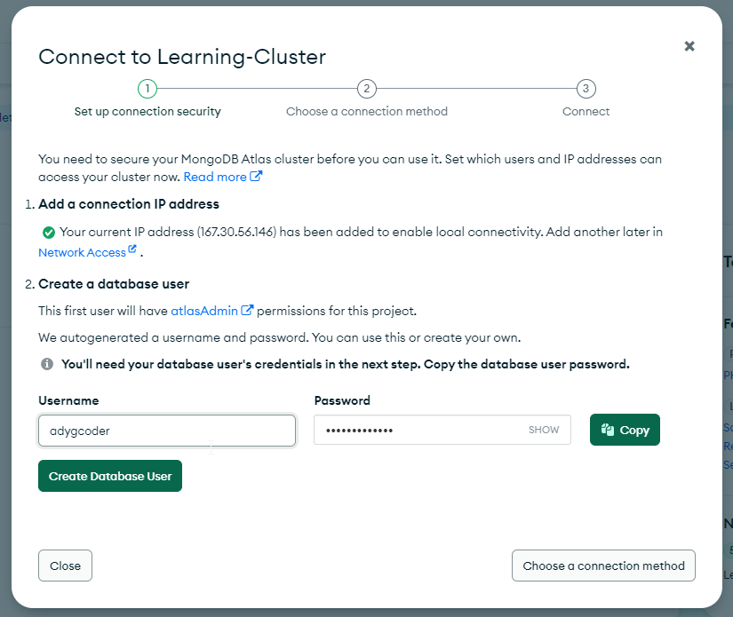
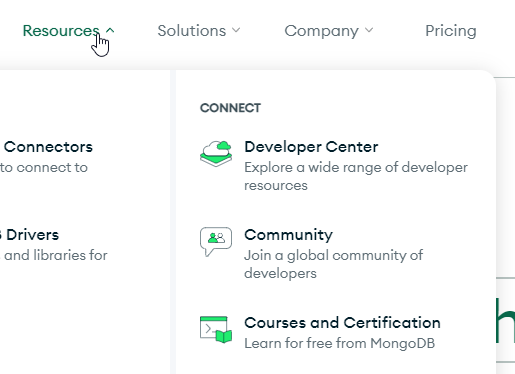
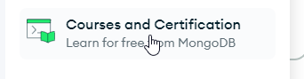
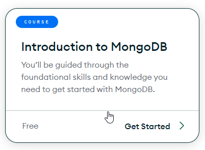

# Learning MongoDB

## Software as a Service - Back-End Development

#### ICT50120 Diploma of Information Technology (Advanced Programming) 

#### ICT50120 Diploma of Information Technology (Back-End Development)

Press <kbd>Space</kbd> or <kbd>RIGHT</kbd> for next slide/step <fa7-solid-arrow-right />

  <a href="https://github.com/adygcode/SaaS-FED-Notes" target="_blank" class="slidev-icon-btn">
    <fa7-brands-github class="text-zinc-300 text-3xl -mr-2"/>
  </a>

<!--
The last comment block of each slide will be treated as slide notes. It will be visible and editable in Presenter Mode along with the slide. [Read more in the docs](https://sli.dev/guide/syntax.html#notes)
-->

---
layout: default
level: 2
---

# Navigating Slides

Hover over the bottom-left corner to see the navigation's controls panel.

## Keyboard Shortcuts

|                                                     |                             |
|-----------------------------------------------------|-----------------------------|
| <kbd>right</kbd> / <kbd>space</kbd>                 | next animation or slide     |
| <kbd>left</kbd>  / <kbd>shift</kbd><kbd>space</kbd> | previous animation or slide |
| <kbd>up</kbd>                                       | previous slide              |
| <kbd>down</kbd>                                     | next slide                  |

---
layout: section
---

# Objectives

---
layout: two-cols
level: 2
class: text-left
---

# Objectives

::left::
By the end of this session, you will be able to:

-

::right::
You will demonstrate learning by:

-

---
level: 2
---

# Contents

<Toc minDepth="1" maxDepth="1" columns="2" />

---
layout: section
---

# Learning MongoDB

### The life and times of going to MongoDB University

#### The following sections indicate:

- what is needed to be covered in your learning
- how to sign up to MongoDB's University

---
level: 1
layout: section
---

# Learning MongoDB - Schedule

---
level: 2
layout: default
---

# Learning MongoDB - Schedule

## Learning Timeline

The table on the following slide outlines the timeline for completion of the MongoDB
Learning & Practice.

Remember that we will expect the Mongo University content for each session to be at least 2/3
completed as part of your out-of-class activities.

You may find topics being covered in class that do not match this timeline.

You will also be expected to complete some learning during our non-contact week.

There are 4 parts to the learning.

---
level: 2
layout: default
---

# Learning MongoDB - Schedule Part 1

| Session | Chapter                            | Link                                                                         | Duration (Mins) |
|---------|------------------------------------|------------------------------------------------------------------------------|-----------------|
| 09      | MongoDB Overview                   | https://learn.mongodb.com/courses/mongodb-overview                           | 60              |
| 09      | Intro to MongoDB                   | https://learn.mongodb.com/courses/start-here-introduction-to-mongodb         | 15              |
| 09-10   | Getting Started with MongoDB Atlas | https://learn.mongodb.com/courses/getting-started-with-mongodb-atlas         | 60              |
| 10-11   | MongoDB and the Document Model     | https://learn.mongodb.com/courses/overview-of-mongodb-and-the-document-model | 75              |
| 10-11   | Connecting to a MongoDB Database   | https://learn.mongodb.com/courses/connecting-to-a-mongodb-database           | 60              |

Sessions 11-14 on next page

---
level: 2
layout: default
---

# Learning MongoDB - Schedule Part 2

| Session | Chapter                                               | Link                                                                                   | Duration (Mins) |
|---------|-------------------------------------------------------|----------------------------------------------------------------------------------------|-----------------|
| 11-12   | MongoDB CRUD Operations: Insert and Find Documents    | https://learn.mongodb.com/courses/mongodb-crud-operations-insert-and-find-documents    | 105             |
| 11-12   | MongoDB CRUD Operations: Replace and Delete Documents | https://learn.mongodb.com/courses/mongodb-crud-operations-replace-and-delete-documents | 105             |
| 12-13   | MongoDB CRUD Operations: Modifying Query Results      | https://learn.mongodb.com/courses/mongodb-crud-operations-modifying-query-results      | 85              |
| 12-13   | MongoDB Aggregation                                   | https://learn.mongodb.com/courses/mongodb-aggregation                                  | 105             |
| 12-14   | MongoDB Indexes                                       | https://learn.mongodb.com/courses/mongodb-indexes                                      | 105             |

Sessions 12 - 15 on next page

---
level: 2
layout: default
---

# Learning MongoDB - Schedule Part 3

| Session | Chapter                                          | Link                                                                    | Duration (Mins) |
|---------|--------------------------------------------------|-------------------------------------------------------------------------|-----------------|
| 12-14   | MongoDB Atlas Search                             | https://learn.mongodb.com/courses/mongodb-atlas-search                  | 90              |
| 13-14   | MongoDB Data Modelling Intro                     | https://learn.mongodb.com/courses/introduction-to-mongodb-data-modeling | 45              |
| 13-14   | MongoDB Transactions                             | https://learn.mongodb.com/courses/mongodb-transactions                  | 60              |
| 14      | MongoDB and Data Encryption (Encryption at Rest) | https://learn.mongodb.com/courses/encryption-at-rest                    | 45              |
| 14      | MongoDB and Network Security (Atlas)             | https://learn.mongodb.com/courses/networking-security-atlas             | 45              |

Session 15 & Bonus content on next page (Optional).

---
level: 2
layout: default
---

# Learning MongoDB - Part 4

| Session | Chapter                                  | Link                                                                       | Duration (Mins) |
|---------|------------------------------------------|----------------------------------------------------------------------------|-----------------|
| 15      | PHP MongoDB Extension                    | https://www.php.net/manual/en/set.mongodb.php                              |                 |
| 15      | Laravel MongoDB ODM                      | https://github.com/mongodb/laravel-mongodb                                 |                 |
| 15      | Gettign Started with laravel and MongoDB | https://learn.mongodb.com/courses/getting-started-with-laravel-and-mongodb | 20              |
| 15      | Laravel and MongoDB Transactions         | https://learn.mongodb.com/courses/laravel-transactions                     | 20              |

Bonus Content on following slide...

---
level: 2
layout: default
---

# Learning MongoDB - Bonus Content

| Session | Chapter                                     | Link                                                               | Duration (Mins) |
|---------|---------------------------------------------|--------------------------------------------------------------------|-----------------|
| n/a     | MongoDB Data Resilience (Self-managed)      | https://learn.mongodb.com/courses/data-resilience-self-managed     | 45              |
| n/a     | MongoDB and Network Security (Self-Managed) | https://learn.mongodb.com/courses/networking-security-self-managed | 60              |

---
layout: section
---

# Learning MongoDB - Signing Up

---
level: 2
layout: two-cols
---

# Learning MongoDB

## Going to University (MongoDB Style)

- Sign Up for Free MongoDB Atlas Account
- Complete the Introduction to MongoDB course

 

## Cheat Sheets

::left::

#### MongoDB Shell Cheat Sheet

[Original Download](https://learn.mongodb.com/learn/course/mongodb-shell-cheatsheet/main/mongodb-shell-cheatsheet)

[Copy in Repo 2026-04-17](public/MongoDBShellCheatSheet-FY26.pdf)

::right::

#### SQL to MongoDB Cheat Sheet

[Original download](https://learn.mongodb.com/learn/course/mongodb-sql-cheat-sheet/main/mongodb-sql-cheat-sheet)

[Copy in repo 2024-09-05](./public/SQLtoMongoDBCheatSheet1.pdf)

---
layout: section
---

# Learning MongoDB: Signing Up

---
level: 2
layout: two-cols
---

# Learning MongoDB: Signing Up

::left::

1) Head
   to [Introduction to MongoDB Course | MongoDB University](https://learn.mongodb.com/learning-paths/introduction-to-mongodb)
2) Create a FREE Atlas Account
   via: [MongoDB Atlas | MongoDB](https://www.mongodb.com/cloud/atlas/register)

::right::

---
level: 2
layout: two-cols
---

# Learning MongoDB: Signing Up

::left::

3) Once you have created the free account, use teh create deployment option.

:: right::

4) You will use the FREE level.

---
level: 2
layout: two-cols
---

# Learning MongoDB: Signing Up

::left::

5) Name your cluster - keep it TAFE appropriate

6) Use the region with Australia as the cloud location

::right::

7) You will need to add an IP Address, this is usually done automatically, plus you will need a
   username and password to use the MongoDB Atlas instance.

---
layout: section
---

# Learning MongoDB: Intro Course

---
level: 2
layout: two-cols
---

# Learning MongoDB: Intro Course

::left::

## Intro to MongoDB Course

Open MongoDB's home page in new browser window.

Click on resources

::right::

Click on Courses and Certification

You may also search for Introduction to MongoDB if you find that faster and easier.

---
level: 2
layout: two-cols
---

# Learning MongoDB: Intro Course

::left::

Click
on [Get Started](https://learn.mongodb.com/learning-paths/introduction-to-mongodb)

::right::

Once you have clicked the get started, you will be able to ...

Click on Register now

This will use the Atlas account to log you into the MongoDB University and thus allow your
progress to be tracked.

---
layout: section
---

# Recap 🧢

---
level: 2
---

# Recap 🧢

Before leaving, ensure you:

- [ ] Have set up a free MongoDB account
- [ ] Logged into the Atlas account and are able to navigate
- [ ] Signed up for the Introduction to MongoDB course
- [ ] Have started the online course

---
layout: section
---

# Acknowledgements and References

---
level: 2
---

# Acknowledgements and References

MongoDB. (2026). MongoDB Courses and Trainings | MongoDB Shell Cheatsheet | MongoDB University. 
Mongodb.com. https://learn.mongodb.com/learn/course/mongodb-shell-cheatsheet/

MongoDB. (2025). MongoDB Courses and Trainings | Relational to Document Model | MongoDB 
University. Mongodb.com. https://learn.mongodb.com/courses/relational-to-document-model

MongoDB. (n.d.). MongoDB Courses and Trainings | Introduction to MongoDB | MongoDB University. 
Learn.mongodb.com. https://learn.mongodb.com/learning-paths/introduction-to-mongodb

> Some content may have been generated with the assistance of Microsoft CoPilot
