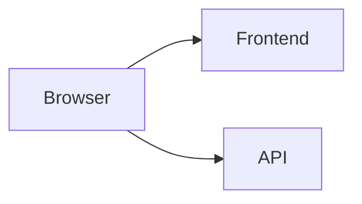
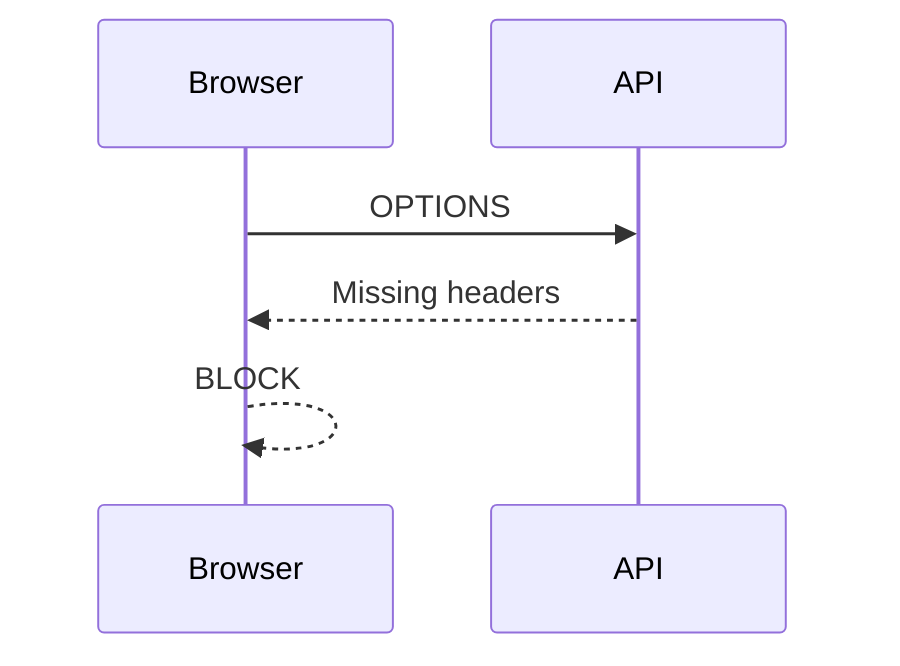

# CORS Debugging Lab

## Objectives
- Diagnose a real CORS failure
- Identify misconfiguration in Laravel
- Apply correct fix

---

# Scenario

You are given a system:

- Frontend: http://frontend.local:5173
- API: http://api.local:8000

Users report:

❌ API calls are failing in browser

---

# Architecture



---

# Step 1 — Run the System

API:

```bash
php artisan serve --host=api.local --port=8000
```

Frontend:

```bash
npm run dev
```

---

# Step 2 — Test Request

```js
fetch('http://api.local:8000/api/user', {
  headers: {
    Authorization: 'Bearer testtoken'
  }
});
```

---

# Step 3 — Observe Error

In DevTools:

❌ "Blocked by CORS policy"

---

# Step 4 — Investigate

Inspect request:

- Origin: frontend.local:5173
- Request method: GET
- Headers: Authorization

---

# Step 5 — Check Laravel Config

You find:

```php
'allowed_origins' => ['http://localhost:5173'],
'allowed_headers' => ['Content-Type'],
'supports_credentials' => false,
```

---

# Task 1

Identify ALL issues in the configuration.

---

# Task 2

Explain why the request fails.

---

# Task 3

Fix the configuration.

---

# Step 6 — Preflight

Check for OPTIONS request



---

# Task 4

What headers are missing from the preflight response?

---

# Task 5

Test after your fix

✅ Does it work?

---

# Challenge Extension

Break it again:

- Change port
- Add credentials

Explain what changes are required

---

# Quiz

## Q1
Why does this fail?

A. API offline  
B. Wrong origin ✅  
C. Bad route  
D. DNS  

---

## Q2
Why is Authorization failing?

A. Token expired  
B. Header not allowed ✅  
C. Wrong URL  
D. Server crash  

---

## Q3
Why does browser block response?

A. Server error  
B. CORS violation ✅  
C. Timeout  
D. JSON invalid  

---

# Summary

- CORS is browser enforced
- Laravel must allow correct origin
- Headers must be explicitly allowed

---

# End Lab
