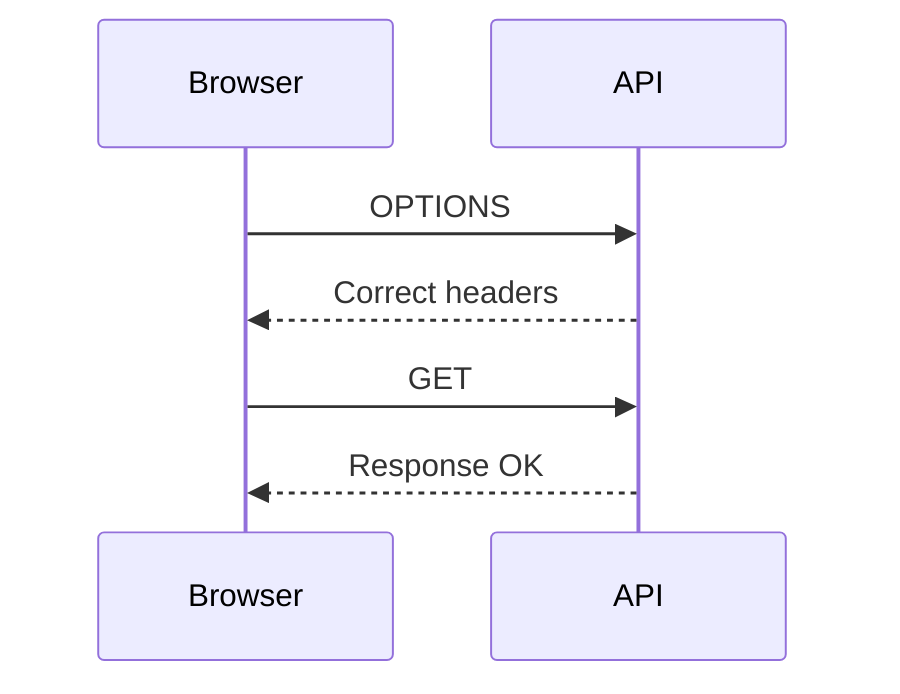

# Solutions Overview

---

# Problem Analysis

Issues found:

1. Wrong origin configured
2. Authorization header not allowed
3. Credentials disabled (potential issue)

---

# Root Cause

Browser sends:

```text
Origin: http://frontend.local:5173
```

Laravel allows:

```text
http://localhost:5173
```

Mismatch ⇒ blocked

---

# Header Issue

Request includes:

```text
Authorization
```

But config allows:

```php
['Content-Type']
```

⇒ Preflight fails

---

# Fixed Config

```php
return [
    'paths' => ['api/*'],
    'allowed_methods' => ['*'],
    'allowed_origins' => ['http://frontend.local:5173'],
    'allowed_headers' => ['*'],
    'supports_credentials' => true,
];
```

---

# Preflight Success



---

# Verification

✅ Request succeeds
✅ JSON returned

---

# Key Lessons

- Origin must match exactly
- Headers must include all custom headers
- Credentials require explicit origin

---

# Bonus Fix (Env Based)

```php
'allowed_origins' => explode(',', env('CORS_ORIGINS')),
```

---

# Final Takeaways

✅ CORS errors are config issues, not server failures  
✅ Always check DevTools network tab  
✅ Preflight is the key debugging point  

---

# End Solution
