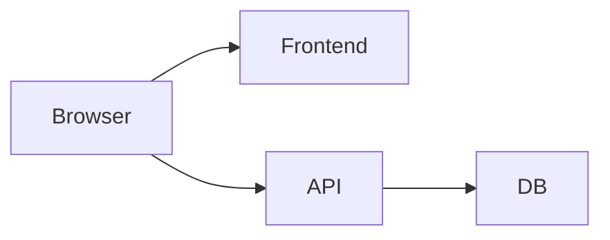
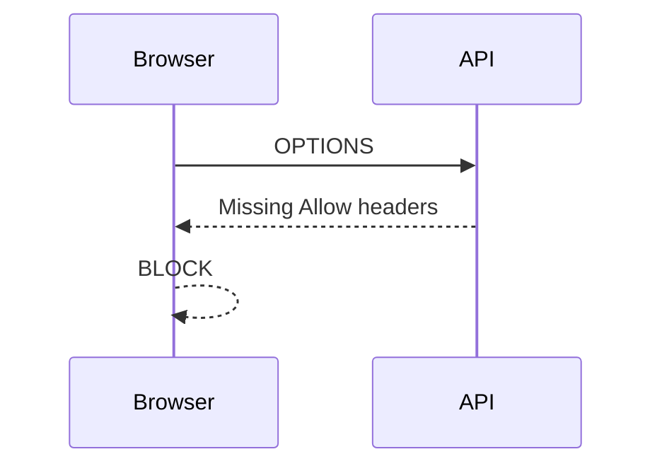

# Multi-Bug CORS Lab

## Purpose
Extend previous lab with multiple simultaneous issues

Students must:
- Diagnose multiple failures
- Prioritise debugging steps
- Apply layered fixes

---

# Scenario

System already deployed (Docker):

- Frontend: http://localhost:5173
- API: http://localhost:8000

Multiple reports:

❌ Requests failing intermittently  
❌ Auth not working  
❌ Some routes work, others fail

---

# Architecture



---

# Known (Broken) Config

```php
return [
    'paths' => ['api/*'],
    'allowed_methods' => ['GET'],
    'allowed_origins' => ['http://localhost:3000'],
    'allowed_headers' => ['Content-Type'],
    'supports_credentials' => false,
];
```

---

# Frontend Requests

## Request 1

```js
fetch('/api/data');
```

## Request 2

```js
fetch('/api/user', {
  headers: { Authorization: 'Bearer token' }
});
```

## Request 3

```js
fetch('/api/update', {
  method: 'POST',
  headers: { 'Content-Type': 'application/json' }
});
```

---

# Observed Problems

- Request 1: Fails sometimes
- Request 2: Always fails
- Request 3: Preflight failure

---

# Task 1 — Identify Issues

List ALL configuration problems

(Hint: There are at least 4)

---

# Task 2 — Match Errors to Causes

Match each failure to a configuration issue

---

# Task 3 — DevTools Investigation

Check:
- Origin header
- Request method
- Preflight (OPTIONS)
- Response headers

---

# Step — Preflight Failure



---

# Task 4 — Fix Strategy

Order your fixes:

1.
2.
3.
4.

Explain why order matters

---

# Task 5 — Apply Fix

Students should produce:

```php
return [
    'paths' => ['api/*'],
    'allowed_methods' => ['*'],
    'allowed_origins' => ['http://localhost:5173'],
    'allowed_headers' => ['*'],
    'supports_credentials' => true,
];
```

---

# Task 6 — Verification Matrix

| Request | Expected Result |
|--------|---------------|
| GET /data | ✅ works |
| GET /user | ✅ auth works |
| POST /update | ✅ works |

---

# Challenge Extension

Introduce additional bug:

```php
'paths' => ['api/data'],
```

Question:
- Why do some routes still fail?

---

# Advanced Challenge

Add Nginx proxy

Remove CORS entirely

Explain:
- Why problem disappears

---

# Quiz

## Q1
Why does GET sometimes fail?

A. Network issue  
B. Wrong origin ✅  
C. DB failure  

---

## Q2
Why does auth fail?

A. Token invalid  
B. Header not allowed ✅  
C. Route missing  

---

## Q3
Why does POST fail?

A. Method not allowed ✅  
B. Timeout  
C. JSON error  

---

## Q4
Why is credentials important?

A. Speed  
B. Required for auth ✅  
C. Routing  

---

# Summary

✅ Multiple small misconfigs cause complex failures  
✅ Debug systematically  
✅ Preflight is key signal  
✅ Fix config holistically  

---

# End Lab
