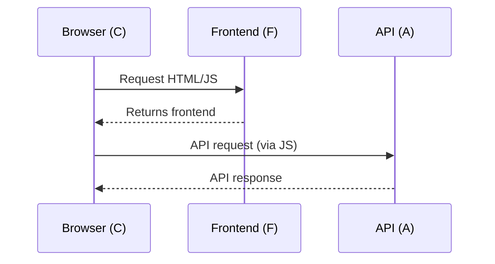
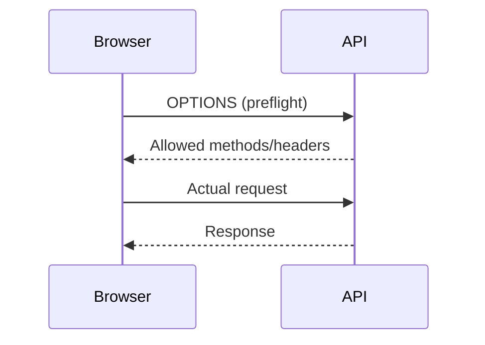

# Understanding CORS

## Learning Outcomes
- Explain how browsers handle API requests
- Understand how CORS works
- Identify when CORS is required
- Distinguish browser vs server communication
- Apply correct configurations in real systems

---

# Scenario Overview

- Frontend server (F)
- Client browser (C)
- API server (A)



---

# Key Insight

✅ The browser talks directly to the API
❌ Requests do NOT go via frontend server

---

# What is CORS?

CORS = Cross-Origin Resource Sharing

- Browser security mechanism
- Enforces Same-Origin Policy
- Controls whether JS can access responses

---

# Same-Origin Policy

Different origins:
- Protocol
- Domain
- Port

Example:
- https://frontend.com
- https://api.com

➡️ Cross-origin = CORS required

---

# Simple Request Flow

```mermaid
sequenceDiagram
    participant C as Browser
    participant A as API

    C->>A: GET /data
Origin: frontend.com
    A-->>C: Response + Access-Control-Allow-Origin
```

---

# Preflight Request



---

# Where to Configure CORS

| Component | Needed? |
|----------|--------|
| Browser (C) | ❌ |
| Frontend (F) | ❌ |
| API (A) | ✅ |

---

# Example Config (Node)

```js
app.use(cors({
  origin: 'https://frontend.com',
  methods: ['GET','POST'],
  credentials: true
}))
```

---

# Distributed APIs

Multiple services communicating:


---

# Does CORS Apply?

❌ No — server-to-server calls

Reason:
- No browser
- No Same-Origin Policy

---

# What Replaces CORS?

✅ Authentication
✅ Network security
✅ Service identity

---

# Architecture Patterns

## API Gateway


CORS only at gateway ✅

---

## Backend-for-Frontend


CORS simplified ✅

---

# Common Mistakes

- Configuring CORS on every service
- Expecting servers to enforce CORS
- Thinking CORS blocks requests

---

# Quiz (Review)

## Question 1
A browser app calls api.com directly. Where must CORS be configured?

A. Browser
B. Frontend server
C. API server ✅
D. Network switch

---

## Question 2
Service A calls Service B internally. Why is CORS not required?

A. Same codebase
B. No browser involved ✅
C. Same server
D. Same language

---

## Question 3
A frontend calls two APIs directly. What must be done?

A. Only one API needs CORS
B. Both APIs must allow frontend origin ✅
C. No CORS needed
D. Browser setting change

---

## Question 4
Why might a preflight request occur?

A. GET request
B. Simple headers
C. Custom headers or methods ✅
D. Cached request

---

## Question 5
What is the main role of CORS?

A. Block requests
B. Encrypt traffic
C. Control JS access to responses ✅
D. Route traffic

---

# Summary Checklist

- Browser talks directly to API ✅
- CORS enforced by browser ✅
- Configure CORS only on API ✅
- No CORS in server-to-server ✅
- Use gateway to simplify ✅

---

# End
