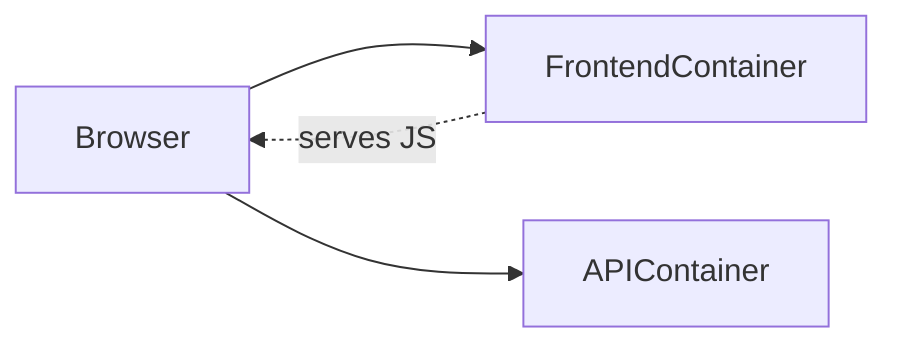
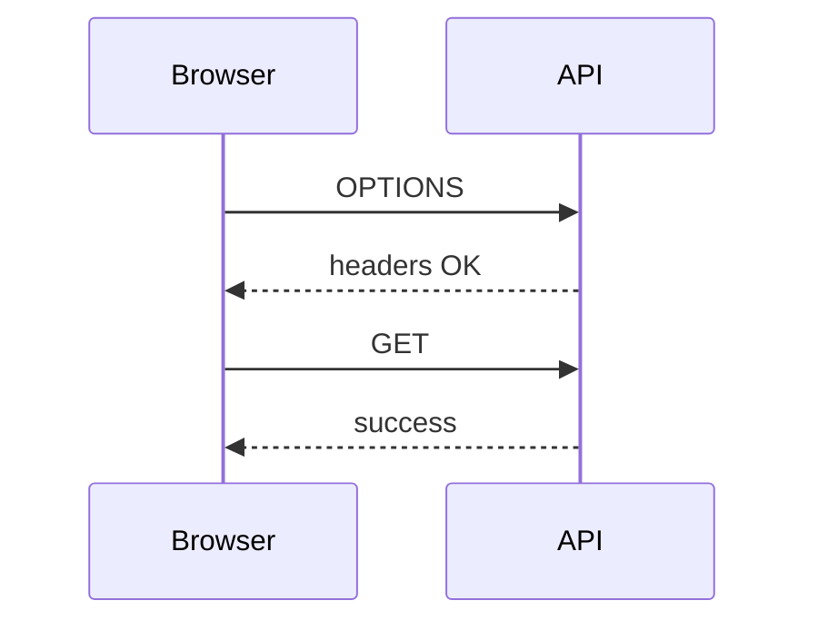

# Docker Multi-Host CORS Lab

## Goal
Simulate separate machines:
- Frontend container
- Laravel API container

Trigger and fix CORS issues

---

# Architecture (Docker)



---

# Lab Overview

You will:
1. Run frontend + API in separate containers
2. Trigger CORS issue
3. Debug via browser
4. Fix Laravel configuration

---

# Step 1 — Project Structure

```
cors-lab/
  api/
  frontend/
  docker-compose.yml
```

---

# Step 2 — docker-compose.yml

```yaml
version: '3.8'

services:
  api:
    build: ./api
    ports:
      - "8000:8000"
    container_name: laravel-api

  frontend:
    build: ./frontend
    ports:
      - "5173:5173"
    container_name: frontend-app
```

---

# Step 3 — Laravel Dockerfile

`api/Dockerfile`

```dockerfile
FROM php:8.2-cli

WORKDIR /app

COPY . .

RUN docker-php-ext-install pdo pdo_mysql

CMD php artisan serve --host=0.0.0.0 --port=8000
```

---

# Step 4 — Frontend Dockerfile

`frontend/Dockerfile`

```dockerfile
FROM node:18

WORKDIR /app

COPY . .

RUN npm install

CMD ["npm","run","dev","--","--host"]
```

---

# Step 5 — Broken Laravel CORS Config

`config/cors.php`

```php
return [
    'paths' => ['api/*'],
    'allowed_methods' => ['*'],
    'allowed_origins' => ['http://localhost:3000'],
    'allowed_headers' => ['Content-Type'],
];
```

---

# Step 6 — Start Lab

```bash
docker-compose up --build
```

Open:
- http://localhost:5173

---

# Step 7 — Trigger Request

Frontend JS:

```js
fetch('http://localhost:8000/api/data', {
  headers: {
    Authorization: 'Bearer test'
  }
});
```

---

# Step 8 — Observe Failure

DevTools:

❌ CORS error

---

# Debug Checklist

- Origin mismatch?
- Port mismatch?
- Headers allowed?
- Preflight response?

---

# Task 1

Why does this fail?

Hint:
- Frontend runs on :5173
- Config allows :3000

---

# Task 2

Why does Authorization fail?

---

# Task 3

Fix Laravel config

---

# Correct Config (Students should reach)

```php
return [
    'paths' => ['api/*'],
    'allowed_methods' => ['*'],
    'allowed_origins' => ['http://localhost:5173'],
    'allowed_headers' => ['*'],
    'supports_credentials' => true,
];
```

---

# Step 9 — Retest

✅ Request succeeds

---

# Preflight View



---

# Real-World Insight

Docker simulates:
- Separate machines
- Different origins
- Real deployment conditions

---

# Extension Tasks

- Add second API service
- Use nginx as gateway
- Add Sanctum auth

---

# Summary

✅ Containers simulate distributed systems
✅ CORS behaves same as real servers
✅ Fix is always at API layer

---

# End
