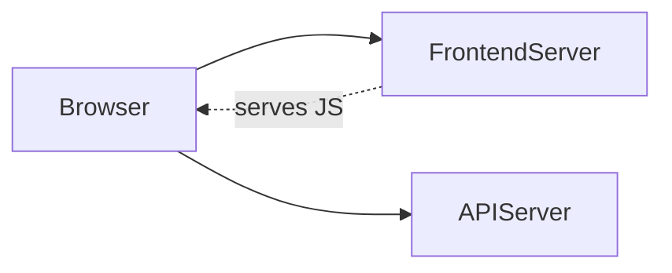
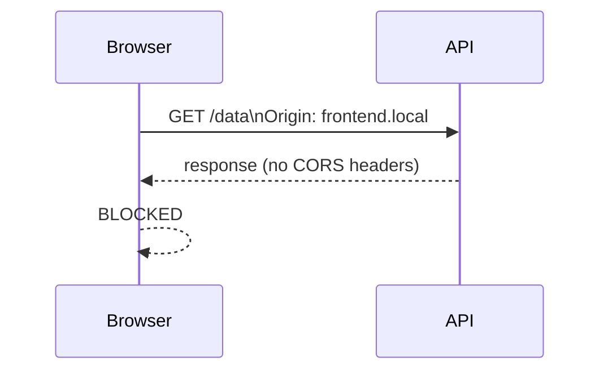
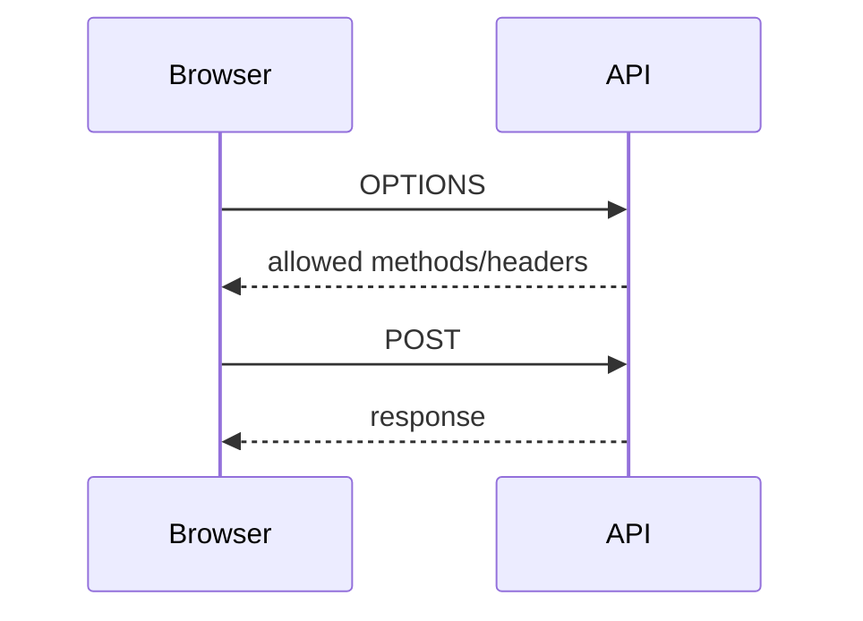
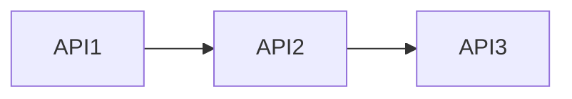
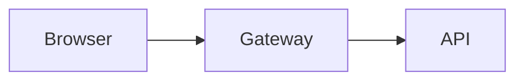
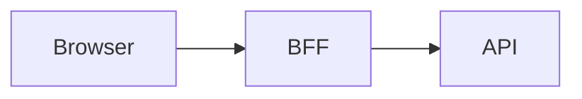

# Laravel CORS Lab

## Outcomes
- Build split frontend + API
- Trigger CORS errors
- Fix CORS in Laravel
- Understand real deployment patterns

---

# Topology (Two Servers)



## Example Hosts
- Frontend: http://frontend.local:5173
- API: http://api.local:8000

---

# Key Concept

✅ Browser executes frontend code
✅ Browser calls API directly
❌ Frontend server is NOT used as a proxy

---

# Lab Flow

1. Create API (Laravel)
2. Create frontend (Vite)
3. Trigger CORS error
4. Fix CORS in Laravel
5. Explore preflight + auth

---

# Step 1 — Laravel API

```bash
laravel new cors-api
cd cors-api
php artisan serve --host=api.local --port=8000
```

Add route:

```php
use Illuminate\Support\Facades\Route;

Route::get('/data', function () {
    return response()->json([
        'message' => 'Hello from API'
    ]);
});
```

---

# Step 2 — Separate Frontend (Vite)

```bash
npm create vite@latest frontend
cd frontend
npm install
npm run dev
```

Edit `main.js`:

```js
fetch('http://api.local:8000/data')
  .then(r => r.json())
  .then(console.log)
  .catch(console.error);
```

---

# Step 3 — Observe Failure

Open DevTools console

❌ CORS error

Reason:
- Origin = frontend.local
- API = api.local

---

# What Actually Happens



---

# Step 4 — Enable CORS (Laravel)

Edit:

`config/cors.php`

```php
return [
    'paths' => ['*'],
    'allowed_methods' => ['*'],
    'allowed_origins' => ['http://frontend.local:5173'],
    'allowed_headers' => ['*'],
    'supports_credentials' => true,
];
```

Restart server if needed

---

# Step 5 — Retest

✅ Works correctly

```json
{ "message": "Hello from API" }
```

---

# Step 6 — Trigger Preflight

```js
fetch('http://api.local:8000/data', {
  method: 'POST',
  headers: {
    'Content-Type': 'application/json'
  }
});
```

---

# Preflight Flow



---

# Step 7 — Add Auth Header

```js
fetch(url, {
  headers: {
    Authorization: 'Bearer test'
  }
});
```

Ensure:

```php
'allowed_headers' => ['*']
```

---

# Step 8 — Break & Debug

Try:
- Wrong origin
- Different port
- Remove headers

Observe failures

---

# Real Deployment Example

## Servers
- Frontend: https://app.example.com
- API: https://api.example.com

---

# Production Laravel Config

```php
'allowed_origins' => [
    'https://app.example.com'
],
```

---

# Sanctum Example (Cookies)

```php
'supports_credentials' => true,
```

Frontend:

```js
fetch(url, {
  credentials: 'include'
});
```

---

# Distributed APIs



✅ No CORS required

Reason:
- No browser involved

---

# Gateway Pattern



✅ Configure CORS once

---

# BFF Pattern



✅ No direct frontend-to-API CORS

---

# Student Tasks

- Deploy frontend + API on different ports
- Trigger CORS
- Fix config
- Add auth header
- Break config intentionally

---

# Quiz

## Q1
Why does this request fail?
Frontend:5173 → API:8000

Answer: Different origin (port mismatch)

---

## Q2
Where is CORS configured?

Answer: Laravel API server

---

## Q3
Why does API→API not need CORS?

Answer: No browser involved

---

## Q4
What triggers preflight?

Answer: POST or custom headers

---

## Q5
Why not use '*' with credentials?

Answer: Browser blocks response

---

# Summary

✅ Browser → API direct
✅ Laravel controls access
✅ CORS only browser boundary
✅ Internal APIs ignore CORS

---

# End
