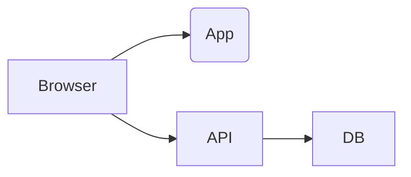
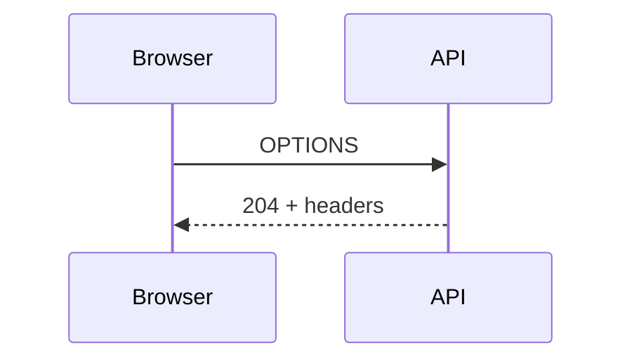
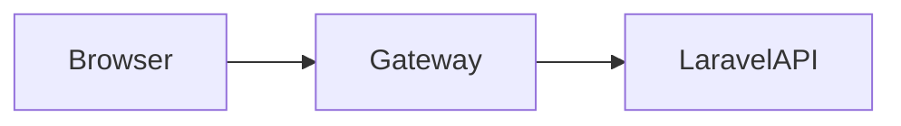
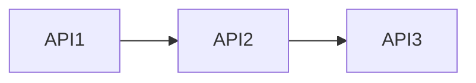

# Laravel in the Real World

## Focus
- Split frontend + API deployments
- Production CORS configs
- Auth (Sanctum / tokens)
- Debugging and pitfalls

---

# Typical Deployment



## Domains
- https://app.company.com
- https://api.company.com

---

# Key Principle

✅ Browser enforces CORS  
✅ Laravel must explicitly allow origins  
❌ Servers talking to servers ignore CORS

---

# Laravel CORS Config (Production)

File: `config/cors.php`

```php
return [
    'paths' => ['api/*', 'sanctum/csrf-cookie'],
    'allowed_methods' => ['*'],
    'allowed_origins' => [
        'https://app.company.com'
    ],
    'allowed_headers' => ['*'],
    'supports_credentials' => true,
];
```

---

# Why Not Use '*'

❌ Invalid with credentials

```php
'supports_credentials' => true
```

Browser will block response if origin is '*'

---

# Environment-Based Config

```php
'allowed_origins' => explode(',', env('CORS_ORIGINS', '')),
```

.env:

```
CORS_ORIGINS=https://app.company.com,https://admin.company.com
```

---

# Example: Token Auth API

Controller:

```php
public function user(Request $request)
{
    return $request->user();
}
```

Frontend:

```js
fetch('/api/user', {
  headers: {
    Authorization: 'Bearer ' + token
  }
});
```

---

# Required CORS Headers

```php
'allowed_headers' => ['*']
```

Or explicitly:

```php
'allowed_headers' => ['Authorization', 'Content-Type']
```

---

# Sanctum (SPA Auth)

Laravel:

```php
'paths' => ['api/*', 'sanctum/csrf-cookie'],
'supports_credentials' => true,
```

Frontend:

```js
fetch('/sanctum/csrf-cookie', {
  credentials: 'include'
});
```

---

# Common Failure: Missing Credentials

❌ Session not persisted

Fix:

```js
fetch(url, { credentials: 'include' })
```

---

# Preflight Debugging

Check in DevTools:



If missing headers → request fails

---

# Logging Preflights in Laravel

Middleware example:

```php
public function handle($request, Closure $next)
{
    if ($request->isMethod('OPTIONS')) {
        logger('Preflight', $request->headers->all());
    }
    return $next($request);
}
```

---

# Reverse Proxy Setup (Nginx)

```nginx
location /api/ {
    proxy_pass http://127.0.0.1:8000;
}
```

Then frontend calls:

```
https://app.company.com/api/data
```

✅ No CORS needed

---

# API Gateway Pattern



- CORS handled once
- Simplifies services

---

# Microservices Example



✅ No CORS config required internally

Use:
- Tokens
- mTLS
- Internal networking

---

# Security Best Practices

- Only allow known origins
- Use HTTPS
- Avoid wildcard origins
- Validate tokens server-side

---

# Debug Checklist

- Origin matches config?
- Port correct?
- Headers allowed?
- Credentials enabled?
- Preflight responding?

---

# Real Bug Example

Problem:
- Works locally
- Fails in production

Cause:

```php
'allowed_origins' => ['http://localhost:5173']
```

Fix:

```php
'https://app.company.com'
```

---

# Another Real Bug

Problem:
- Auth fails silently

Cause:
- Missing credentials flag

Fix:

```js
credentials: 'include'
```

---

# Summary

✅ CORS is a browser rule  
✅ Laravel must allow origin  
✅ Auth requires credentials  
✅ Internal APIs ignore CORS  

---

# End
