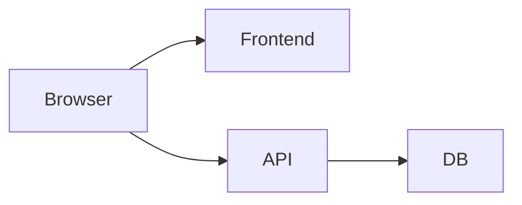
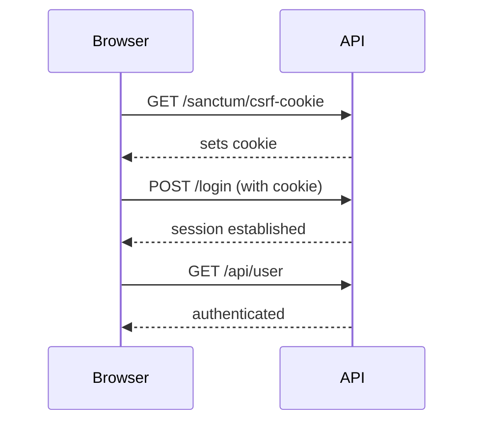

# Sanctum Extension Lab

## Purpose
Extend previous labs by introducing authentication

Students will:
- Integrate Laravel Sanctum
- Debug CORS + cookies issues
- Fix authentication failures

---

# Architecture



---

# Key Concept

CORS + Authentication = More Constraints

- Cookies require credentials
- Origins must be exact
- Preflight must allow cookies

---

# Step 1 — Install Sanctum

```bash
composer require laravel/sanctum
php artisan vendor:publish --provider="Laravel\\Sanctum\\SanctumServiceProvider"
php artisan migrate
```

---

# Step 2 — Configure Sanctum Middleware

In `app/Http/Kernel.php`:

```php
\Laravel\Sanctum\Http\Middleware\EnsureFrontendRequestsAreStateful::class,
```

---

# Step 3 — Configure CORS

```php
return [
    'paths' => ['api/*', 'sanctum/csrf-cookie'],
    'allowed_methods' => ['*'],
    'allowed_origins' => ['http://localhost:5173'],
    'allowed_headers' => ['*'],
    'supports_credentials' => true,
];
```

---

# Step 4 — Configure Sanctum Domains

.env:

```
SANCTUM_STATEFUL_DOMAINS=localhost:5173
SESSION_DOMAIN=localhost
```

---

# Step 5 — Frontend Auth Flow

```js
await fetch('http://localhost:8000/sanctum/csrf-cookie', {
  credentials: 'include'
});

await fetch('http://localhost:8000/login', {
  method: 'POST',
  credentials: 'include',
  headers: { 'Content-Type': 'application/json' },
  body: JSON.stringify({ email, password })
});
```

---

# Step 6 — Broken Setup

Students are given:

```php
'allowed_origins' => ['http://localhost:3000'],
'supports_credentials' => false,
```

.env:

```
SANCTUM_STATEFUL_DOMAINS=localhost
SESSION_DOMAIN=null
```

---

# Observed Issues

❌ Login appears to work but user not authenticated  
❌ Cookies not stored  
❌ API returns 401

---

# Task 1 — Identify Problems

Find ALL misconfigurations

---

# Task 2 — Debug Cookies

Check DevTools:

- Are cookies being set?
- Are they sent back?

---

# Task 3 — Explain Failure

Why auth fails even though login returns 200?

---

# Task 4 — Fix Config

Students should reach:

```php
'allowed_origins' => ['http://localhost:5173'],
'supports_credentials' => true,
```

---

# Correct .env

```
SANCTUM_STATEFUL_DOMAINS=localhost:5173
SESSION_DOMAIN=localhost
```

---

# Step 7 — Verify

✅ CSRF cookie set  
✅ Session cookie present  
✅ Authenticated request succeeds

---

# Request Flow



---

# Common Mistakes

- Missing `credentials: include`
- Wrong domain config
- Using '*' origin
- Missing sanctum paths

---

# Debug Checklist

- Origin correct?
- Credentials enabled?
- Cookies set?
- Cookies sent back?
- Sanctum domains correct?

---

# Challenge Extension

Add second frontend domain:

```
SANCTUM_STATEFUL_DOMAINS=localhost:5173,admin.localhost:5174
```

---

# Quiz

## Q1
Why does login succeed but auth fails?

A. DB issue  
B. Cookies not stored ✅  
C. Route missing  

---

## Q2
Why must credentials be true?

A. Performance  
B. Required for cookies ✅  
C. Routing  

---

## Q3
What does Sanctum rely on?

A. Tokens only  
B. Cookies + sessions ✅  
C. Headers only  

---

# Summary

✅ Sanctum uses cookies  
✅ Cookies require credentials  
✅ CORS must allow credentials  
✅ Domains must match exactly  

---

# End Extension
