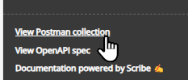
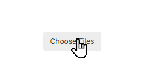
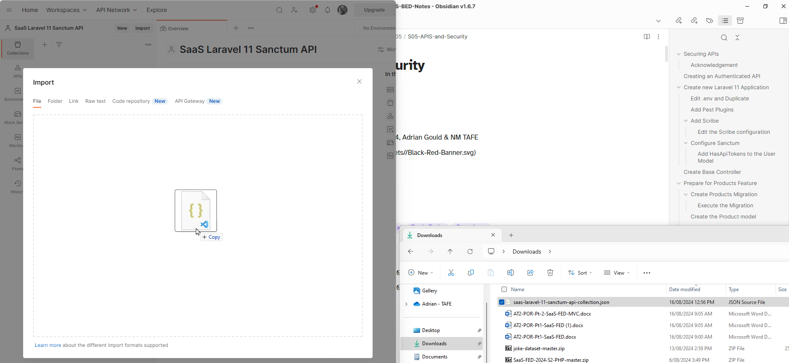

# Securing APIs

Software as a Service - Back-End Development

Session 05

Developed by Adrian Gould

---


```table-of-contents
title: # Contents
style: nestedList
minLevel: 0
maxLevel: 3
includeLinks: true
```


---

### Acknowledgement

This tutorial is based
on [Laravel 10 REST API Authentication using Sanctum (vidvatek.com)](https://vidvatek.com/post/laravel-10-rest-api-authentication-using-sanctum).

---

# Creating an Authenticated API

For this tutorial we will start a fresh Laravel application. You may then apply the principles
to your own code.


---

# Create new Laravel 11 Application

```shell
cd ~/Source/Repos
laravel new SaaS-Laravel-11-Sanctum-API
```

Respond to the questions with the following:

- Would you like to install a starter kit? `breeze`
- Which Breeze stack would you like to install? `api`
- Which testing framework do you prefer? `Pest`
- Would you like to initialise a Git repository? `yes`
- Which database will your application use? `SQLite`
- Would you like to run the default database migrations? `yes`

Change into the new project folder:

```shell
cd SaaS-Laravel-11-Sanctum-API/
```

Because we have selected the Breeze and API options, the Sanctum configuration and database migrations have been completed during this installation process.

## Edit .env and Duplicate

Open the `.env` file and make the following changes:

| Item              | Value                                   |
| ----------------- | --------------------------------------- |
| APP_NAME          | XXX Laravel 11 Sanctum API              |
| APP_DEBUG         | true                                    |
| APP_TIMEZONE      | UTC                                     |
| APP_URL           | http://saas-laravel-11-sanctum-api.test |
| APP_LOCALE        | en_AU                                   |
| MAIL_MAILER       | smtp                                    |
| MAIL_FROM_ADDRESS | saas-laravel-11-sanctum-api@example.com |
| MAIL_HOST         | 127.0.0.1                               |
| MAIL_PORT         | 2525                                    |

Remember that `XXX` are your initials!

Save the changes and then make a copy of the file and name it: `.env.dev`.

## Add Pest Plugins

@We will be adding the following Pest plugins:

- faker -  *allows the fake namespace in your tests*
- Laravel -  *this adds extra commands for use with artisan*
- watch -  *this will let you watch for file changes and have pest automatically re-run*

Use the following commands:

```bash
composer require pestphp/pest-plugin-faker --dev 
composer require pestphp/pest-plugin-laravel --dev
composer require pestphp/pest-plugin-watch --dev
```

or as one line:

```bash
composer require pestphp/pest-plugin-faker --dev pestphp/pest-plugin-laravel --dev pestphp/pest-plugin-watch --dev
```


> **Note:** The pest watch plugin is **NOT** usable on Windows systems due to the way the pipes block processes from allowing other processes to run.
> 
> MacOS and Linux users may use `./vendor/bin/pest --watch` or `php artisan test --watch`.
> 
> Remember that PhpStorm *does* have the ability to watch and run tests automatically.


## Add Scribe

Add the Scribe package & publish the configuration to Laravel:

```shell
composer require --dev knuckleswtf/scribe
php artisan vendor:publish --tag=scribe-config
```

### Edit the Scribe configuration

Open the configuration file in PhpStorm (<kbd>shift</kbd> <kbd>shift</kbd> type in `apidoc-` and find the `config/scribe.php` file.)

Make these changes, with strings being in quotes, and booleans being unquoted…

- type: `laravel`,
- title: `SaaS Sanctum API Demo`,
- description: `Developed by YOUR_NAME_HERE`,
- use_csrf: `true`,
- example_languages: `bash`, `javascript`, `php`, `python`

This configuration means that Scribe will use the Laravel routing and …

It will also add CSRF to form requests, and automatically generate examples of the API using Bash (curl), JavaScript, PHP and Python.

## Configure Sanctum

Make sure that the `app\bootstrap\app.php` file contains the following lines:

```php
->withMiddleware(function (Middleware $middleware) {  
    $middleware->api(prepend: [  
        \Laravel\Sanctum\Http\Middleware\EnsureFrontendRequestsAreStateful::class,  
    ]);
```

### Add HasApiTokens to the User Model

Edit the `app\Models\User.php` file and add the required `HasApiTokens` trait.

Before the `class User` line add:

```php
use Laravel\Sanctum\HasApiTokens;
```

In the `class` definition update the `use` line to read:

```php
use HasFactory, Notifiable, HasApiTokens;
```

This enables us to use tokens for verifying login status and whom  originated requests.


# Create Base Controller

In a previous tutorial we created an `ApiResponseClass` to deal with the responses... this time we will extend the Controller class to create a new "Base Controller" and in here create the response methods we need.

```bash
php artisan make:controller BaseController
```

Now edit the controller...

First add a `sendResponse` method:

```php
/**  
 * success response method.
 *
 * @return \Illuminate\Http\JsonResponse  
 */  
public function sendResponse($result, $message): JsonResponse  
{  
    $response = [  
        'success' => true,  
        'data' => $result,  
        'message' => $message,  
    ];  
    return response()->json($response, 200);  
}  
```

Next add the `sendError` method:

```php
/**  
 * return error response.
 *
 * @return \Illuminate\Http\JsonResponse  
 */  
public function sendError(
	$error, 
	$errorMessages = [], 
	$code = 404): JsonResponse  
{  
    $response = [  
        'success' => false,  
        'message' => $error,  
    ];  
    if (!empty($errorMessages)) {  
        $response['data'] = $errorMessages;  
    }  
    return response()->json($response, $code);  
}  
```

We will use this with our Controllers.

> **Note:** 
> 
> As the developer, you make your decisions on how you implement the components of a solution. 
> 
> When working in a team, these decisions should be for all the team to apply. 
> 
> When working for an established company, they will often have requirements for code that you will apply.


<div class="page-break" style="page-break-before: always;"></div>


# Prepare for Products Feature

We start by creating the product migration, model, factory and controller... testing as we go.

The API Endpoint for this feature will be based on URI structure:

```http
/api/v1/products
```

We will implement the endpoints...

| BREAD | Verb   | Endpoint                |
| ----- | ------ | ----------------------- |
| B     | GET    | `/api/v1/products`      |
| R     | GET    | `/api/v1/products/{id}` |
| E     | PUT    | `/api/v1/products/{id}` |
| A     | POST   | `/api/v1/products`      |
| D     | DELETE | `/api/v1/products/{id}` |

## Create Products Migration

We will create a new products table migration:

```shell
php artisan make:migration create_products_table
```

Now edit the new `yyyy_mm_dd_hhmmss_create_products_table.php` file that has been created in the `database\migrations\` folder and add the following definitions:

| field name | type   | size | other    |
| ---------- | ------ | ---- | -------- |
| name       | string | 128  |          |
| detail     | text   |      | nullable |

### Execute the Migration

Run the migration using:

```bash
php artisan migrate
```

If you have errors then make sure to fix them before continuing.

## Create the Product model

We will create a new product model:

```shell
php artisan make:model Product
```

Edit the model and update the fillable and other details as needed:

```php
/**  
 * The attributes that are mass assignable. 
 * 
 * @var array<int, string>  
 */
protected $fillable = [  
    'name',  
    'detail',  
];  
  
/**  
 * The attributes that should be hidden for serialization. 
 * 
 * @var array<int, string>  
 */
protected $hidden = [];  
  
/**  
 * Get the attributes that should be cast. 
 * 
 * @return array<string, string>  
 */
protected function casts(): array  
{  
    return [];  
}
```


## Create a Product Factory

We will create a new product factory:

```shell
php artisan make:factory ProductFactory
```

Edit the factory to have the following `definition` method detail:

```php
// This will create a string of 3 words  
'name' => fake()->words(3, true), 
// This will create a random sentence / or null description
'detail' => random_int(1, 5) > 2 ? fake()->sentence(10) : null,
```

## Create Route Tests

Create the Product Feature Test Pest test file:

```shell
php artisan make:test --pest ProductFeatureTest
```

Edit the `tests/Feature/ProductFeatureTest.php` file and add a new test, and ensure the database is reset between tests:

```php
use Illuminate\Foundation\Testing\RefreshDatabase;  
  
uses(RefreshDatabase::class);  
  
it('has products page')  
    ->get('/api/v1/products')  
    ->assertStatus(200);
```

Run the test to see the failures:

```shell
php artisan test
```

Result:

```text

   FAIL  Tests\Feature\ProductFeatureTest
  ⨯ it has products page                                                                                         0.16s
  ────────────────────────────────────────────────────────────────────────────────────────────────────────────────────
   FAILED  Tests\Feature\ProductFeatureTest > it has products page
  Expected response status code [200] but received 404.
Failed asserting that 404 is identical to 200.
```


## Create Routes

Edit the `routes\api.php` file and add the products route:

```php
  
Route::group(['prefix' => 'v1'], function () {  
    Route::apiResource('/products', ProductController::class);  
});
```

Run the tests again.... this time we get a different error:

```text
   FAIL  Tests\Feature\ProductFeatureTest
  ⨯ it has products page                                                                                         3.84s
  ────────────────────────────────────────────────────────────────────────────────────────────────────────────────────
   FAILED  Tests\Feature\ProductFeatureTest > it has products page
  Expected response status code [200] but received 500.
Failed asserting that 500 is identical to 200.

The following exception occurred during the last request:

ReflectionException: Class "ProductController" does not exist in C:\Users\5001775\Source\Repos\SaaS-Laravel-11-Sanctum-API\vendor\laravel\framework\src\Illuminate\Container\Container.php:938
```

We need to create our controllers...

## Create Products Controller

```shell
php artisan make:controller ProductController
```

> **Note:** 
> 
> Remember that **ONLY** tables and routes use plurals.

## Run tests

```shell
php artisan test 
```

We get...

```text

   FAIL  Tests\Feature\ProductFeatureTest
  ⨯ it has products page                                                                                                                              1.69s
  ─────────────────────────────────────────────────────────────────────────────────────────────────────────────────────────────────────────────────────────
   FAILED  Tests\Feature\ProductFeatureTest > it has products page
  Expected response status code [200] but received 500.
Failed asserting that 500 is identical to 200.

The following exception occurred during the last request:

ReflectionException: Class "ProductController" does not exist 
```

This is because we do not have the `ProductController` class included in the routes class, make sure to add this to the top of the file:

```php
use App\Http\Controllers\ProductController;
```

Running the test again... it will still fail, but it is ok...

```text
   FAIL  Tests\Feature\ProductFeatureTest
  ⨯ it has products page                                                                                         3.76s
  ────────────────────────────────────────────────────────────────────────────────────────────────────────────────────
   FAILED  Tests\Feature\ProductFeatureTest > it has products page
  Expected response status code [200] but received 500.
Failed asserting that 500 is identical to 200.

The following exception occurred during the last request:

Error: Call to undefined method App\Http\Controllers\ProductController::index() 
```

We haven't got our index method!

<div class="page-break" style="page-break-before: always;"></div>


# List Products Feature

Edit the Product controller to use the `BaseController` class...

```php

```

## Add Products Index method

Add  a very basic index method:

```php
public function index():JsonResponse  
{  
    $data = [];  
    return $this->sendResponse($data,"No Data");  
}
```

We do this so we pass the test, briefly...

```text
   PASS  Tests\Feature\ProductFeatureTest
  ✓ it has products page      
```

## Update Test

Add a new test...

```php
it('returns Data, Message & Success', function () {  
  
    // Arrange the test  
    $products = Product::factory(5)->create();  
  
    // Act on the endpoint  
    $response = $this->getJson('/api/v1/products');  
  
    // Assert these facts  
    $response  
        ->assertJson(fn(AssertableJson $json) =>  
        $json->hasAll(['data','message','success'])  
    );  
  
});
```


Running the test it should pass... if not, why not?

## Update Feature Test...

We will now add a third test:

```php
it('returns all products', function () {  
  
    // Arrange the test  
    $products = Product::factory(5)->create();  
  
    // Act on the endpoint  
    $response = $this->getJson('/api/v1/products');  
  
    $response  
        ->assertJson(fn(AssertableJson $json) =>  
        $json->has('data', 5)  
            ->etc()  
    );  
  
});
```

This test checks to see that once we add five (5) records to the table, that when the data is retrieved by the endpoint we get five records back.

Run the test...

```text

   FAIL  Tests\Feature\ProductFeatureTest
  ✓ it has products page                                                                                                                              0.02s
  ⨯ it returns all products                                                                                                                           0.04s
  ─────────────────────────────────────────────────────────────────────────────────────────────────────────────────────────────────────────────────────────
   FAILED  Tests\Feature\ProductFeatureTest > it returns all products
  Property [data] does not have the expected size.
Failed asserting that actual size 0 matches expected size 5.
```

## What is this `->etc()`?

The `etc()` method is very cool.

It allows the test to ignore any other parts of the JSON response and concentrate on only the parts that are listed.

For example:

```php
$response  
    ->assertJson(fn(AssertableJson $json) => $json  
        ->has('message')  
        ->has('success')  
        ->has('data', 5)  
        ->etc()  
    );
```

## Update Product Index Method

We are now ready to update the first of the methods, and in this case it will retrieve all the products.

```php
public function index():JsonResponse  
{  
    $data = Product::all();  
    return $this->sendResponse($data,"Products retrieved successfully");  
}
```

Running the test again we get a new error... in fact now three tests are failing!

```text
   FAIL  Tests\Feature\ProductFeatureTest
  ⨯ it has products page                                                                                                                              1.25s
  ⨯ it returns Data, Message & Success                                                                                                                0.02s
  ⨯ it returns all products                                                                                                                           0.02s
  ─────────────────────────────────────────────────────────────────────────────────────────────────────────────────────────────────────────────────────────
   FAILED  Tests\Feature\ProductFeatureTest > it has products page
  Expected response status code [200] but received 500.
Failed asserting that 500 is identical to 200.

The following exception occurred during the last request:

Error: Class "App\Http\Controllers\Product" 
```

We forgot to import the Product model.

Make sure the `use` section imports the `Product` model into the Product Controller.

```php
use App\Models\Product;
```

Running the test one more...

```text

 PASS  Tests\Feature\ProductFeatureTest
✓ it has products page                                             0.03s
✓ it returns Data, Message & Success                               0.03s
✓ it returns success, message and data with all products           0.03s
✓ it returns all products                                          0.03s

Tests:    12 passed (32 assertions)
Duration: 1.50s
```

Excellent. Based on our test, we have a working index...

*For now.*

## Remember your Scribe Commenting!

Finally go back and add the comments for Scribe to pick up the end point and document it.

```php
/**  
 * Return all Products
 * 
 * @group Products
 * 
 * @response status=200 scenario="List Products" {  
 *      "success": true, 
 *      "message": "Products retrieved successfully", 
 *      "data": [ 
 *          { 
 *              "id" : 1, 
 *              "name": "LoRa 32", 
 *              "details": "LoRa 32, 863-928, LoRa/Wi-Fi/BLE, 0.96in 128x64 OLED, Li-Po management." 
 *          } 
 *      ] 
 * } 
 *
 * @return JsonResponse  
 */
```

Publish the docs...

```bash
php artisan scribe:generate
```

You should now be able to view the documentation at: <http://saas-laravel-11-sanctum-api.test/docs>


<div class="page-break" style="page-break-before: always;"></div>


# Product Show Method and Tests

As before we will now go through the sequence...

- Repeat until feature complete:
	- Write Tests
	- Create code to pass test
	- Refactor

## Write Tests

Create a new test file...

```bash
php artisan make:test ProductShowFeatureTest
```

Edit the file and add the following tests, remembering to add the use statements for Product model, Refresh Database and Assertable Json.

```php
uses(RefreshDatabase::class);  
  
it('has products/{id} page')  
    ->get('/api/v1/products/1')  
    ->assertStatus(200);  
  
it('returns Data, Message & Success', function () {  
  
    $product = Product::factory(1)->create();  
  
    $response = $this->getJson('/api/v1/products/1');  
  
    $response  
        ->assertJson(fn(AssertableJson $json) => $json  
            ->hasAll(['data', 'message', 'success'])  
        );  
  
});  
  
  
it('returns success, message and one record in data', function () {  
  
    $product = Product::factory()->create();  
  
    $response = $this->getJson('/api/v1/products/1');  
  
    $response  
        ->assertJson(fn(AssertableJson $json) => $json  
            ->has('message')  
            ->has('success')  
            ->has('data', 1)  
            ->etc()  
        );  
  
});  
  
  
it('returns correct Product data', function () {  

  $products = Product::factory(1)->create();  
  
  $response = $this->getJson('/api/v1/products');  
  
  $response  
    ->assertJson(fn(AssertableJson $json) => $json->has('data', 1)  
        ->where('data.0.id',1)  
        ->etc()  
    );
});
```

> **Note:**
> 
> The `->where('data.0.id,1)` call does the following:
> 
> - looks at the `data` key from the JSON (an array is returned)
> - `0` identifies the 1st array element 
> - `id` identifies the `id` key from the data.
>
> This means we can target one item of data from a JSON array.

## Run just this set of tests

We can run one set of tests by using the `--filter` switch...

```bash
php artisan test  --filter ProductShowFeatureTest
```

Results in...

```text

   FAIL  Tests\Feature\ProductShowFeatureTest
  ⨯ it has products/{id} page                                                             5.04s
  ⨯ it returns Data, Message & Success                                                    0.05s
  ⨯ it returns success, message and one record in data                                    0.05s
  ⨯ it returns correct Product data                                                       0.05s
  ─────────────────────────────────────────────────────────────────────────────────────────────
   FAILED  Tests\Feature\ProductShowFeatureTest > it has products/{id} page
  Expected response status code [200] but received 500.
Failed asserting that 500 is identical to 200.

The following exception occurred during the last request:

Error: Call to undefined method App\Http\Controllers\ProductController::show() 
```

## Write Code to Pass Each Test

Write the code to pass each part of the tests in turn

- Create Route (this is taken care of by using an `ApiResource` route)
- Create `show` method in controller

```php
/**  
 * Return the product identified by `id` *  
 * @group Products  
 * 
 * @response status=200 scenario="Show Product" {  
 *      "success": true, 
 *      "message": "Products retrieved successfully", 
 *      "data": [ 
 *          { 
 *              "id" : 1, 
 *              "name": "LoRa 32", 
 *              "details": "LoRa 32, 863-928, LoRa/Wi-Fi/BLE, 
 *                          0.96in 128x64 OLED, Li-Po management. www.heltech.cn" 
 *          } 
 *      ] 
 * } 
 * 
 * @return JsonResponse  
 */public function show(int $id):JsonResponse  
{  
    $data = Product::whereId($id)->get();  
    return $this->sendResponse($data,"Product retrieved successfully");  
}
```


<div class="page-break" style="page-break-before: always;"></div>


# Postman Tests

- Export Collection from Scribe
- Create Workspace
- Import Collection
- Run tests

## Export Postman Collection

Open your Scribe documentation and locate the link "View Postman Collection".



Right Click and select save as, name the download: "`saas-laravel-11-sanctum-api-collection.json`".

## Create Workspace

Open Postman and create a new (private) Workspace called `SaaS Laravel 11 Sanctum API`.

## Import Collection from Scribe

Once your workspace is created and you have it selected/active...

Click on the Import


Either drag and drop the JSON file onto the interface or locate it via the Choose Files button.




Here is a demo of the import process:




## Endpoint Requests

One of the best parts of using Scribe to document, is the automatic generation of the collection for endpoints, as we have seen.

The list below identifies the important endpoints for our example.

| API Name           | Verb   | URI                                     |
| ------------------ | ------ | --------------------------------------- |
| **Register**       | GET    | http://localhost:8000/api/register      |
| **Login**          | GET    | http://localhost:8000/api/login         |
| **Logout**         |        |                                         |
| **Product List**   | GET    | http://localhost:8000/api/products      |
| **Product Create** | POST   | http://localhost:8000/api/products      |
| **Product Show**   | GET    | http://localhost:8000/api/products/{id} |
| **Product Update** | PUT    | http://localhost:8000/api/products/{id} |
| **Product Delete** | DELETE | http://localhost:8000/api/products/{id} |


# Secured API Requests


# Postman and Secure Requests

### Add header details to Postman


### Test Endpoint Requests

