# Session 06 Using Scramble to Document an API

## Software as a Service - Back-End Development

Developed by Adrian Gould

---

```table-of-contents
title: # Contents
style: nestedList
minLevel: 0
maxLevel: 3
includeLinks: true
```

---

# Session 06 Scramble

We will demo how to document your API using a small project.

Follow the steps to set a demo up.

## Set Up Demo Laravel 12 App

Update the Laravel installer: 
```shell
composer global require laravel/installer
```

Create a new Laravel 12 project: 
```shell
laravel new SaaS-L12-API-Demo
```

Answer the prompts with:
- None
- SQLite
- Yes

Move into the 'Demo' folder: 
```shell
cd SaaS-L12-API-Demo
```

Install Sanctum: 
```shell
composer require laravel/sanctum
```

Install Scramble: 
```shell
composer require dedoc/scramble
```

> you can also do these in one go: 
> ```shell
> composer require laravel/sanctum dedoc/scramble
> ```

Publish Laravel API requirements:

```shell
php artisan install:api
```


## Debug Mode or Not Debug Mode

Before we being with the creation of the API in any form, we need to visit a setting or two that will make a huge difference to our development and production code.

Open your `.env` file, and change `APP_DEBUG` from `true` to `false`.

Why?

### Security

Security of any application is on the top of the requirements list.

So what difference does the `APP_DEBUG` setting make?

> If you turn it on as _true_, then all your errors will be shown with all the details, including names of the classes, DB tables etc. This is a huge security issue, so in production environment it's strictly advised to set this to _false_.
>
> 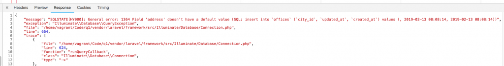

*Image care of Laravel Daily (https://laraveldaily.com/post/laravel-api-errors-and-exceptions-how-to-return-responses) used for educational purposes only.*

Another *excellent* reason for using this even when developing...

### Forces Developers to Think Like Consumers

Possibly a more important factor of this is the following:

> By turning off actual errors, you will be **forced** to think like API consumer who would receive just _"Server error"_ and no more information. In other words, you will be forced to think how to handle errors and provide useful messages from the API.


My thanks to Povilas Korop at [Laravel Daily](https://laraveldaily.com) for this tip.

- Korop, P. (2019). _Laravel API Errors and Exceptions: How to Return Responses_. Laravel Daily. https://laraveldaily.com/post/laravel-api-errors-and-exceptions-how-to-return-responses

‌
We will look at more error handling within this tutorial.


## Run the Dev Server from Command Line

In MS Terminal split the terminal into two sessions (<kbd>ALT</kbd>+<kbd>SHIFT</kbd>+<kbd>MINUS</kbd>).

In the new session:
```shell
cd SaaS-L12-API-Demo
```

and then execute 
```shell
composer run dev
```

## Publish Scramble Config

Publish the Scramble config and service provider:
```shell
php artisan vendor:publish --provider="Dedoc\Scramble\ScrambleServiceProvider"
php artisan vendor:publish --tag="scramble-config"
```


### Open Scramble API Docs in browser to test

Open a new browser window and go to `http://localhost:8000/docs/api`

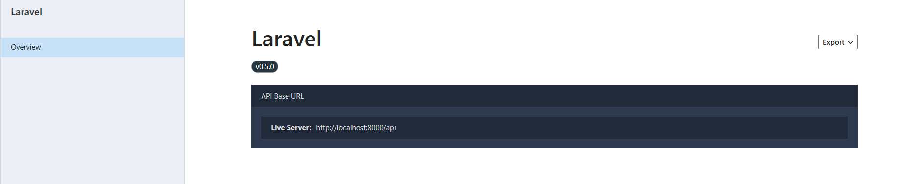


### Edit Scramble Config

Open the `config/scramble.php` file

Update the following lines:

```php
'version' => env('API_VERSION', '0.5.0'),

'description' => 'This is a small demonstration API for showing how to document using SCramble.'
```

## Add User Seeder 

Create a User Seeder:
```shell
php artisan make:seeder UserSeeder
```

Open the `database\seeders\UserSeeder.php` file and add:

```php
$users = [  
    [  
        'name' => 'Ad Ministrator',  
        'email' => 'admin@example.com',  
        'email_verified_at' => now(),  
        'password' => Hash::make('Password1'),
        'remember_token' => Str::random(10),  
    ],  
];  
  
  
DB::beginTransaction();  
foreach ($users as $user) {  
    User::create($user);  
DB::commit();
```


Update the `database\seeders\DatabaseSeeder.php`:

```php
  
$this->call([  
    UserSeeder::class,  
    CategorySeeder::class,  
]);
```


## Create a Model with the Trimmings

In your shell, execute: 

```shell
php artisan make:model Category --api -a
```

Open the `database\migrations\..._create_categories_table.php` migration.

### Up Method

Add to the UP method the two fields:
```php
$table->string('name',64)->required();  
$table->string('description')->nullable();
```

### Update Model

```php
<?php  
  
namespace App\Models;  
  
use Illuminate\Database\Eloquent\Factories\HasFactory;  
use Illuminate\Database\Eloquent\Model;  
use Illuminate\Notifications\Notifiable;  
  
class Category extends Model  
{  
  
    /** @use HasFactory<\Database\Factories\UserFactory> */  
    use HasFactory, Notifiable;  
  
    /**  
     * The attributes that are mass assignable.     
     *     
     * @var list<string>  
     */  
    protected $fillable = [  
        'name',  
        'description',  
    ];  
  
    /**  
     * The attributes that should be hidden for serialization.     
     *     
     * @var list<string>  
     */  
    protected $hidden = [  
  
    ];  
  
    /**  
     * Get the attributes that should be cast.     
     *     
     * @return array<string, string>  
     */  
    protected function casts(): array  
    {  
        return [  
  
        ];  
    }  
}
```


Open the `database\seeders\CategorySeeder.php` file and add:

```php
$categories = [  
    ['id'=>1,'name'=>'Unknown', 'description'=>'No category assigned'],  
    ['id'=>100, 'name'=>'dad', 'description'=>'Dad Jokes'],  
    ['name'=>'programmer', 'description'=>null],  
    ['name'=>'lightbulb', 'description'=>null],  
    ['name'=>'one-liner', 'description'=>null],  
    ['name'=>'mum', 'description'=>null],  
    ['name'=>'explicit', 'description'=>"Not for under 18 year olds"],  
];  
  
DB::beginTransaction();  
foreach ($categories as $category) {  
    Category::create($category);  
}  
DB::commit();
```

Remember to add the required Illuminate facades and models as needed.

Execute the migration and seeders.

```shell
php artisan migrate
php artisan db:seed
```


> If you need to run a seeder individually use:
> ```shell
> 	php artisan db:seed --class=ClassNameSeeder
> ```

## Add Routes

Edit the `routes\api.php` file and add the following:

```php
Route::apiResource('categories', \App\Models\Category::class);
```

Refresh the API Documentation preview.

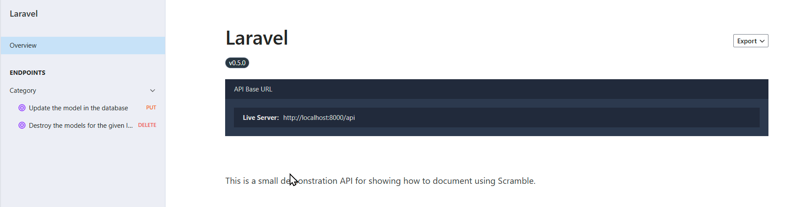


### Update Routes

You already have a simple route that allows for the API.

We will now amend this so that we are showing version 1 of the API.

Modify the route above so it is now wrapped in a Route Group:

```php
Route::group(['prefix' => 'v1'], function () {  
    Route::apiResource('categories', CategoryController::class);  
});
```

If you do this then make sure to update the Scramble config (`config/scramble.php`) so the version is shown to be 1.0.0 or similar.

When you refresh the API Docs you will now see the API version (1.0.0) and the endpoints with `v1`.


## Add `ApiResponse` Class

This generalised response class can be reused over and over again - a very useful tool in your arsenal.

Let's begin by creating the class...

### Create the class

Create the class using the command line.

```shell
php artisan make:class Classes/ApiResponseClass
```

In the new `App\Classes\ApiResponse.php` class we will remove the `__construct`, and add `Rollback`, `Throw`, `sendResponse`, `success` and `error` methods.

### Constructor

First is the constructor (`__construct`) method for the `ApiResponseClass`. This is automatically added by the make command.

```php
class ApiResponseClass  
{  
    /**  
     * Create a new class instance.     
     * TODO: Delete this method
     */
    public function __construct()  
    {  
        //  
    }  
```

It's empty, so delete this method as it is not needed. We will not be instantiating any objects using this class.

All methods are statically called.


### Rollback

The `rollback` method is defined to allow for undoing a transaction. It is best practice to use database transactions when dealing with data insertion, updates or deletes. 

When the rollback is called it will throw an error and message.

We declare the method as being static as we do not need to instantiate the class to use these methods.

```php
	/**
	* TODO: Add description and parameters for this method
	*/
    public static function rollback($e, $message = "Something went wrong! Process not completed")  
    {  
        DB::rollBack();  
        self::throw($e, $message);  
    }  
```

### Throw

The `throw` method is used by the class to log the error to file (or elsewhere), and then to send a response to the client in JSON format, with the error code 500 and the message.

We declare the method as being static as we do not need to instantiate the class to use these methods.

```php
	/**
	* TODO: Add description and parameters for this method
	*/
    public static function throw($e, $message = "Something went wrong! Process not completed")  
    {  
        Log::info($e);  
        throw new HttpResponseException(response()->json(["message" => $message], 500));  
    }  
```


### Send Response

Finally we get to where we actually send the response, the `sendResponse` method.

We pass the data to be sent to the client, a success message, and the required result code (default 200, OK) to the method, and it constructs an array with these items.

The response is then sent back to the client in JSON format.

We declare the method as being static as we do not need to instantiate the class to use these methods.

```php
  	/**
	* TODO: Add description and parameters for this method
	*/
    public static function sendResponse($result, $message, $code = 200)  
    {  
        $response = [  
            'success' => true,  
            'message'=>$message??null,  
            'data' => $result  
        ];  
        return response()->json($response, $code);  
    }  
    
/**
 * End of ApiResponseClass
 */
}
```

The `sendResponse` method is a generalised method, with the `success` and `error` methods using this to abstract (and at the same time, simplify) their content.

### success method

```php
public static function success($result, $message,$code = 200)  
{  
    $success=true;  
    return self::sendResponse($result,$message,$success, $code);  
}  
  
```


### error method

The error method calls the `sendResponse` with default of an HTTP code 500. 

```php  
public static function error($result, $message,  $code = 500)  
{  
    $success = false;  
    return self::sendResponse($result, $message,$success, $code);  
}
```


### Commonly used Error and Success Codes

Other appropriate response codes include:

| Code | Meaning               | Common use situations                                                                                                                                                                                                         |     |
| ---- | --------------------- | ----------------------------------------------------------------------------------------------------------------------------------------------------------------------------------------------------------------------------- | --- |
| 200  | OK                    | when an action succeeds successfully, unless one of 201, 202 or 204 are more appropriate                                                                                                                                      |     |
| 201  | Created               | Use when you add new data to the system (a new resource).   This happens AFTER the resource is created. If the system cannot create the resource immediately, then 202.                                                       |     |
| 202  | Accepted              | If a process takes a while to complete, then 202 is appropriate. The request may or may not get acted upon (as it it may succeed, fail or be disallowed) when finally processed. This is idea for batch processing responses. |     |
| 204  | No Content            | Usually the response to a PUT, PATCH or DELETE request, when the API does not want to send any form of response body back to the consuming application                                                                        |     |
| 400  | Bad request           | when you need to tell the consuming application they have sent a header or request in general that is badly conbstructed.                                                                                                     |     |
| 401  | Unauthorised          | When the credentials used to log-in are not correct, or missing. Also used when access to a resource is not permitted due to insufficient privileges.                                                                         |     |
| 403  | Forbidden             | When you need to tell the client that is authenticated (logged in) they do not have permission to access the requested resource                                                                                               |     |
| 404  | Not Found             | When a search gives zero results, a resource (record) does not exist, or there are no records in the resource collection                                                                                                      |     |
| 412  | Precondition failed   | When you need to provide response for conditions in the request header fields that shows a problem (i.e. false)                                                                                                               |     |
| 429  | Too many requests     | When a single application instance makes too many requests and 'floods' the API                                                                                                                                               |     |
| 500  | Internal server error | A problem with the server. For example a configuration issue.                                                                                                                                                                 |     |
| 503  | Service not available | The server is not able to service the request due to high load, it being down for maintenance etc.                                                                                                                            |     |

We have a number of references for you listed at the end of this tutorial.

We do recommend that you read this one:

- Gupta, L. (2018, May 30). _HTTP Status Codes_. REST API Tutorial. https://restfulapi.net/http-status-codes/ **Please read**

## Custom Error Responses

There are different ways of formulating a suitable way for JSON responses that are given by Laravel as default over the commonly created HTML based respionses.

This is important for an API as the consumer (the client application) should only be given JSON responses.

### Missing Routes

The first thing we can handle is the possibility of a route not being found. AKA the 404 error.

To handle this we can add a **default fallback route** to the routes file.

Open the `routes/api.php` routes file and at the very end of the file add:

```php
Route::fallback(function(){
    return response()->json([
        'message' => 'Page Not Found. If error persists, contact info@website.com'], 404);
});
```

In fact if we then use our `ApiResponse` class...

```php
Route::fallback(static function(){
    return ApiResponse::error(
	    [],
	    "Page Not Found. If error persists, contact info@website.com", 
	    404
	);

});
```

This would be customised for the application, and you could even have a link to a feedback form rather than the email address.

### Wherefore art thou, 404 - Model Not Found

The next error to handle will be the error created when a user tries to retrieve a record from the database that is not present.

This is usually responded to as a 404 - not found.

To create a better response we edit the `bootstrap/app.php` file and update ...

First add to the `use` lines the following:

```php
use Illuminate\Database\Eloquent\ModelNotFoundException;  
use Illuminate\Support\Facades\Request;
```


Next edit the `->withExceptions` section to read:

```php
->withExceptions(function (Exceptions $exceptions) {  
    $exceptions->render(function (ModelNotFoundException $e, Request $request) {  
        if ($request->wantsJson()) {  
            return response()->json([  
                'error' => 'Entry for ' . str_replace('App', '', $e->getModel()) . ' not found'],  
                404  
            );  
        }  
    });
```

We will come to a couple of other additional good ideas as we progress.


## Build the Requests (Store and Update Category Request)

Let's start with the `StoreCategoryRequest`.

Open the `App\Http\Requests\StoreCategoryRequest`  class.

We now edit the two methods, `authorise` and `rules`.

Allow the request to be used (default to true for now)

```php
public function authorize(): bool  
{  
    return true;  
}

```

Add the validation rules:

```php
    return [
	    'name' => ['required', 'string', 'max:64', 'min:3'],  
        'description' => ['optional', 'string', 'max:255'],  
    ];  
```


## Build the Category API

Open the `CategoryController` from the `App\Http\Controllers` namespace.

Now to update/add the API CRUD/BREAD methods:

We will do this in the order:
- Browse / Read (index method)
- Read / Read (show method)
- Add / Create (store method) 
- Edit / Update (update method)
- Delete / Delete (destroy method)

### Browse / Read (index method)

The index method will read:

```php
 /**  
  * Display a listing of the Categories. 
  * 
  */
  public function index()  
  {  
    $categories = Category::all();  
  
    if (count($categories) > 0) {  
        return ApiResponse::success($categories, "All categories");  
    }  
  
    return ApiResponse::error($categories, "No categories Found", 404);  
  }
```

### Read / Read (show method)

```php
/**  
 * Display the specified category. 
 * 
 * @param  int  $id  Integer ID of the Category  
 */
 public function show(int $id)  
 {  
    $category = Category::findOrFail($id)->get();  
  
    return ApiResponse::success($category, "Category Found");  
    
 }
```


### Add / Create (store method) 

```php
/**  
 * Store a newly created category resource in storage. 
 */
 public function store(StoreCategoryRequest $request)  
{  

    $category = Category::create($request->all());  
    return ApiResponse::success($category, "Category Added");  
}
```


### Edit / Update (update method)


### Delete / Delete (destroy method)


# Testing Using Postman

Postman is the most commonly used RESTful API testing application around.

It is free to use, unless you go beyond the free account limits.

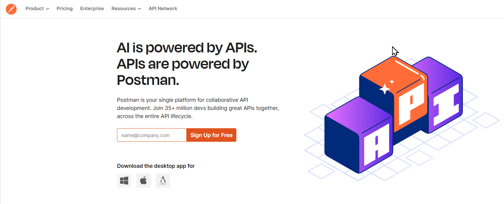
*Postman Home page*

## Create a Postman Account

To use postman you will need to create an account.

Head to [https://postman.com](https://postman.com) and either enter your student email address into the "**Sign Up for Free**" box, or click on the **Sign Up for Free** button or use this [Sign up for Postman](https://identity.getpostman.com/signup?continue=https%3A%2F%2Fgo.postman.co%2Fhome) link.

The latter option gives you the opportunity to sign up using your email address, your GitHub account or a Google account.

We will show the longer, eMail based join up process.

The steps below use the last option.

1) Fill out the form with your student email address, a suitable username and a password that has at least 7 characters including upper and lower case letters, numbers and symbols.
   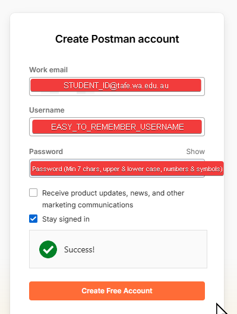

2) On the next page, Enter your name and then click on the drop down and select STUDENT.
   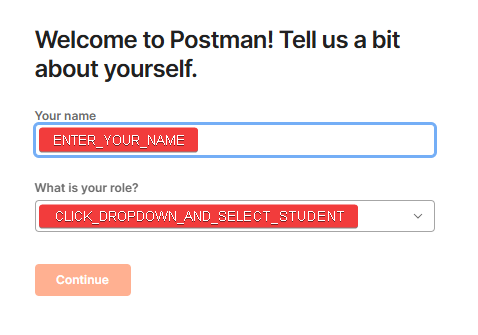
3) Click Continue and Postman's Web UI will open.

Whilst you were doing this an email will have been sent to your student account for you to verify the email address. Open your Outlook email and find the new message. Open this and click on the Verify Email button (The email will come from notifications@getpostman.com)

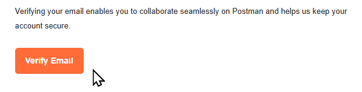

Once complete you will get a nice verification completed screen.

![[assets/postman-sign-up-4.png]]

## Download and Install the Desktop Client

The easiest way to work is to use the Desktop based Postman client.

On your own machines you may download it from the [Postman Downloads](https://postman.com/downloads) pages, and then install the application wherever you wish.

> Alternatively we will provide a version in the Laravel 6 project available from the [NMTAFE Laragon V6](https://github.com/AdyGCode/NMTAFE-Laragon-v6) GitHub repository. This may NOT be the most up to date version of the software.

Once installed open Postman.

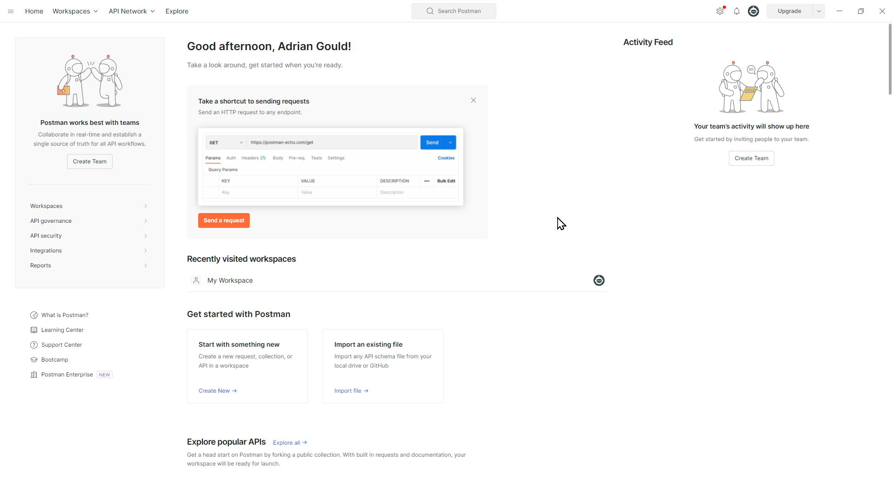


All instructions will be for the Desktop Application. 

> **Important:** Using the Web Application for Local Development of APIs requires more work. This is left to you to explore if you wish to use this way of testing.

### Workspaces

Workspaces are where you can work on a project.

They usually contain one or more collections, depending on how the team wishes to construct the testing.


### Collections

Collections are groups of API endpoints that are being tested.

One way to organise your collections is to create a new collection for each group of endpoints. For example "Categories", "Products", "Users" and even "Authentication".

We will use this way to organise our collections for the projects.

### Requests

A request is a singe endpoint test that will be sent to your API to obtain a response.

## Create a Workspace

Create a workspace for the API Demo we are using.

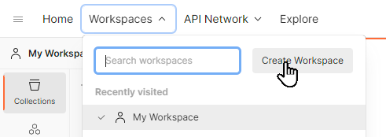

Click on Workspaces, and then click Create Workspace

Enter the name of the workspace, in our case `SaaS-L12-API-Demo-YYYY-SN`. If you wish add a short description. 

> **Remember** to change `YYYY` to the year and `SN` to `S` and the semester number.

The last part of creating a workspace will determine the visibility of the workspace and if it is for the public, a team, or personal (there are other options but they are not important at this time)

Visibility determines who can access this workspace.

| Option   | Visibility          |
| -------- | ------------------- |
| Personal | Only you can access |
| Private| Only invited team members can access |
| Team | All team members can access |
| Partner| Only invited partners and team members can access |
| Public| Everyone can view |

We will use the **Personal** option for this example.

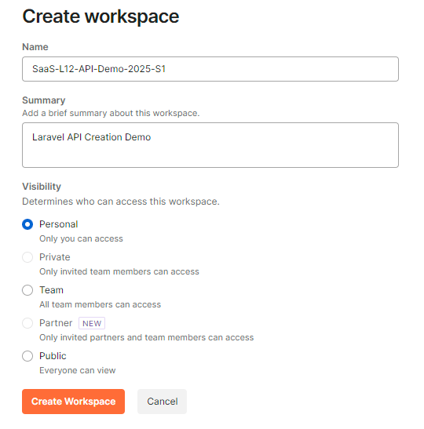


## Workspaces and Environments

One of the beautiful parts of the Postman application is that you can create Environments that allow you to add variables, and use other features for a specific purpose.

For example:
- When developing you work with a local instance of the application, and
- Before release you work with a remote testing deployment

Two Environments will allow you to specify the URL used for these, plus secrets and more.

We will create a new Environment and add at least one variable.

Click on the Environments button:


Then click on the `+` to add a new environment.

In the new name area enter `Localhost 8000` to represent the Localhost (your PC) and the port (8000 as we are using composer's run dev).

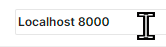


### Adding a Variable

There are two types of variable we may use in the Environment, Default (public) and Secret (Hidden).

We will use Default for our work, but consider **passwords, API Keys and so on should be secret**.

To add a variable names `url`, click in a cell under "Variable", and enter `url` for Uniform Resource Locator.

Leave the type as default.

Enter the initial variable as `http://localhost:8000/api`


***The image shows the URL missing the `/api` - ensure you add it to the end!***

When we use the variable we enclose it in `{{` double braces/moustache brackets `}}`.

## Create a Collection

Once you have your workspace, you may now create a collection.

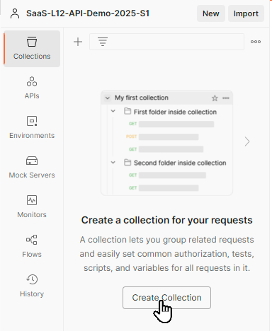


Click on the Create Collection button, or use the `+` to create a new collection.


When prompted (the text New Selection will be shown and selected) enter the collection name. 


In our case `Categories`.

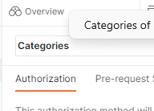


## Organising our Tests

It is possible to create folders to help organise the tests.

For example, you may want to split tests that require authentication from those that do not. 

To do so we create a folder.

For example, click on the ellipsis (`...`) next to the name of the collection (Categories) and add a new folder. Name the folder `Not Authenticated`. Repeat for a second folder `Authenticated`

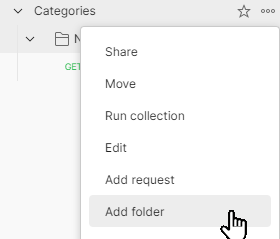


Here are the two folders:


## Create a request

> **Important:** we are not using authentication at this time.

As with our previous steps we can either use a link or button to create a new request within our new collection.

Click the ellipsis (`...`) next to the collection/folder you wish to add anew request, and select the `Add request` item.

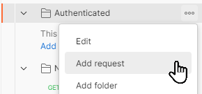

When you click the "New Request" text will be selected, and you may name the request what you want. 

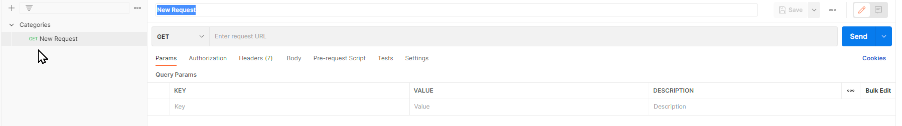

We recommend using simple text to name the requests.

Let's name out first request: `(NA) Get all categories`

We have used `NA` to remind us that this is an unauthenticated request.

### The Request Endpoint

The endpoint for a request is the URI that will be used to access the required resource/method.

In our case we are going to access:  `http://localhost:8000/api/v1/categories`.

This will be reduced in length as we have a variable to use for the protocol, hostname and port part, plus the first 'folder':

```text
{{url}}
```

With this in mind, we are now able to enter: `{{url}}/v1/categories`:

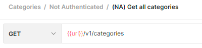


### The Request Type

We are performing a GET request so the first part stays as GET.

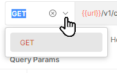


### The Request Headers

The headers are important with any form of API, and this is true for RESTful APIs.

We need to make sure we both send and receive data in JSON format.

To do this we:
- Update the Headers of the request, and
- Add a new option "`accept`" that will override the current `*/*` value.

Click on Headers


Then click on "7 hidden" next to the Headers heading:


This reveals the default headers that are part of the request.

At the bottom where it says "Key" and "Value" we will change them to:

| Item | Value |
| ---- | ----- |
| Key   | `Accept`       |
| Value    | `application/vnd.api+json`       |

This makes sure we send the request as an API request using JSON data and we get JSON data back from the application.


### Renaming Collections, Requests and Workspaces

If you clicked away from the selected text then you may edit the name of a collection, workspace, request et al by using the pencil icon that will appear when you hover over the name:

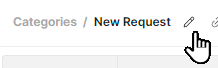


Finally, we click `SAVE` to make sure the request is saved.

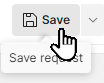

Once saved you can test the request by clicking `SEND`.

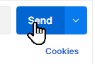

## Errors

If you forgot to add the `api` to the environment variable, then you will get an error like this.
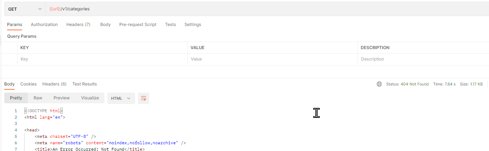


Make sure you navigate back to the Environments, and update the URL value.

*If you do change a value in the environment variables, make sure you save and then click rest all and save once more.*

Once this is completed retry the request.

## Successful requests

Successful requests will contain our data in the forma we expect.

Here are some examples.

The successful request to `http://localhost:8000/api/v1/categories`:


The successful request to find a non existent route (`http://localhost:8000/wrong-endpoint`):


The successful request to find a single category (`http://localhost:8000/api/v1/categories/100`)


The successful request to not find a single category (`http://localhost:8000/api/v1/categories/999`)


## Remaining Route Tests

The remaining details for the Routes (before we add authentication) are shown below.

| Name                 | Endpoint                      | Type | id  | name            | description                       |
| -------------------- | ----------------------------- | ---- | --- | --------------- | --------------------------------- |
| (NA) Create category | {{url}}/api/v1/categories     | POST | 200 | Dummy           | Just a Dummy Category for Testing |
| (NA) Update Category | {{url}}/api/v1/categories/200 | PUT  |     | Dummy Revisited |                                   |
| (NA) Delete Category | {{url}}/api/v1/categories/200 | PUT  |     |                 |                                   |

### Create Endpoint 

The create endpoint call requires the same basic settings as the GET, but it also needs a body.

Click on the **Body* heading.

Then select **Raw** and the type will be **JSON**.


In the editor area now add:
```json
{
    "id": 200,
    "name": "Dummy",
    "description": "Just a Dummy Category for Testing"
}
```

Click Beautify to have the JSON indented correctly.

Click Save and then Send.


### Exercise

You will create the Requests for the following:

- Add with missing name (POST)
- Add with missing name and description (POST)
- Add with missing category (POST)
- Update with non-existent category ID (PUT)
- Update with missing name (PUT)
- Update with missing description (PUT)
- Delete with non-existent category ID (DELETE)


## Authenticated Routes

Our previous version of the routes allowed for anyone to use the API to create, delete and so on. We need to protect the routes, and the easiest way to do this is to apply middleware.

After this we can add extra layers of security by using roles and permissions and other techniques.

Update the `routes/api.php` file to split the requests into *authenticatieon NOT required* and *authentication required* sections.

We use the `->only()` and/or `->except()` methods to do this.

The image shows the use of just the `only` method.


The code below shows using `except` and `only`.

```php
Route::group(['prefix' => 'v1'], function () {  
    Route::apiResource('categories', CategoryController::class)  
        ->except(['update','delete',]);  
  
    Route::apiResource('categories', CategoryController::class)  
        ->only(['update','delete',])  
        ->middleware('auth:sanctum');  
});
```


### Check the Routes Out

Remember that you may list the routes the applicaiton has using the `php artisan route:list` on the CLI.

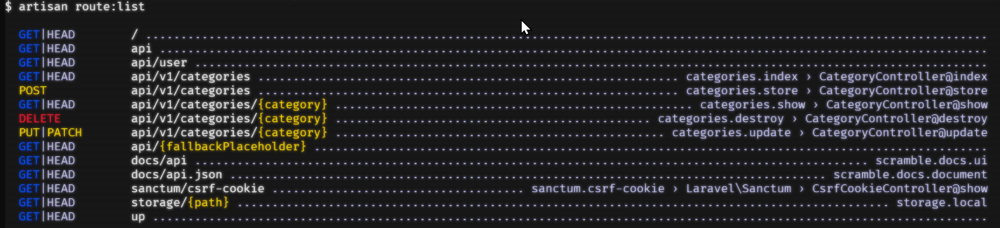


# References

- Albano, J. (2019, October 25). _Baeldung_. Baeldung. https://www.baeldung.com/rest-api-error-handling-best-practices
- Bello, G. (2024, February 8). _Best Practices for API Error Handling | Postman Blog_. Postman Blog. https://blog.postman.com/best-practices-for-api-error-handling/
- Gitlin, J. (2024, June 12). _API response codes: examples and error-handling strategies_. Merge.dev; Merge. https://www.merge.dev/blog/api-response-codes
- Gitlin, J. (2024, June 12). _API response codes: examples and error-handling strategies_. Merge.dev; Merge. https://www.merge.dev/blog/api-response-codes
- Gupta, L. (2018, May 30). _HTTP Status Codes_. REST API Tutorial. https://restfulapi.net/http-status-codes/
- Korop, P. (2019). _Laravel API Errors and Exceptions: How to Return Responses_. Laravel Daily. https://laraveldaily.com/post/laravel-api-errors-and-exceptions-how-to-return-responses
- Ploesser, K. (2022, July 8). _10 Error Status Codes When Building APIs For The First Time And How To Fix Them_. 10 Error Status Codes When Building APIs for the First Time and How to Fix Them | Moesif Blog. https://www.moesif.com/blog/technical/monitoring/10-Error-Status-Codes-When-Building-APIs-For-The-First-Time-And-How-To-Fix-Them/
- The Postman Team. (2023, September 20). _What Are HTTP Status Codes? | Postman Blog_. Postman Blog. https://blog.postman.com/what-are-http-status-codes/
- Umbraco. (2019, May 3). _What are HTTP status codes?_ Umbraco.com; Umbraco. https://umbraco.com/knowledge-base/http-status-codes/
- _Getting started - Scramble_. (2025). Dedoc.co. https://scramble.dedoc.co/usage/getting-started

‌

‌

- https://scramble.dedoc.co/usage/getting-started
- https://www.binaryboxtuts.com/php-tutorials/laravel-tutorials/how-to-make-laravel-12-rest-api/
- https://medium.com/@dev.muhammadazeem/building-a-restful-api-with-laravel-a-step-by-step-guide-d9ae6dca9873
- https://medium.com/@andreelm/laravel-api-documentation-with-scramble-best-practices-and-tutorial-317950599982
- https://laravel-news.com/scramble-laravel-api-docs


---
# Found a Problem?
 
If you spotted any problems (including missing details) in notes or other materials, then make sure you note that, and as a big help to your lecturer, you could fork the notes repository, create an issue, create a fix to the issue, and submit a pull request.


---

# END
