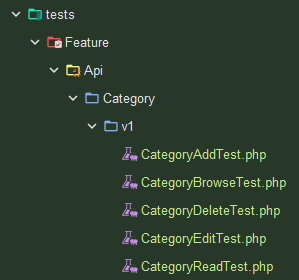

---
theme: default
paginate: true
footer: © Copyright 2024, Adrian Gould & NM TAFE
banner: "![[Black-Red-Banner.svg]]"
banner_x: 1
banner_y: "0"
auto-scaling: true
size: 1920x1080
color: "#ccc"
backgroundColor: "#060606"
tags:
  - SaaS
  - APIs
  - Back-End
  - Journal
created: 2024-07-31T07:52
updated: 2025-03-27T18:46

---

# Session 07 API Testing Revisited

## Software as a Service - Back-End Development

Developed by Adrian Gould

---

```table-of-contents
title: # Contents
style: nestedList
minLevel: 0
maxLevel: 3
includeLinks: true
```

---

# Session 07 Testing Revisited: Organisation


So far we have created and documented a Categories API in [S06-Using-Scramble-to-Document-an-API](Session-06/S06-Using-Scramble-to-Document-an-API.md) and [S07-Using-Scramble-to-Document-an-API-2](Session-07/S07-Using-Scramble-to-Document-an-API-2.md).

Whilst doing this we omitted the testing part of development, to make the process a little smother to understand and complete.

In this set of notes we are going to develop a method to organise tests as well as provide test examples for the complete BREAD/CRUD method of working with databases.

These tests are not optimised, but provide a good basis for you to develop further.

These tests concentrate on the Categories Feature.

## Test Organisation

A common way to organise tests is to place them into the tests/Feature or tests/Unit folders, keeping each group of tests together in a single file per set of tests.

This can lead to issues such as:
- excessively long code files
- uncertainty if a test has been completed
- difficulty tracking issues in a test

So what are we proposing?

The proposal is to:
- Create a folder for each feature
- Split the tests into B.R.E.A.D. or C.R.U.D. groups and have a test file for each group

How will we achieve this? We will use artisan's ability to create files and folders for us based on what we give it.

For out Categories Feature we will use the following structure:
- tests
	- Feature
		- Api
			- Category
				- v2
				- ...
	- Unit
		- ...


## Creating a New (Category) Pest Test

To create a new Pest based API Feature test, we use the following:

```shell
php artisan make:test Api/Category/V1/CategoryBrowseTest --pest
```

This automatically creates the folder structure under the `tests/Feature` folder, plus the "Category Browse Test" file.

You can repeat the task for the other files at this point if you wish.

```shell
php artisan make:test Api/Category/V1/CategoryReadTest --pest
php artisan make:test Api/Category/V1/CategoryEditTest --pest
php artisan make:test Api/Category/V1/CategoryAddTest --pest
php artisan make:test Api/Category/V1/CategoryDeleteTest --pest
```

Here is the PhpStorm folder view:




Let's now work on each of the sets of tests.

## Category Browse Test

Open the `CategoryBrowseTest.php` file.

Edit the file.

We will quickly go over each part of the code that resides after the `<?php` opening tag. Add each part in turn after the previous part.

We start by adding the required `use` lines to include the User and Category models plus the `RefreshDatabase` trait that will drop all data from the database and reseed as needed.

```php
use App\Models\Category;  
use App\Models\User;  
use Illuminate\Foundation\Testing\RefreshDatabase;  
```


We now tell the testing framework to use the Refresh Database class EVERY time a test is executed.

> ### ⚠️ WARNING: 
> 
> The Refresh Database should NEVER be used on a production system as ALL the existing data is removed.
> 
> Use a separate database for all these tests, even better use an "in memory" database.


```php 
// Necessary to access Laravel testing helpers and
// database factories as needed  

uses(  
    RefreshDatabase::class  
);  
```

#### First Test (AUS defeat ENG by 3 wickets)

We are now ready to add our First Test.

This test will do the following:
- reset the database (automatic)
- create a user to perform the 'creation of fake categories'
- create a token for the user's interaction
- create five categories in the database
```php  
test('five categories are created and returned in the list', function () {  
    $user = User::factory()->create();  
    $token = $user->createToken('TestToken')->plainTextToken;  
  
    $categories = Category::factory()->count(5)->create();  
```

Next we make a request to the "Categories Index" route (http://DOMAIN/api/v2/categories) :
```php  
    $response = $this->withHeader('Authorization', 'Bearer ' . $token)  
        ->getJson(route('categories.index'));  
```

> **NB:** If you have multiple versions of an endpoint, the tests may need to use a more direct approach to the endpoints and use the likes of `api/v2/categories` or such.

We now process the response and:
- verify we got a 200 OK response
- assert the data that is returned is of the correct data structure (has success, message and data fields, with the data field having zero or more records with an id, name, description, created & updated at dates)
- assert we got five results back
```php  
    $response->assertStatus(200)  
        ->assertJsonStructure([  
            'success',  
            'message',  
            'data' => [  
                '*' => [
	                'id', 
	                'name', 
	                'description', 
	                'created_at', 
	                'updated_at'
				]  
            ]  
        ])  
        ->assertJsonCount(5, 'data');  
```

If this is asserted as OK, then we check if the data retrieved is the same as the data we inserted into the table.
```php  
    foreach ($categories as $category) {  
        $response->assertJsonFragment([  
            'id' => $category->id,  
            'name' => $category->name,  
            'description' => $category->description  
        ]);  
    }  
  
});  
```


#### Second Test (ENG defeat AUS by 1 run)

The second test will perform a similar test to the first, except we are going to verify that the API returns a correctly formed "404 not found" error to indicate no categories exist in the data at this time.

So, we start the test with a title to make it identifiable.
Next the test:
- creates a fake user
- creates the login token
- sends a request to the API's 'categories index' endpoint
```php  
test('index returns 404 when no categories exist', function () {  
    $user = User::factory()->create();  
    $token = $user->createToken('TestToken')->plainTextToken;  
  
    $response = $this->withHeader('Authorization', 'Bearer ' . $token)  
        ->getJson(route('categories.index'));  
```

We are now ready to assert the status of the test.

The assertions are in two (chained) stages:
- Verify a 404 Not found error response if provided.
- Verify the data, message and success fields are as expected.

```php  
    $response->assertStatus(404)  
        ->assertJson([  
            'success' => false,  
            'message' => 'No categories found',  
            'data' => []  
        ]);  
});
```


And that is it. The Browse tests are complete (apart from testing with pagination).

Next, lets carry on with the Read Tests.

### Read Tests

Next we do the Read tests.

The start of the file is basically identical to the Browse test file, so we will not repeat the description:

```php
<?php  
  
use App\Models\Category;  
use App\Models\User;  
use Illuminate\Foundation\Testing\RefreshDatabase;  
use Illuminate\Support\Carbon;  
  
// Necessary to access Laravel testing helpers and database factory stuff  
uses(  
    RefreshDatabase::class  
);  
  
```

#### Third Test: Category Exists Read Test

Now we add the first of the tests, where the category exists and is returned as expected.

To do this we:
- Create a user
- Grab the user token
- Create a new fake category
- Send the request with the token and the category's id

```php

test('category exists and is returned correctly', function () {  
    $user = User::factory()->create();  
    $token = $user->createToken('TestToken')->plainTextToken;  
  
    $category = Category::factory()->create();  
  
    $response = $this->withHeader('Authorization', 'Bearer ' . $token)  
        ->getJson(route('categories.show', $category->id));  
```

We then check the response in three steps:
- verify a 200 OK response
- Verify the data structure is as excpected

```php

    $response->assertStatus(200)  
        ->assertJsonStructure([  
            'success',  
            'message',  
            'data' => ['id', 'name', 'description', 'created_at', 'updated_at']  
        ])  
```

- verify the data retrieved is as expected (verifies against the data from the fake category creation)

```php
        ->assertJson([  
            'success' => true,  
            'message' => 'Category found',  
            'data' => [  
                'id' => $category->id,  
                'name' => $category->name,  
                'description' => $category->description  
            ]  
        ]);  
});  
  
```

#### Fourth Test: Category read non existent category

As before the start of the test is identical to the previous tests.

```php
test('category does not exist and returns 404', function () {  
    $user = User::factory()->create();  
    $token = $user->createToken('TestToken')->plainTextToken;  
    
```

After creating the user and token, we next define a non existent ID for retrieval, and send the request with this ID to the "Categories Show" endpoint.

```php
    $nonExistentCategoryId = 999;  
  
    $response = $this->withHeader('Authorization', 'Bearer ' . $token)  
        ->getJson(route('categories.show', $nonExistentCategoryId));  
```

With the response from this request, we now check for:
- a response code of 404
- a message that reads "Category not found", and
- no data

```php

    $response->assertStatus(404)  
        ->assertJson([  
            'success' => false,  
            'message' => 'Category not found',  
            'data' => []  
        ]);  
});

```

And that is the basic tests for this part of the BREAD.

### Edit Tests

Ok, we have reached the half way point, and we tackle tests for editing data.

These tests will 
- update both the name and description
- update the name and remove the description
- obtain error messages when the name is missing

The start of the Category Edit Test file is:

```php
<?php
use App\Models\Category;  
use App\Models\User;  
use Illuminate\Foundation\Testing\RefreshDatabase;  
use Illuminate\Support\Carbon;  
  
// Necessary to access Laravel testing helpers and database factory stuff  
uses(  
    RefreshDatabase::class  
);  
```

#### Fifth Test (AUS defeat ENG by a innings & 20 runs)

Now we add the update with name and description. From this point we will explain the main parts, but common code will be left unexplained.

```php
test('update an existing category with new details (name and description)', function () {  
    $user = User::factory()->create();  
    $token = $user->createToken('TestToken')->plainTextToken;  
```

For the edits we do two steps:
- Create a fake category
- Create faked update data

```php
    $category = Category::factory()->create();  
    $updatedData = Category::factory()->make()->toArray();  

  ```

We then call the "Category Update" route via a "PUT" request:

```php

    $response = $this->withHeader('Authorization', 'Bearer ' . $token)  
        ->putJson(route('categories.update', $category->id), $updatedData);  

  ```

Next we ascertain if the retunred JSON is the correct structure and iff the results were as expected:
- 200 OK
- Success true
- Message 'Category updated"'
- Data with updated category details

```php

    $response
	    ->assertStatus(200)  
        
        ->assertJsonStructure([  
            'success',  
            'message',  
            'data' => ['id', 'name', 'description', 'created_at', 'updated_at']  
        ])  
        
        ->assertJson([  
            'success' => true,  
            'message' => 'Category updated',  
            'data' => [  
                'id' => $category->id,  
                'name' => $updatedData['name'],  
                'description' => $updatedData['description']  
            ]  
        ]);  
```

Finally we verify if the database has the updated category and data:

```php
  
    $this->assertDatabaseHas('categories', [  
        'id' => $category->id,  
        'name' => $updatedData['name'],  
        'description' => $updatedData['description']  
    ]);  
});  
```

#### Sixth Test: 

```php
  
test('update an existing category with new details (name only)', function () {  
    $user = User::factory()->create();  
    $token = $user->createToken('TestToken')->plainTextToken;  
  
    $category = Category::factory()->create();  
    $updatedData = Category::factory()->make(['description' => null])->toArray();  
```


```php
  
    $response = $this->withHeader('Authorization', 'Bearer ' . $token)  
        ->putJson(route('categories.update', $category->id), $updatedData);  
  
    $response->assertStatus(200)  
        ->assertJsonStructure([  
            'success',  
            'message',  
            'data' => ['id', 'name', 'created_at', 'updated_at']  
        ])  
```


```php
        ->assertJson([  
            'success' => true,  
            'message' => 'Category updated',  
            'data' => [  
                'id' => $category->id,  
                'name' => $updatedData['name']  
            ]  
        ]);  
```


```php
  
    $this->assertDatabaseHas('categories', [  
        'id' => $category->id,  
        'name' => $updatedData['name']  
    ]);  
});  
  
```


```php
test('update an existing category with missing name', function () {  
    $user = User::factory()->create();  
    $token = $user->createToken('TestToken')->plainTextToken;  
  
    $category = Category::factory()->create();  
    $updatedData = ['description' => 'Updated description without name'];  
  
    $response = $this->withHeader('Authorization', 'Bearer ' . $token)  
        ->putJson(route('categories.update', $category->id), $updatedData);  
```


```php
  
    $response->assertStatus(422)  
        ->assertJsonValidationErrors(['name']);  
});
```


### Add Tests

```php
<?php  
  
use App\Models\Category;  
use App\Models\User;  
use Illuminate\Foundation\Testing\RefreshDatabase;  
use Illuminate\Support\Carbon;  
  
// Necessary to access Laravel testing helpers and database factory stuff  
uses(  
    RefreshDatabase::class  
);  
  
test('API creates new category (full details)', function () {  
    $user = User::factory()->create();  
    $token = $user->createToken('TestToken')->plainTextToken;  
```


```php
  
    $category = Category::factory()->make()->toArray();  
    $name = $category['name'];  
    $description = $category['description'];  
  
    $response = $this->withHeaders(['Authorization' => 'Bearer ' . $token,])  
        ->postJson(route('categories.store', $category)); // call '/api/v2/categories'  
```


```php
  
    $response->assertStatus(201)  
        ->assertJsonStructure([  
            'success',  
            'message',  
            'data' => ['id', 'name', 'description', 'created_at', 'updated_at']  
        ])  
```


```php
        ->assertJson([  
            'success' => true,  
            'message' => 'Category created',  
            'data' => [  
                'name' => $name,  
                'description' => $description,  
            ]  
        ]);  
```


```php
  
    $category = Category::whereName($name)->first();  
    $this->assertNotNull($category);  
    $this->assertTrue(Carbon::parse($category->created_at)->diffInSeconds(now()) <= 5);  
    $this->assertTrue(Carbon::parse($category->updated_at)->diffInSeconds(now()) <= 5);  
  
});  
```


```php
  
test('API creates new category (name only)', function () {  
    $user = User::factory()->create();  
    $token = $user->createToken('TestToken')->plainTextToken;  
  
    $category = Category::factory()->make(['description' => null])->toArray();  
    $name = $category['name'];  
    $description = $category['description'];  
  ```


```php

    $response = $this->withHeaders(['Authorization' => 'Bearer ' . $token,])  
        ->postJson(route('categories.store', $category)); // call '/api/v2/categories'  
```


```php
  
    $response->assertStatus(201)  
        ->assertJsonStructure([  
            'success',  
            'message',  
            'data' => ['id', 'name', 'created_at', 'updated_at']  
        ])  
```


```php
        ->assertJson([  
            'success' => true,  
            'message' => 'Category created',  
            'data' => [  
                'name' => $name,  
            ]  
        ]);  
```


```php
  
    $category = Category::whereName($name)->first();  
    $this->assertNotNull($category);  
    $this->assertTrue(Carbon::parse($category->created_at)->diffInSeconds(now()) <= 5);  
    $this->assertTrue(Carbon::parse($category->updated_at)->diffInSeconds(now()) <= 5);  
  
});  
  
```


```php
  
test('an error is returned when name is not provided', function () {  
    $user = User::factory()->create();  
    $token = $user->createToken('TestToken')->plainTextToken;  
```


```php
  
    $data = ['description' => 'A category without a name'];  
```


```php
  
    $response = $this->withHeader('Authorization', 'Bearer ' . $token)  
        ->postJson(route('categories.store'), $data);  
```


```php
  
    $response->assertStatus(422)  
        ->assertJsonValidationErrors(['name']);  
});
```


### Delete Tests


```php
<?php  
  
use App\Models\Category;  
use App\Models\User;  
use Illuminate\Foundation\Testing\RefreshDatabase;  
  
// Necessary to access Laravel testing helpers and database factory stuff  
uses(  
    RefreshDatabase::class  
);  
  
  
it('can delete a category', function () {  
    $user = User::factory()->create();  
    $token = $user->createToken('TestToken')->plainTextToken;  
```


```php
  
    $category = Category::factory()->create();  
    $name = $category->name;  
	$description = $category->description;
```


```php

    $response = $this->withHeader('Authorization', 'Bearer ' . $token)  
        ->deleteJson(route('categories.destroy', $category->id));  
```


```php
  
    $response->assertStatus(200)  
        ->assertJsonStructure([  
            'success',  
            'message',  
            'data' => ['id', 'name', 'description', 'created_at', 'updated_at']  
        ])  
```


```php
        ->assertJson([  
            'success' => true,  
            'message' => 'Category deleted',  
			'data' => [  
			    'name' => $name,  
			    'description' => $description,  
			] 
        ]);  
```


```php
        
    expect(Category::find($category->id))->toBeNull();  
});  
  
```


```php
  
it('returns error when trying to delete a non-existent category', function () {  
    $user = User::factory()->create();  
    $token = $user->createToken('TestToken')->plainTextToken;  
  
    $category = Category::factory()->create();  
```


```php
  
    $nonExistentId = 9999;  
```


```php
  
    $response = $this->withHeader('Authorization', 'Bearer ' . $token)  
        ->deleteJson(route('categories.destroy', $nonExistentId));  
```


```php
  
    $response->assertStatus(404)  
        ->assertJsonStructure([  
            'success',  
            'message',  
            'data' => []  
        ])  
```


```php
        ->assertJson([  
            'success' => false,  
            'message' => 'Category not found',  
            'data' => []  
        ]);  
});

```

## Source Code

You may find the source code for this demonstration API here:

https://github.com/AdyGCode/SaaS-L12-API-Scramble-Demoi


# Additional Learning

See [S07-Exercises-and-Additional-Learning](../Session-07/S07-Exercises-and-Additional-Learning.md).

# References

- Albano, J. (2019, October 25). _Baeldung_.
  Baeldung. https://www.baeldung.com/rest-api-error-handling-best-practices
- Bello, G. (2024, February 8). _Best Practices for API Error Handling | Postman Blog_. Postman
  Blog. https://blog.postman.com/best-practices-for-api-error-handling/
- _Getting started - Scramble_. (2025).
  Dedoc.co. https://scramble.dedoc.co/usage/getting-started
- Gitlin, J. (2024, June 12). _API response codes: examples and error-handling strategies_.
  Merge.dev; Merge. https://www.merge.dev/blog/api-response-codes
- Gupta, L. (2018, May 30). _HTTP Status Codes_. REST API
  Tutorial. https://restfulapi.net/http-status-codes/
- Korop, P. (2019). _Laravel API Errors and Exceptions: How to Return Responses_. Laravel
  Daily. https://laraveldaily.com/post/laravel-api-errors-and-exceptions-how-to-return-responses
- Ploesser, K. (2022, July 8). _10 Error Status Codes When Building APIs For The First Time And
  How To Fix Them_. 10 Error Status Codes When Building APIs for the First Time and How to Fix
  Them | Moesif
  Blog. https://www.moesif.com/blog/technical/monitoring/10-Error-Status-Codes-When-Building-APIs-For-The-First-Time-And-How-To-Fix-Them/
- The Postman Team. (2023, September 20). _What Are HTTP Status Codes? | Postman Blog_. Postman
  Blog. https://blog.postman.com/what-are-http-status-codes/
- Umbraco. (2019, May 3). _What are HTTP status codes?_ Umbraco.com;
  Umbraco. https://umbraco.com/knowledge-base/http-status-codes/


- https://www.binaryboxtuts.com/php-tutorials/laravel-tutorials/how-to-make-laravel-12-rest-api/
- https://medium.com/@dev.muhammadazeem/building-a-restful-api-with-laravel-a-step-by-step-guide-d9ae6dca9873
- https://medium.com/@andreelm/laravel-api-documentation-with-scramble-best-practices-and-tutorial-317950599982
- https://laravel-news.com/scramble-laravel-api-docs

---

# Found a Problem?

If you spotted any problems (including missing details) in notes or other materials, then make
sure you note that, and as a big help to your lecturer, you could fork the notes repository,
create an issue, create a fix to the issue, and submit a pull request.


---

# END
