# Image Uploads and APIs

Software as a Service - Back-End Development

Session 07

Developed by Adrian Gould

Repository: https://github.com/AdyGCode/SaaS-Laravel-11-API-Files-Uploads

---


```table-of-contents
title: # Contents
style: nestedList
minLevel: 0
maxLevel: 3
includeLinks: true
```


---

### Acknowledgement

This tutorial is based on https://www.devopsschool.com/blog/how-to-store-and-retrieve-image-from-the-database-in-laravel/

---

# Creating a File Upload API

For this tutorial we will start a fresh Laravel application. You may then apply the principles to your own code.

This tutorial does not include tests, so you should investigate and practice the creation of suitable tests for the API.

Most up to date code may be found on [GitHub - SaaS Laravel 11 API Files Uploads](https://github.com/AdyGCode/SaaS-Laravel-11-API-Files-Uploads.git). 


---

## Create new Laravel 11 Application

```shell
cd ~/Source/Repos
laravel new SaaS-Laravel-11-API-File-Upload
```

Respond to the questions with the following:

- Would you like to install a starter kit? `breeze`
- Which Breeze stack would you like to install? `api`
- Which testing framework do you prefer? `Pest`
- Would you like to initialise a Git repository? `yes`
- Which database will your application use? `SQLite`
- Would you like to run the default database migrations? `yes`

Change into the new project folder:

```shell
cd SaaS-Laravel-11-API-File-Upload
```

Because we have selected the Breeze and API options, the Sanctum configuration and database migrations have been completed during this installation process.

As we are using SQLite for development, we will make sure the database file is present:

```shell
touch database/database.sqlite
```

### Edit `.env` and Duplicate

Open the `.env` file and make the following changes:

| Item              | Value                                       |
| ----------------- | ------------------------------------------- |
| APP_NAME          | XXX Laravel 11 API with File Uploads        |
| APP_DEBUG         | true                                        |
| APP_TIMEZONE      | UTC                                         |
| APP_URL           | http://saas-laravel-11-api-file-upload.test |
| APP_LOCALE        | en_AU                                       |
| MAIL_MAILER       | smtp                                        |
| MAIL_FROM_ADDRESS | saas-laravel-11-api-file-upload@example.com |
| MAIL_HOST         | 127.0.0.1                                   |
| MAIL_PORT         | 2525                                        |

Remember that `XXX` are your initials!

Save the changes and then make a copy of the file and name it: `.env.dev`.

### Add Pest Plugins

We will be adding the following Pest plugins:

- faker -  *allows the fake namespace in your tests*
- Laravel -  *this adds extra commands for use with artisan*
- watch -  *this will let you watch for file changes and have pest automatically re-run*

Windows users (non WSL), use the following commands:

```bash
composer require pestphp/pest-plugin-faker --dev 
composer require pestphp/pest-plugin-laravel --dev
```

or as one line:

```bash
composer require pestphp/pest-plugin-faker --dev pestphp/pest-plugin-laravel --dev
```

For WSL, MacOS and Linux users you may use:
```bash
composer require pestphp/pest-plugin-faker --dev 
composer require pestphp/pest-plugin-laravel --dev
composer require pestphp/pest-plugin-watch --dev
```

or as one line:

```bash
composer require pestphp/pest-plugin-faker --dev pestphp/pest-plugin-laravel --dev pestphp/pest-plugin-watch --dev
```


> **Note:** The PEST watch plugin is **NOT** usable on Windows systems due to the way that pipes block processes from allowing other processes to run.
> 
> MacOS and Linux users may use `./vendor/bin/pest --watch` or `php artisan test --watch`.
> 
> Remember that PhpStorm *does* have the ability to watch and run tests automatically.


### Add Scribe

Add the Scribe package & publish the configuration to Laravel:

```shell
composer require --dev knuckleswtf/scribe
php artisan vendor:publish --tag=scribe-config
```

### Edit the Scribe configuration

Open the configuration file in PhpStorm (<kbd>shift</kbd> <kbd>shift</kbd> type in `apidoc-` and find the `config/scribe.php` file.)

Make these changes, with strings being in quotes, and booleans being unquoted…

- type: `laravel`,
- title: `SaaS API File Upload Demo`,
- description: `Developed by YOUR_NAME_HERE`,
- use_csrf: `true`,
- example_languages: `bash`, `javascript`, `php`, `python`

This configuration means that Scribe will use the Laravel routing and …

It will also add CSRF to form requests, and automatically generate examples of the API using Bash (curl), JavaScript, PHP and Python.

### Configure Sanctum

Make sure that the `app\bootstrap\app.php` file contains the following lines:

```php
->withMiddleware(function (Middleware $middleware) {  
    $middleware->api(prepend: [  
        \Laravel\Sanctum\Http\Middleware\EnsureFrontendRequestsAreStateful::class,  
    ]);
```

### Add HasApiTokens to the User Model

Edit the `app\Models\User.php` file and add the required `HasApiTokens` trait.

Before the `class User` line add:

```php
use Laravel\Sanctum\HasApiTokens;
```

In the `class` definition update the `use` line to read:

```php
use HasFactory, Notifiable, HasApiTokens;
```

This enables us to use tokens for verifying login status and whom  originated requests.

### Create a Symbolic Link for File Storage

To allow access via the public folder to the files we need to create a symbolic link (symlink) from `/storage/app/` to `/public/`.

Run this command:

```bash
artisan storage:link
```

> **Aside:**
> 
> This does make the files directly accessible but each file has a 'meaningless' UUID for the name, which will make it harder to discover and download.


## Create Base Controller

In a previous tutorial we created an `ApiResponseClass` to deal with the responses... this time we will extend the Controller class to create a new "Base Controller" and in here create the response methods we need.

```bash
php artisan make:controller BaseController
```

Now edit the controller...

First add a `sendResponse` method:

```php
/**  
 * success response method.
 *
 * @return \Illuminate\Http\JsonResponse  
 */  
public function sendResponse($result, $message): JsonResponse  
{  
    $response = [  
        'success' => true,  
        'data' => $result,  
        'message' => $message,  
    ];  
    return response()->json($response, 200);  
}  
```

Next add the `sendError` method:

```php
/**  
 * return error response.
 *
 * @return \Illuminate\Http\JsonResponse  
 */  
public function sendError(
	$error, 
	$errorMessages = [], 
	$code = 404): JsonResponse  
{  
    $response = [  
        'success' => false,  
        'message' => $error,  
    ];  
    if (!empty($errorMessages)) {  
        $response['data'] = $errorMessages;  
    }  
    return response()->json($response, $code);  
}  
```

We will use this with our Controllers.

> **Note:** 
> 
> As the developer, you make your decisions on how you implement the components of a solution. 
> 
> When working in a team, these decisions should be for all the team to apply. 
> 
> When working for an established company, they will often have requirements for code that you will apply.


<div class="page-break" style="page-break-before: always;"></div>


## Prepare for Products Feature

We start by creating the product migration, model, factory and controller... testing as we go.

The API Endpoint for this feature will be based on URI structure:

```http
/api/v1/products
```

We will implement the endpoints...

| BREAD | Verb   | Endpoint                |
| ----- | ------ | ----------------------- |
| B     | GET    | `/api/v1/products`      |
| R     | GET    | `/api/v1/products/{id}` |
| E     | PUT    | `/api/v1/products/{id}` |
| A     | POST   | `/api/v1/products`      |
| D     | DELETE | `/api/v1/products/{id}` |

## Create Products Migration

We will create a new products table migration:

```shell
php artisan make:migration create_products_table
```

Now edit the new `yyyy_mm_dd_hhmmss_create_products_table.php` file that has been created in the `database\migrations\` folder and add the following definitions:

| field name        | type   | size | other    |
| ----------------- | ------ | ---- | -------- |
| name              | string | 128  |          |
| detail            | text   |      | nullable |
| original_filename | string | 255  | nullable |
| mime_type         | string | 64   | nullable |
| stored_filename   | string | 255  | nullable |

Here is a set of sample definitons:

```php
$table->string('name', 128);  
$table->text('detail')->nullable();  
$table->string('original_filename', 255)->nullable();  
$table->string('mime_type', 64)->nullable();  
$table->string('stored_filename', 255)->nullable();
```

### Execute the Migration

Run the migration using:

```bash
php artisan migrate
```

If you have errors then make sure to fix them before continuing.


## Create the Product model

We will create a new product model:

```shell
php artisan make:model Product
```

Edit the model and update the fillable and other details as needed:

```php
/**  
 * The attributes that are mass assignable. 
 * 
 * @var array<int, string>  
 */
protected $fillable = [  
    'name',  
    'detail',  \
    'original_filename',
    'mime_type',
    'stored_filename',
];  
  
/**  
 * The attributes that should be hidden for serialization. 
 * 
 * @var array<int, string>  
 */
protected $hidden = [];  
  
/**  
 * Get the attributes that should be cast. 
 * 
 * @return array<string, string>  
 */
protected function casts(): array  
{  
    return [];  
}
```


## Create a Product Factory

We will create a new product factory:

```shell
php artisan make:factory ProductFactory
```

Edit the factory to have the following `definition` method detail:

```php
	// This will create a string of 3 words  
	'name' => fake()->words(3, true), 
	// This will create a random sentence / or null description
	'detail' => random_int(1, 5) > 2 ? fake()->sentence(10) : null,

    'original_filename'=> null,
    'mime_type'=> null,
    'stored_filename'=> null,
    ```


## Create the API Routes

When creating the sample code, we used a technique to exclude selected HTTP Verb actions using the `except` modifier in the API Routes file.

For example:
```php
Route::group(['prefix' => 'v1'], function () {  
    Route::apiResource('/products',
                       ProductController::class)  
        ->except(['create', 'update', 'delete',]);  
    
});
```

This prevents anything except the index and show methods being used.

Open the `routes/api.php` file, and add:

```php
use App\Http\Controllers\ProductController;
```

To the use lines at the top of the file.

Then add:

```php
Route::group(['prefix' => 'v1'], function () {  
    Route::apiResource('/products', 
                       ProductController::class)  
        ->except(['index', 'show', 'update', 'delete',]);  
  
});
```

We will create the `create` method and test this using Postman.


## Add the Product Create method

Create a product controller:

```
php artisan make:controller ProductController --api
```

This creates a resourceful API controller which has the required stub methods.

Open the `/app/Http/Controllers/ProductController.php` file and locate the `store` method.

In this method we will need to:
- Validate the name, description and product image
- Process and store the uploaded image using a random filename
- Store the product model including the original image name, the MIME type and the random filename.
- Return the data and success as required.

At some point it would be beneficial to send a suitable error response if:
- the file failed to be stored
- there was an error in validation
- some unexpected error occurred

### Validation

Let's start by validating the data:

The name is a simple validation, it is required, and we have set a minimum length of 4 characters:
```php
    'name' => [
	    'required',  
	    'min:4'
	],
```

The description uses the `sometimes` option, which means it is optional, and we only check if there is data... oh and if there is data there has to be at least 12 characters...

```php
'description' => [  
    'sometimes',  
    'min:12'  
],
```

Now onto the interesting part, the image validation...

We allow for no image to be uploaded (`sometimes`), then tell the validation we are expecting an `image`. 

We set the allowed image types to be `jpeg`,`png`,`jpg`,`gif`. 

The penultimate item indicates the maximum size of image (2Mb). 

Finally we force the image to be at least 100x100 pixels, and at most 2048x2048 pixels.

```php
'product_image' => [  
    'sometimes',  
    'image',  
    'mimes:jpeg,png,jpg,gif',  
    'max:2048',  
    'dimensions:min_width=100,min_height=100,max_width=2048,max_height=2048',
],
```

Add this code to the `store` method.

```php
public function store(Request $request)  
{
    $request->validate([  
       'name' => [
	        'required',  
	        'min:4'
	   ],
       'description' => 'sometimes',  
       'product_image' => [  
           'sometimes',  
           'image',  
           'mimes:jpeg,png,jpg,gif',  
           'max:2048',  
'dimensions:min_width=100,min_height=100,max_width=2048,max_height=2048',
	   ],  
    ]);
```


#### Mini-Exercise...

Which of the following would be also allowed to be used in the MIME types? 
- SVG
- WebP
- JPEG XL

### Process & Store Image

At the moment we are not rejecting invalid data, we will investigate this later.

For now let's process the image, if one has been uploaded.

First of all, we initialise some variables so we can reuse the various parts in a more readable manner:

```php
$productImage = $request->file('product_image');  
$originalName = null;  
$storedName = null;  
$mimeType = null;
```

This also takes care of the possibility of no image upload being present.

Now we check to see if an image was uploaded, and if so extract the file extension, the mime type, the original name, and create a random name for storing.

Then the file is moved from the temporary upload location into the storage area in a folder 'images':

```php
if ($productImage != null) {  
    $originalExtension = $productImage->extension();  
    $originalName = $productImage->getClientOriginalName();  
    $storedName = Str::uuid().'.'.$originalExtension;  
    $request->product_image->storeAs('images', $storedName);  
    $mimeType = $productImage->getClientMimeType();  
}
```

The stored name uses the UUID string method to create a 36 character string that is extremely unlikely to reoccur. 

You will need to add this to the use lines at the top of the controller file:

```php
use Illuminate\Support\Str;
```

Also add the Storage facade:

```phpo
use Illuminate\Support\Facades\Storage;
```

### Store the data

Next we are ready to create the Product's record in the database.

As we have handled the eventuality of not having a file, or even details, we can now write the following to insert the product into the database:

```php
$product = new Product([  
    "name" => $request->name,  
    "detail" => $request->detail,  
    "mime_type" => $mimeType ?? null,  
    "original_filename" => $originalName ?? null,  
    "stored_filename" => $storedName ?? null,  
]);
```

We have added the null-coalesce as a precaution, just in case there is a problem with the fields we need to be optional.

### Return the Success Response

Finally we can return the success message:

```php
return $this->sendResponse($product, "Created product");
```


## Testing the Endpoint

Open Postman, and create a new workspace, `SaaS-Laravel-API-Files`.

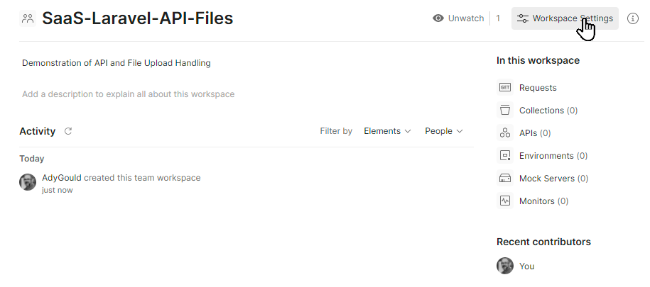


#### Create a Collection

Click on the New button next to the Workspace name

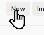

Click Collection on the dialog box

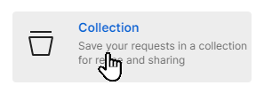

Name the collection `Product Feature`.

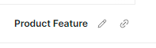

#### Add Collection Variables

Add the base URI to the collection variables, by clicking the variables button.

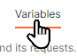

Add a new variable `baseURI` with a value of `http://saas-laravel-11-api-file-upload.test`

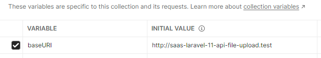


## Add Create (No file uploaded) Test

Hover over Product Feature and click on the `...` that will appear

Click the Add Request option

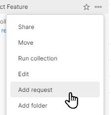

Click on Headers and click the show hidden headers.

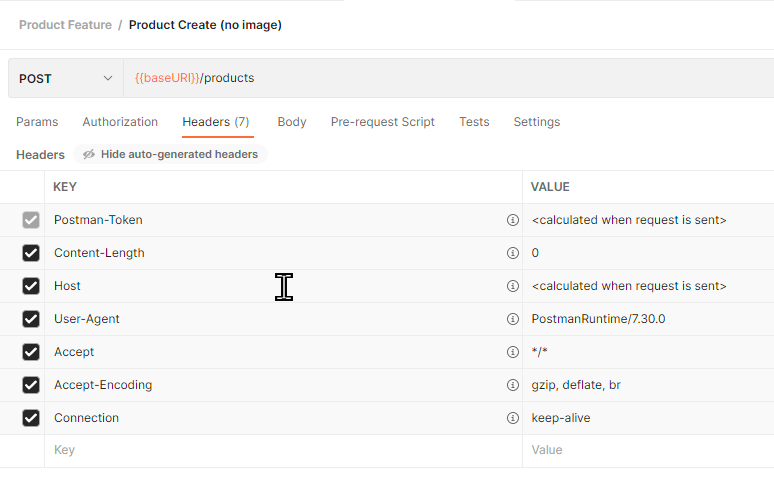

Click on Body

Click on Form Data

To the body add the following keys and values:

| Key    | Type | Value                    |
| ------ | ---- | ------------------------ |
| name   | Text | `{{$randomProductName}}` |
| detail | Text | `{{$randomPhrase}}`      |


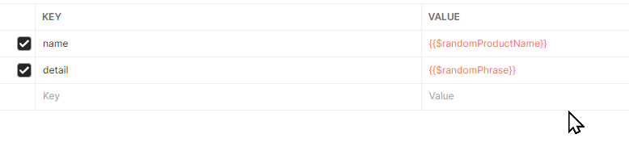

Click Save

### Run the Test

You are now ready to run the test... Click Send

Hopefully you will get a response similar to this:

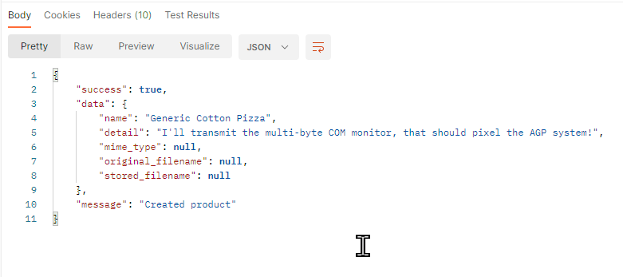


## Create Valid Image (with file) Test

Duplicate the Image Test.

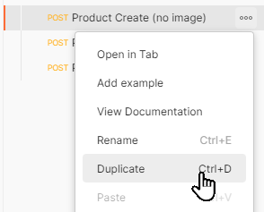


Open the Body

Add a new field by hovering over a blank line in the key/value list, and clicking on the little grey "Text v", and selecting File.

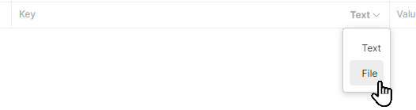


Add the following key:

| Key           | Type | Value |
| ------------- | ---- | ----- |
| product_image | File |       |

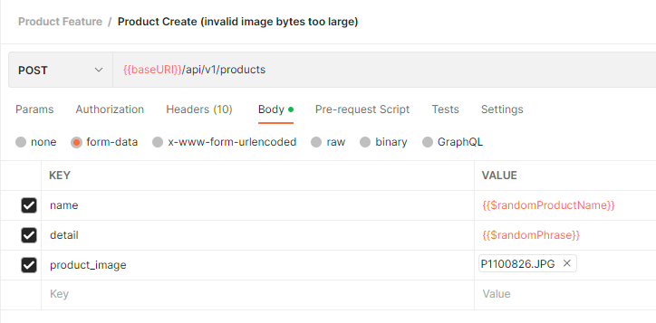

You will be presented with a "select file" button in the value field.

This is where you can select an image that is suitable for the testing.

You may use this [1024x1024 pixel image](../assets/S07-Image-Uploads-and-APIs-20240830120823987.png) as a test. 

Save the updated test.

Then try sending, and see what results you get...

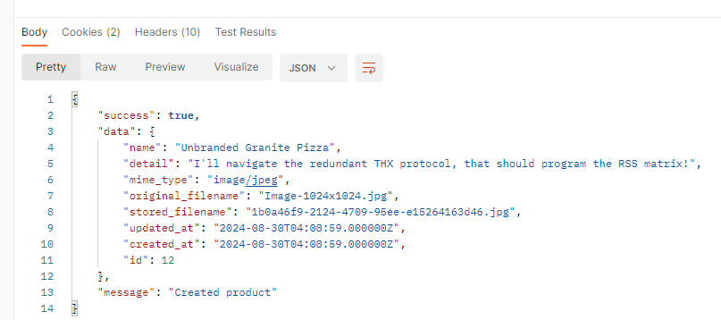


## Create Invalid Image Tests

We are going to cheat, as we have the first part of the test already created.

Click on the "Valid Image" test we just created, and either:

- hover over the name and then click the `...` then click the Duplicate option
- or...
- use CTRL+D to duplicate the test


You will need THREE copies for the Invalid images as we will be testing:
- image dimensions are too small (< 100x100 pixels)
- image dimensions are too large (> 2048x2048 pixels)
- image size (bytes) is too large (> 1024Kb)

Name each test and alter each one as needed.

Here is a complete list and what each tests for (possible descriptions).

| Test Name                                           | Tests for                                                |
| --------------------------------------------------- | -------------------------------------------------------- |
| Product Create (invalid image dimensions too large) | The pictures width and/or height are over 2048 pixels    |
| Product Create (invalid image bytes too large)      | The picture's storage size is over 1024 bytes (1M)       |
| Product Create (invalid image - too small)          | The pictures width and/or height is less than 100 pixels |
| Product Create (no product_image key)               | Creates a product without an image specified             |
| Product Create (no filename)                        | Creates a product without an image specified             |
| Product Create (valid image)                        | Creates a product with a suitable image attached         |

Locate and use suitable test images to test each of the tests you have created.

Here is the complete list as an image from our copy of Postman:

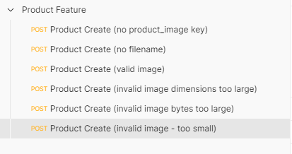

### Execute each test and verify

Make sure you save each test, and you check it does what is expected.

## Update the create method to include error response

Ok, we did cheat a little and not handle the situation that we have invalid data. We simply ignored it, so it is time to make sure we get things right.

We will alter the code a little to use an instance of the Validator class, rather than call `validate`.

We gain a little more control over what we do with this method.

Update the start of the store method thus:

```php
public function store(Request $request)  
{  
  
    $validator = Validator::make($request->all(), [  
        'name' => [  
            'required',  
            'min:4'  
        ],  
        'description' => [  
            'sometimes',  
            'min:12'  
        ],  
        'product_image' => [  
            'sometimes',  
            'image',  
            'mimes:jpeg,png,jpg,gif',  
            'max:1024',  
            'dimensions:min_width=100,min_height=100,max_width=2048,max_height=2048',  
        ],  
    ]);
```

Now we are ready to add the new "oops you stuffed it up"  response immediately after this new code:

```php
if ($validator->fails()) {  
    $errors = $validator->errors();  
  
    return $this->sendError("Error in product data", $errors);  
}
```

This appears just before the `$productImage = $request->file('product_image');` line of code.

### Test again!

Now when you test with invalid data we will get messages similar to this:

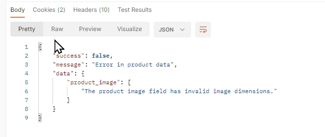


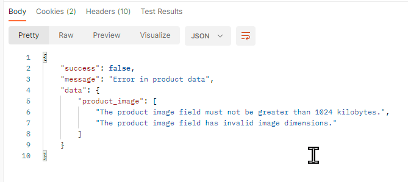


So that's how to use an API to upload an image when creating a new record.

To round off we will briefly cover each of the Index, Show, and Delete Methods.

## Index Method

The index method simply returns all the records for the model.

```php
public function index()  
{  
    $data = Product::all();  
    return $this->sendResponse($data, "Products retrieved successfully");  
}
```

We are not looking at Pagination in this example.

## Show Method

The show methods will attempt to retrieve the record requested, but will give an error response when not found.

```php
public function show(string $id)  
{  
    $data = Product::whereId($id)->get();  
  
    if ($data->isEmpty()) {  
        return $this->sendError("Product Not Found", $data);  
    }  
  
    return $this->sendResponse($data, "Product retrieved successfully");  
  
}
```


## Destroy Method

The destroy method attempts to retrieve the requested resource.

If the resource is not found, it will send a suitable error message.

If found then the image associated with the resource is deleted, and then the product is deleted from the model.

```php
public function destroy(int $id)  
{  
  
    $products = Product::whereId($id)->limit(1)->get();  
  
    if ($products->isEmpty()) {  
        return $this->sendError("Product Not Found", $products);  
    }  
  
    foreach ($products as $product) {  
        $storedName = $product->stored_filename;  
  
        if(Storage::exists('images/' . $storedName)) {  
            Storage::delete('images/' . $storedName);  
        }  
  
        $product->delete();  
    }  
  
    return $this->sendResponse($product, "Product deleted");  
}
```


Here is the result of a test in action


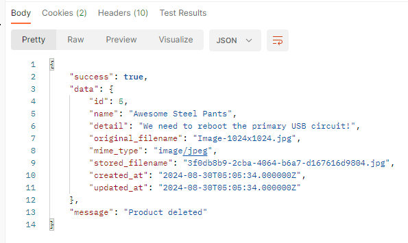


### Update API Endpoint

Update is left (at the moment) as an exercise. When you do look at it, make sure you do the following:
- As per create, check the image dimensions etc
- If an image exists for the record, and the supplied data does not have a new image, leave the current one untouched
- If an image exists and the supplied data contains a new image, delete the old image, save the new one, and update the record with the new name
