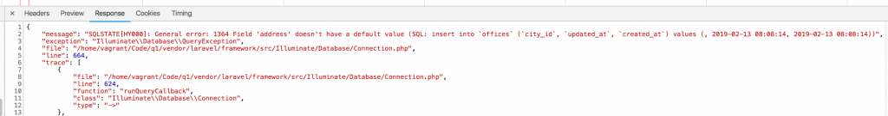
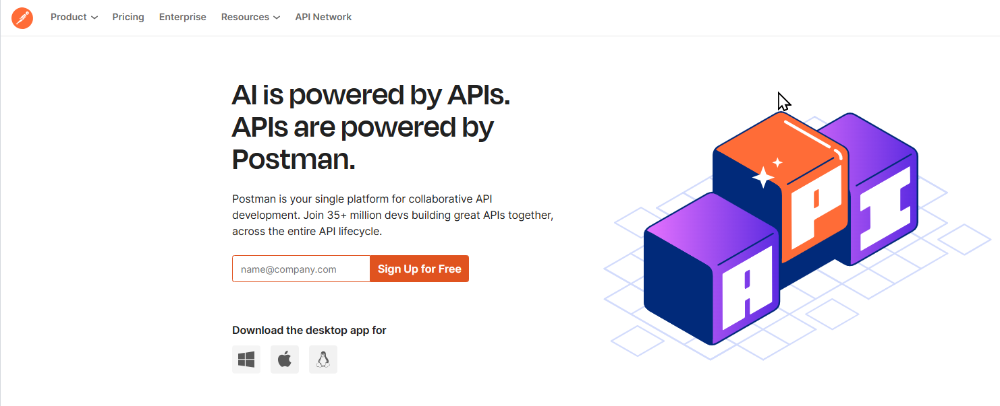
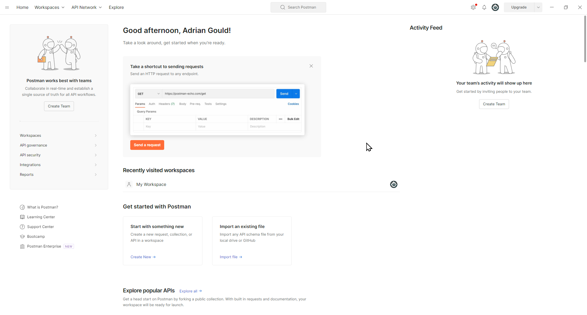
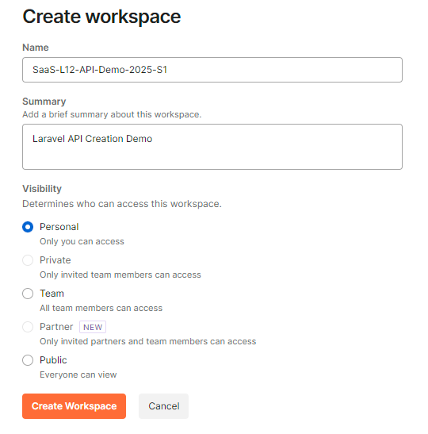
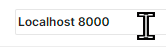
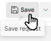
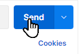

# Session 07 Postman and APIs

## Software as a Service - Back-End Development

Developed by Adrian Gould

---

```table-of-contents
title: # Contents
style: nestedList
minLevel: 0
maxLevel: 3
includeLinks: true
```

---

# Overview

In this set of notes we will investigate how to use Postman to test our APIs as we develop them.

You will also be directed to complete a free introductory Postman course that creates

# Requirements

You will require:

- Internet access
- Web Browser
- Student Email Account
- JetBrains Student Account
    - PhpStorm
- Postman Desktop Application (see )
- Laragon v6
    - PHP 8.8 or later
    - Git
    - MailPit
- Windows Terminal
    - Configured to use the `Laragon/bin/git/bin/bash.exe` CLI

# Source code

You may clone the current source code for the API by completing the following steps:

1) Open Terminal
2) Go to your Source Repos folder

```shell
cd ~/Source/Repos
```

3) Execute

```shell
git clone https://github.com/AdyGCode/SaaS-BED-L12-API-Demo-2025-S1
```

4) Execute

```shell
cd SaaS-BED-L12-API-Demo-2025-S1
```

5) Execute

```shell
composer install
```

6) Execute a dry run update to the composer packages and check for any major version updates. If
   there are you should check if there any breaking changes.

```shell
composer update --dry-run
```

7) Execute

```shell
composer update
```

8) Execute

```shell
npm install
```

9) Execute

```shell
npm run build
```

10) Execute the application's key generation, migrations and seeders using:

```shell
touch database/database.sqlite
php artisan key:generate
php artisan migrate
php artisan db:seed
```

11) Execute the development server to expose the Application API on `http://localhost:8000`

```shell
composer run dev
```

12) In MS Terminal split the terminal into two sessions (<kbd>ALT</kbd>+<kbd>SHIFT</kbd>+<kbd>
    MINUS</kbd>).
13) In the lower section, change into the working folder for the cloned project ready for any
    further commands to be executed (e.g. creating a new model).

```shell
cd ~/Source/Repos/SaaS-BED-L12-API-Demo-2025-S1
```

# Reminder: Debug Mode

Before we begin with the creation of the API in any form, we need to visit a setting or two that
will make a huge difference to our development and production code.

Open your `.env` file, and change `APP_DEBUG` from `true` to `false`.

During development, you may want to re-enable or disable this setting.

> ⚠️ **For production, it MUST be false.**

Why?

## Security

Security of any application is on the top of the requirements list.

So what difference does the `APP_DEBUG` setting make?

> If you turn it on as _true_, then all your errors will be shown with all the details,
> including names of the classes, DB tables etc. This is a huge security issue, so in production
> environment it's strictly advised to set this to _false_.
>
> 

*Image care of Laravel
Daily (https://laraveldaily.com/post/laravel-api-errors-and-exceptions-how-to-return-responses)
used for educational purposes only.*

Another *excellent* reason for using this even when developing...

## Forces Developers to Think Like Consumers

Possibly a more important factor of this is the following:

> By turning off actual errors, you will be **forced** to think like API consumer who would
> receive just _"Server error"_ and no more information. In other words, you will be forced to
> think how to handle errors and provide useful messages from the API.


My thanks to Povilas Korop at [Laravel Daily](https://laraveldaily.com) for this tip.

- Korop, P. (2019). _Laravel API Errors and Exceptions: How to Return Responses_. Laravel
  Daily. https://laraveldaily.com/post/laravel-api-errors-and-exceptions-how-to-return-responses

We will look at more error handling within this tutorial.

# Reminder: HTTP Response Codes

As a reminder, these are commonly used HTTP response codes:

| Code | Meaning               | Common use situations                                                                                                                                                                                                         |
|------|-----------------------|-------------------------------------------------------------------------------------------------------------------------------------------------------------------------------------------------------------------------------|
| 200  | OK                    | when an action succeeds successfully, unless one of 201, 202 or 204 are more appropriate                                                                                                                                      |
| 201  | Created               | Use when you add new data to the system (a new resource).   This happens AFTER the resource is created. If the system cannot create the resource immediately, then 202.                                                       |
| 202  | Accepted              | If a process takes a while to complete, then 202 is appropriate. The request may or may not get acted upon (as it it may succeed, fail or be disallowed) when finally processed. This is idea for batch processing responses. |
| 204  | No Content            | Usually the response to a PUT, PATCH or DELETE request, when the API does not want to send any form of response body back to the consuming application                                                                        |
| 400  | Bad request           | when you need to tell the consuming application they have sent a header or request in general that is badly constructed.                                                                                                      |
| 401  | Unauthorised          | When the credentials used to log-in are not correct, or missing. Also used when access to a resource is not permitted due to insufficient privileges.                                                                         |
| 403  | Forbidden             | When you need to tell the client that is authenticated (logged in) they do not have permission to access the requested resource                                                                                               |
| 404  | Not Found             | When a search gives zero results, a resource (record) does not exist, or there are no records in the resource collection                                                                                                      |
| 412  | Precondition failed   | When you need to provide response for conditions in the request header fields that shows a problem (i.e. false)                                                                                                               |
| 429  | Too many requests     | When a single application instance makes too many requests and 'floods' the API                                                                                                                                               |
| 500  | Internal server error | A problem with the server. For example a configuration issue.                                                                                                                                                                 |
| 503  | Service not available | The server is not able to service the request due to high load, it being down for maintenance etc.                                                                                                                            |

We have a number of references for you listed at the end of this tutorial.

We do recommend that you read this one:

- Gupta, L. (2018, May 30). _HTTP Status Codes_. REST API
  Tutorial. https://restfulapi.net/http-status-codes/ **Please read**

# Testing Using Postman

Postman is the most commonly used RESTful API testing application around.

It is free to use, unless you go beyond the free account limits.



*Postman Home page*

## Create a Postman Account

To use postman you will need to create an account.

Head to [https://postman.com](https://postman.com) and either enter your student email address
into the "**Sign Up for Free**" box, or click on the **Sign Up for Free** button or use
this [Sign up for Postman](https://identity.getpostman.com/signup?continue=https%3A%2F%2Fgo.postman.co%2Fhome)
link.

The latter option gives you the opportunity to sign up using your email address, your GitHub
account or a Google account.

We will show the longer, eMail based join up process.

The steps below use the last option.

1) Fill out the form with your student email address, a suitable username and a password that
   has at least 7 characters including upper and lower case letters, numbers and symbols.
   

2) On the next page, Enter your name and then click on the drop down and select STUDENT.
   

3) Click Continue and Postman's Web UI will open.

Whilst you were doing this an email will have been sent to your student account for you to
verify the email address. Open your Outlook email and find the new message. Open this and click
on the Verify Email button (The email will come from notifications@getpostman.com)


Once complete you will get a nice verification completed screen.


## Download and Install the Desktop Client

The easiest way to work is to use the Desktop based Postman client.

On your own machines you may download it from
the [Postman Downloads](https://postman.com/downloads) pages, and then install the application
wherever you wish.

> Alternatively we will provide a version in the Laragon 6 project available from
> the [NMTAFE Laragon V6](https://github.com/AdyGCode/NMTAFE-Laragon-v6) GitHub repository. This
> may NOT be the most up to date version of the software.

Once installed open Postman.



All instructions will be for the Desktop Application.

> **Important:** Using the Web Application for Local Development of APIs requires more work.
> This is left to you to explore if you wish to use this way of testing.

### Workspaces

Workspaces are where you can work on a project.

They usually contain one or more collections, depending on how the team wishes to construct the
testing.


### Collections

Collections are groups of API endpoints that are being tested.

One way to organise your collections is to create a new collection for each group of endpoints.
For example "Categories", "Products", "Users" and even "Authentication".

We will use this way to organise our collections for the projects.

### Requests

A request is a single endpoint test that will be sent to your API to obtain a response.

## Create a Workspace

Create a workspace for the API Demo we are using.


Click on Workspaces, and then click Create Workspace

Enter the name of the workspace, in our case `SaaS-L12-API-Demo-YYYY-SN`. If you wish add a
short description.

> **Remember** to change `YYYY` to the year and `SN` to `S` and the semester number.

The last part of creating a workspace will determine the visibility of the workspace and if it
is for the public, a team, or personal (there are other options but they are not important at
this time)

Visibility determines who can access this workspace.

| Option   | Visibility                                        |
|----------|---------------------------------------------------|
| Personal | Only you can access                               |
| Private  | Only invited team members can access              |
| Team     | All team members can access                       |
| Partner  | Only invited partners and team members can access |
| Public   | Everyone can view                                 |

We will use the **Personal** option for this example.



## Workspaces and Environments

One of the beautiful parts of the Postman application is that you can create Environments that
allow you to add variables, and use other features for a specific purpose.

For example:

- When developing you work with a local instance of the application, and
- Before release you work with a remote testing deployment

Two Environments will allow you to specify the URL used for these, plus secrets and more.

We will create a new Environment and add at least one variable.

Click on the Environments button:


Then click on the `+` to add a new environment.

In the new name area enter `Localhost 8000` to represent the Localhost (your PC) and the port (
8000 as we are using composer's run dev).



### Adding a Variable

There are two types of variable we may use in the Environment, Default (public) and Secret (
Hidden).

We will use Default for our work, but consider **passwords, API Keys and so on should be secret
**.

To add a variable names `url`, click in a cell under "Variable", and enter `url` for Uniform
Resource Locator.

Leave the type as default.

Enter the initial value as `http://localhost:8000/api`


***The image shows the URL missing the `/api` - ensure you add it to the end!***

When we use the variable we enclose it in `{{` double braces/moustache brackets `}}`.

## Create a Collection

Once you have your workspace, you may now create a collection.


Click on the Create Collection button, or use the `+` to create a new collection.


When prompted (the text New Selection will be shown and selected) enter the collection name.


In our case `Categories`.


## Organising our Tests

It is possible to create folders to help organise the tests.

For example, you may want to split tests that require authentication from those that do not.

To do so we create a folder.

For example, click on the ellipsis (`...`) next to the name of the collection (Categories) and
add a new folder. Name the folder `Not Authenticated`. Repeat for a second folder
`Authenticated`


Here are the two folders:

TODO: Add image of folders!

## Create a request

> **Important:** we are not using authentication at this time.

As with our previous steps we can either use a link or button to create a new request within our
new collection.

Click the ellipsis (`...`) next to the collection/folder you wish to add anew request, and
select the `Add request` item.


When you click the "New Request" text will be selected, and you may name the request what you
want.


We recommend using simple text to name the requests.

Let's name out first request: `(NA) Get all categories`

We have used `NA` to remind us that this is an unauthenticated request.

### The Request Endpoint

The endpoint for a request is the URI that will be used to access the required resource/method.

In our case we are going to access:  `http://localhost:8000/api/v1/categories`.

This will be reduced in length as we have a variable to use for the protocol, hostname and port
part, plus the first 'folder':

```text
{{url}}
```

With this in mind, we are now able to enter: `{{url}}/v1/categories`:


### The Request Type

We are performing a GET request so the first part stays as GET.


### The Request Headers

The headers are important with any form of API, and this is true for RESTful APIs.

We need to make sure we both send and receive data in JSON format.

To do this we:

- Update the Headers of the request, and
- Add a new option "`accept`" that will override the current `*/*` value.

Click on Headers


Then click on "7 hidden" next to the Headers heading:


This reveals the default headers that are part of the request.

At the bottom where it says "Key" and "Value" we will change them to:

| Item  | Value                      |
|-------|----------------------------|
| Key   | `Accept`                   |
| Value | `application/vnd.api+json` |

This makes sure we send the request as an API request using JSON data and we get JSON data back
from the application.

### Renaming Collections, Requests and Workspaces

If you clicked away from the selected text then you may edit the name of a collection,
workspace, request et al by using the pencil icon that will appear when you hover over the name:


Finally, we click `SAVE` to make sure the request is saved.



Once saved you can test the request by clicking `SEND`.



## Errors

If you forgot to add the `api` to the environment variable, then you will get an error like
this.


Make sure you navigate back to the Environments, and update the URL value.

*If you do change a value in the environment variables, make sure you save and then click reset
all and save once more.*

Once this is completed retry the request.

## Successful requests

Successful requests will contain our data in the forma we expect.

Here are some examples.

The successful request to `http://localhost:8000/api/v1/categories`:


The successful request to find a non-existent route (`http://localhost:8000/wrong-endpoint`):


The successful request to find a single category (`http://localhost:8000/api/v1/categories/100`)


The successful request to not find a single category (
`http://localhost:8000/api/v1/categories/999`)


## Remaining Route Tests

The remaining details for the Routes (before we add authentication) are shown below.

| Name                 | Endpoint                      | Type | id  | name            | description                       |
|----------------------|-------------------------------|------|-----|-----------------|-----------------------------------|
| (NA) Create category | {{url}}/api/v1/categories     | POST | 200 | Dummy           | Just a Dummy Category for Testing |
| (NA) Update Category | {{url}}/api/v1/categories/200 | PUT  |     | Dummy Revisited |                                   |
| (NA) Delete Category | {{url}}/api/v1/categories/200 | PUT  |     |                 |                                   |

### Create Method Endpoint

The create endpoint call requires the same basic settings as the GET, but it also needs a body.

Click on the **Body** heading.

Then select **Raw** and the type will be **JSON**.


In the editor area now add:

```json
{
  "id": 200,
  "name": "Dummy",
  "description": "Just a Dummy Category for Testing"
}
```

Click Beautify to have the JSON indented correctly.

Click Save and then Send.

### Exercise

You will create the Requests for the following:

- Add with missing name (POST)
- Add with missing name and description (POST)
- Add with missing category (POST)
- Update with non-existent category ID (PUT)
- Update with missing name (PUT)
- Update with missing description (PUT)
- Delete with non-existent category ID (DELETE)

# Additional Learning

See [S06-Reflection-Exercises](../Session-06/S06-Reflection-Exercises.md).

# References

- Albano, J. (2019, October 25). _Baeldung_.
  Baeldung. https://www.baeldung.com/rest-api-error-handling-best-practices
- Bello, G. (2024, February 8). _Best Practices for API Error Handling | Postman Blog_. Postman
  Blog. https://blog.postman.com/best-practices-for-api-error-handling/
- Gitlin, J. (2024, June 12). _API response codes: examples and error-handling strategies_.
  Merge.dev; Merge. https://www.merge.dev/blog/api-response-codes
- Gitlin, J. (2024, June 12). _API response codes: examples and error-handling strategies_.
  Merge.dev; Merge. https://www.merge.dev/blog/api-response-codes
- Gupta, L. (2018, May 30). _HTTP Status Codes_. REST API
  Tutorial. https://restfulapi.net/http-status-codes/
- Korop, P. (2019). _Laravel API Errors and Exceptions: How to Return Responses_. Laravel
  Daily. https://laraveldaily.com/post/laravel-api-errors-and-exceptions-how-to-return-responses
- Ploesser, K. (2022, July 8). _10 Error Status Codes When Building APIs For The First Time And
  How To Fix Them_. 10 Error Status Codes When Building APIs for the First Time and How to Fix
  Them | Moesif
  Blog. https://www.moesif.com/blog/technical/monitoring/10-Error-Status-Codes-When-Building-APIs-For-The-First-Time-And-How-To-Fix-Them/
- The Postman Team. (2023, September 20). _What Are HTTP Status Codes? | Postman Blog_. Postman
  Blog. https://blog.postman.com/what-are-http-status-codes/
- Umbraco. (2019, May 3). _What are HTTP status codes?_ Umbraco.com;
  Umbraco. https://umbraco.com/knowledge-base/http-status-codes/
- _Getting started - Scramble_. (2025).
  Dedoc.co. https://scramble.dedoc.co/usage/getting-started


- https://scramble.dedoc.co/usage/getting-started
- https://www.binaryboxtuts.com/php-tutorials/laravel-tutorials/how-to-make-laravel-12-rest-api/
- https://medium.com/@dev.muhammadazeem/building-a-restful-api-with-laravel-a-step-by-step-guide-d9ae6dca9873
- https://medium.com/@andreelm/laravel-api-documentation-with-scramble-best-practices-and-tutorial-317950599982
- https://laravel-news.com/scramble-laravel-api-docs

---

# Found a Problem?

If you spotted any problems (including missing details) in notes or other materials, then make
sure you note that, and as a big help to your lecturer, you could fork the notes repository,
create an issue, create a fix to the issue, and submit a pull request.


---

# END
