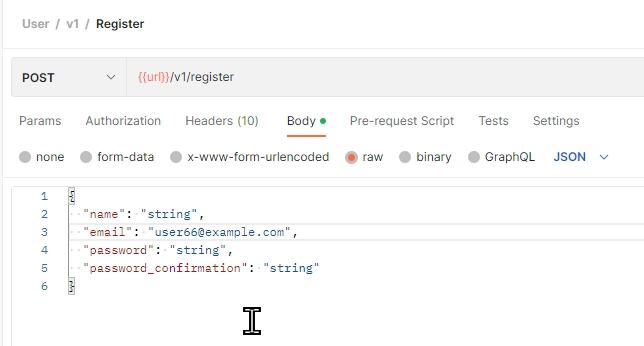
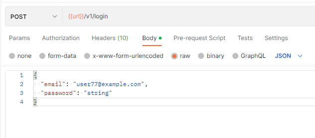
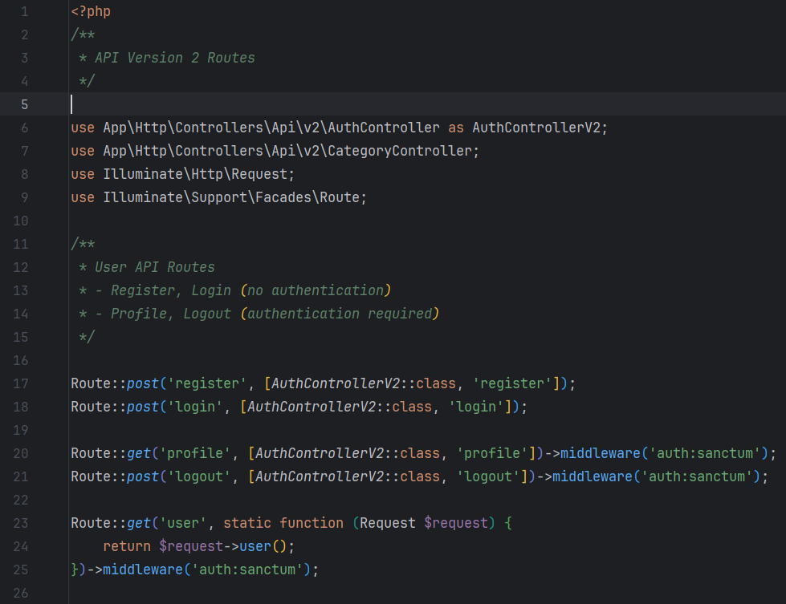
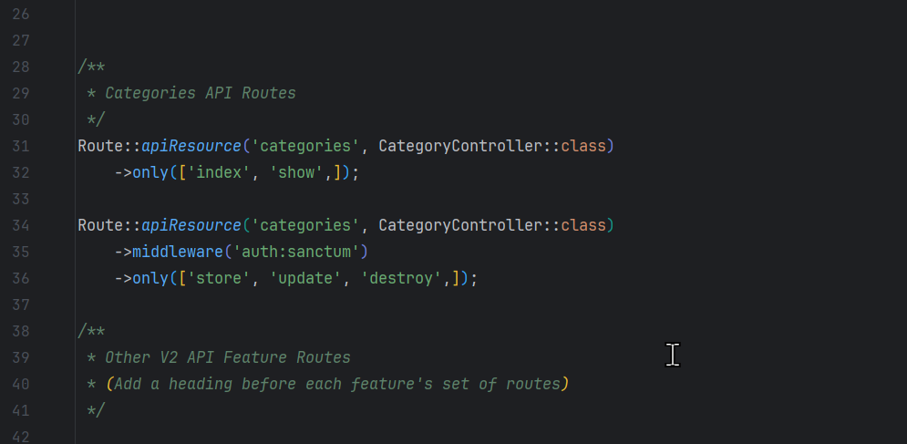
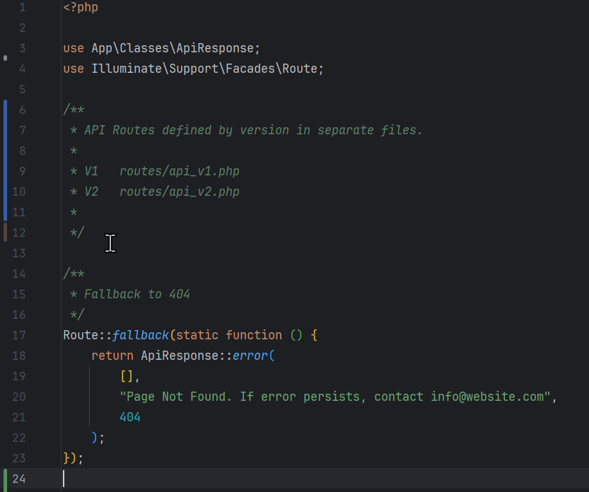
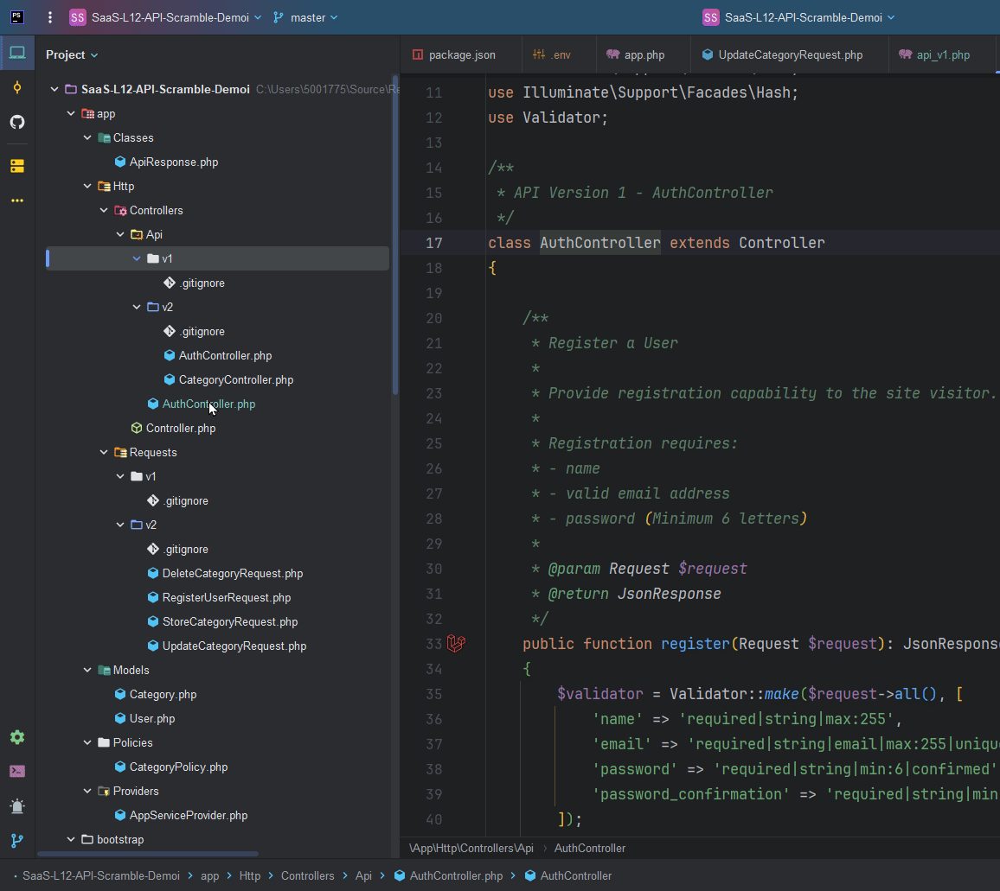

---
theme: default
paginate: true
footer: © Copyright 2024, Adrian Gould & NM TAFE
banner: "![[Black-Red-Banner.svg]]"
banner_x: 1
banner_y: "0"
auto-scaling: true
size: 1920x1080
color: "#ccc"
backgroundColor: "#060606"
tags:
  - SaaS
  - APIs
  - Back-End
  - Journal
created: 2024-07-31T07:52
updated: 2025-03-27T18:46
---

# Session 07 Using Scramble to Document an API Part 2

## Software as a Service - Back-End Development

Developed by Adrian Gould

---

```table-of-contents
title: # Contents
style: nestedList
minLevel: 0
maxLevel: 3
includeLinks: true
```

---

# Session 07 Scramble Part 2

In the previous session we looked at creating a simple API with Scramble documentation.

We have seen how much easier it is to use Scramble to document our APIs than an alternative
system called Scribe.

In this part we are going to investigate how to:

- add authentication to our API
- document multiple versions of an API
- provide previous API versions until they are deprecated and removed from production
- provide API documentation that allows routes to require authentication

> ### Aside:
> ...
> We previously used Scribe for API documentation, but this was exceptionally verbose and proved
> to be cumbersome.
>
> Also, previous versions of Scramble proved to be awkward to configure using the documentation.
>
> There have been improvements and as a result we are now using Scramble 0.8.0+ for documenting
> our APIs.

## Adding Authentication to the API

We are using Sanctum for the Authentication system in this example. In the previous content we
did not implement the required endpoints to provide the ability to register, login, logout or
look at our profile details.

So let's get that done first.

### Create an Auth Controller

Use the following to create the `AuthController`:

```shell
php artisan make:controller Api/AuthController
```

This makes a new controller in an `Api` folder within the `app/Http/Controllers` folder.

Let's now create each of the methods as stubs within this file (
`app/Http/Controllers/Api/Authcontroller.php`):

Just after the line `{` and before the `}`, add the following code to the class:

```php
public function register(Request $request): JsonResponse
{ 
// Do something here
}
  
public function login(Request $request): JsonResponse
{ 
 // Do something here
}
 
public function profile(Request $request): JsonResponse
{ 
 // Do something here
}
 
public function logout(Request $request): JsonResponse
{ 
// Do something here
}
```

We will now add the code for each of these methods.

### Register method

In the register we add the following pieces of code. A brief explanation precedes each one.

Create a validator passing all the request parts.

The validator checks to see if the name, email, password and password confirmation requirements
are met.

```php
        $validator = Validator::make($request->all(), [
            'name' => 'required|string|max:255',
            'email' => 'required|string|email|max:255|unique:users',
            'password' => 'required|string|min:6|confirmed',
            'password_confirmation' => 'required|string|min:6',
        ]);
```

If the validator fails, then we return the `401` HTTP Code with a suitable error message and the
validation errors as an array.

```php
        if ($validator->fails()) {
            return ApiResponse::error(['error' => $validator->errors()],
                'Registration details error', 401);
        }
```

As the validation is correct, we now add the new user's resource data (name, email and hashed
password) to the 'database'.

Note the cumbersome code we have at this point:

```php
        $user = User::create([
            'name'=> $validator->validated()['name'],
            'email' => $validator->validated()['email'],
            'password' => Hash::make($validator->validated()['password']),
        ]);
```

Generate a token to represent the logged-in user in requests that require authenticated access.

```php
        $token = $user->createToken('MyAppToken')->plainTextToken;
```

Return a success API Response with the token, the user's details, message and a 201 HTTP Code to
indicate the resource was created successfully.

```php
        return ApiResponse::success(['token' => $token, 'user' => $user,],
            'User registered successfully.',201);
```

### Login method

Now we do the same for the login method.

We first validate that the email and password were supplied.

```php
$validator = Validator::make($request->all(), [
            'email' => 'required|string|email|max:255',
            'password' => 'required|string|min:6',
        ]);
```

If either, or both were missing then we reject the request and provide the correct HTTP result
code and message.

```php
        if ($validator->fails()) {
            return ApiResponse::error(['error' => $validator->errors()],
                'Invalid credentials', 401);
        }
```

We now check to see if the email and password are the correct combination, and if not, again
reject the login attempt with suitable message, status and HTTP response code.

```php
        if (!Auth::attempt($request->only('email', 'password'))) {
            return ApiResponse::error([],
                'Invalid credentials', 401);
        }
```

As we passed the authentication verification, we grab the user's details and we generate a token
to use for validation as the user makes requests that require authenticated access.

```php
        $user = Auth::user();
        $token = $user->createToken('MyAppToken')->plainTextToken;
```

Finally, we return with a success response.

```php
        return ApiResponse::success(['token' => $token, 'user' => $user,],
            'Login successful.');
```

### Logout method

Logout is up next..

In this method we delete the user's access tokens, and return with a success response.

```php
        $request->user()->tokens()->delete();

        return ApiResponse::success([], 'Logout successful.');
```

### Profile method

Now the final step for the moment, getting the user's profile details:

Not much more to it than getting the current logged-in user's details and sending back to the
requester.

```php
        return ApiResponse::success(['user' => $request->user(),],
            'User profile request successful.');
```

### Adding the Routes to the `api.php` file

We now want to add the routes for the User Authentication to the `api.php` file.

Immediately after the `use` lines add the following:

```php
Route::group(['prefix'=>'v1'], function(){
    /**
     * User API Routes
     * - Register, Login (no authentication)
     * - Profile, Logout (authentication required)
     */
    Route::post('register', [AuthControllerV1::class, 'register']);
    Route::post('login', [AuthControllerV1::class, 'login']);

    Route::get('profile', [AuthControllerV1::class, 'profile'])->middleware(['auth:sanctum',]);
    Route::post('logout', [AuthControllerV1::class, 'logout'])->middleware(['auth:sanctum',]);

    Route::get('user', static function (Request $request) {
        return $request->user();
    })->middleware('auth:sanctum');
});
```

### Clearing route and other caches

It is a good idea when developing to regularly clear the caches within the Laravel framework.
This will solve many headaches such as new routes not being identified, and even worse, old
routes being used!

Use these commands to perform the various cache clearings:

| To Clear      | Command               |
|---------------|-----------------------|
| View Cache    | `artisan view:clear`  |
| General Cache | `artisan cache:clear` |
| Route Cache   | `artisan route:clear` |

Here they are as a one-liner:

```shell
php artisan view:clear && php artisan cache:clear && php artisan route:clear
```

Here are most of the 'clear' commands in a quick table:

| Command              | What it does                                       |
|----------------------|----------------------------------------------------|
| cache:clear          | Flush the application cache                        |
| config:clear         | Remove the configuration cache file                |
| event:clear          | Clear all cached events and listeners              |
| optimize:clear       | Remove the cached bootstrap files                  |
| queue:clear          | Delete all of the jobs from the specified queue    |
| route:clear          | Remove the route cache file                        |
| schedule:clear-cache | Delete the cached mutex files created by scheduler |
| view:clear           | Clear all compiled view files                      |

### Testing the endpoints

You should be able to create Postman requests and test the endpoints out.

#### User Register



### User Login



### User Profile


### User Logout


## Organising Multiple Versions of an API

Before we look at documenting and the other items we mentioned above, we must look at what to do
with multiple versions of the routes that an API may present.

Let's consider the following scenario:

> We have developed our API and in version 1 we only required a simple password (6 characters)
> for registering and authentication.
>
> The company has now decided it wants to upgrade the requirements to be a minimum of 8
> characters with a mix of upper and lower case letters, numbers and symbols.

This is obviously a reasonably sized change in the API, so we decide to upgrade to v2 as this
and other features are being implemented.

What we will do to achieve this is the following:

1. Create a new `routes/api_v1.php` file that contains the original version 1 routes using the
   original controllers and requests.
2. Create a new `routes/api_v2.php` file that is based on version 1, with new controllers and
   requests to satisfy the new requirements and features.
3. Remove the original routes, except the fallback route from the `routes/api.php` file.
4. Update the `bootstrap/app.php` file to add the new `api_vX.php` files and use the appropriate
   prefixes.
5. Clear the currently cached routes and allow Laravel to rebuild the cache on next request.

Once this is done we will then update the Scramble configurations to provide the different
version documentation.

### Create New Routes Files

This step is going to be simple enough, use the following command to duplicate the `api.php`
file into `api_v1.php` and `api_v2.php`:

```shell
cp routes/api.php routes/api_v1.php
cp routes/api.php routes/api_v2.php
```

#### Edit API V1

Open the `api_v1.php` file and modify it by:

- removing the `Route::group` lines
- remove the closing `});` that the Route groups had

You should be left with code that resembles this:


#### Edit API V2

Now we edit the `api_v2.php` file. Again we remove the `Route::group` definitions, but leave te
categories in place.

Here are images showing Lines 1 to 26...



And from line 26 to 42...



#### Edit the original API file

Finally, we are going to cut the majority of the original API file out.

Edit `api.php` so it resembles the following image:



### Fixing the API Route issues

OK, so we have refactored the API routes file into three parts, but it leaves us with a serious
issue. The routes no longer work.

What do we do to resolve this?

We need to tell the Application's bootstrapping file to load the new route files.

In fact, every time you create a new version of the API, you would add the definmition fto the
bootstrapping file.

#### Editing the Bootstrap App file

Locate and open `bootstrap/app.php` file.

At the start you will see the following configuration lines:

```php
return Application::configure(basePath: dirname(__DIR__))
    ->withRouting(
        web: __DIR__ . '/../routes/web.php',
        api: __DIR__ . '/../routes/api.php',
        commands: __DIR__ . '/../routes/console.php',
        health: '/up',
        } ,
    )
    ->withMiddleware(function (Middleware $middleware) {
        //
```

We need to modify this by indicating the new API version files that need to be loaded, plus the
prefix they will use.

Here is an example:

```php
Route::middleware('api')
    ->prefix('api/v2')
    ->group(base_path('routes/api_v2.php'));
```

We cannot just put this in place, we need to tell LAravel to handle the standard routes, and *
*then** the new routes.

Update the `->withRouting( ... )` section to read:

```php
->withRouting(
        web: __DIR__ . '/../routes/web.php',
        api: __DIR__ . '/../routes/api.php',
        commands: __DIR__ . '/../routes/console.php',
        health: '/up',
        then: function(){
            Route::middleware('api')
                ->prefix('api/v1')
                ->group(base_path('routes/api_v1.php'));
             
            /* Add further API versions here... */
        } ,
    )
```

#### Exercise

Add the version 2 API route definition to the `withRouting`.

### Reorganising the Controllers & Requests

Because we will have 2 API versions, we need to make sure we organise the Controllers and
Requests.

The easiest way is to create a folder structure that indicates the version for the API, and then
use namespaces to access the correct one.

Do the following in the command line:

- Create a `v1` and `v2` folder in the `app/Http/Controllers/Api` folder
- Create a `v1` and `v2` folder in the `app/Http/Requests` folder
- Add .gitignore files to the folders

The commands to do these steps are:

```shell
mkdir -p app/Http/{Controllers/Api,Requests}/v{1,2}
touch  app/Http/{Controllers/Api,Requests}/v{1,2}/.gitignore
```

> ### ⚠️ Hints & Tips
>
> Remember that you should clear the routes cache if you make any route changes, and this will
> include the application's bootstrap file.

### Moving Classes into Sub-Folders

If you use a good IDE, such as PhpStorm, then refactoring the locations of files is a breeze.

You simply drag and drop.

When you drag and drop you want to check the changes that will be made to the file and also to
any files tha use it.

Here is an animation showing the process, including previewing the updates.




> ### ⚠️ Hints & Tips
>
> Always make sure that after this form of refactoring, the `namespace` and `use` lines that
> refer to the file(s) moved are correct.

### Testing

At this point we should still be able to test the API endpoints. Both v1 and v2.

## Documenting with Multiple API Versions

We are now ready to update our Scramble configuration to allow for multiple versions of the API.

> ### Aside:
> At the moment wwe have not been able to find a method to get Scramble to provide a 'drop down'
> or similar method to quickly switch between API versions.
>
> If you find out how, then please let us know. We do enjoy learning how to do things.

### Updating the App Service Provider

Scramble provides a way to show multiple versions of a API's documentation by exposing
configurations programmatically.

To do this we edit the `app/Providers/AppServiceProvider.php` file.

Open this file and update the code as follows.

In the `public function boot(): void` method we first add code to

- ignore the default docs/api web endpoint
- add bearer token requirements to the api calls that need authentication (e.g. store, update &
  delete)
- remove the bearer token requirements from endpoints that do not need authentication (e.g.
  index, show)

```php
        /****************************************************************************
         * Scramble Documentation Configuration Section
         *
         * Add bearer token requirements
         * Remove the authentication requirements from routes that do not need it
         ***************************************************************************/
        Scramble::configure()
            ->withDocumentTransformers(function (OpenApi $openApi) {
                $openApi->secure(
                    SecurityScheme::http('bearer')
                );
            });

        Scramble::configure()
            ->withOperationTransformers(function (Operation $operation, RouteInfo $routeInfo) {
                $routeMiddleware = $routeInfo->route->gatherMiddleware();

                $hasAuthMiddleware = collect($routeMiddleware)->contains(
                    fn($m) => Str::startsWith($m, 'auth:')
                );

                if (!$hasAuthMiddleware) {
                    $operation->security = [];
                }
            });

```

Next we register the Version 1 of the API documentation:

```php
       /****************************************************************************
         * API Version 1 Scramble Documentation Configuration
         *
         * Register the api as v1.0.0
         * Set Endpoint path to api/v1
         * Register the docs/v1 web endpoint
         * Register the docs/v1.json endpoint for the OpenAPI Json download
         ***************************************************************************/
        /* API Version 1 Docs */
        Scramble::registerApi('v1',
            [
                'info' => ['version' => '1.0.0'],
                'api_path' => 'api/v1',
            ]);

        Scramble::registerUiRoute(path: 'docs/v1', api: 'v1');
        Scramble::registerJsonSpecificationRoute(path: 'docs/v1.json', api: 'v1');
```

We will next jump to the last step in removing the default API docs endpoint (the one that shows
API version 0.5 in our examples).

```php
        /****************************************************************************
         * API Version X Scramble Documentation Configuration
         * Add each version using the same pattern as for v1 and v2 above
         ***************************************************************************/
        
        
        /****************************************************************************
         * Ignore the default /docs/api endpoint
         ***************************************************************************/
        Scramble::ignoreDefaultRoutes();
```

### Exercise

We are leaving the configuration for the version 2 of the API to you as an exercise.

Hint: duplicate the version 1 code, and edit to suit.

## Test the Docs

At this point you should be able to view the documentation using URIs similar to this:

- Version 0.5: http://saas-l12-api-scramble-demoi.test/docs/api
    - This endpoint should give a 404. 
    - Try commenting out the `Scramble::ignoreDefaultRoutes();`
      and see what happens.
- Version 1: http://saas-l12-api-scramble-demoi.test/docs/v1
- Version 2: http://saas-l12-api-scramble-demoi.test/docs/v2

## Source Code

You may find the source code for this demonstration API here:

https://github.com/AdyGCode/SaaS-L12-API-Scramble-Demoi


# Additional Learning

See [S07-Reflection-Exercises-and-Additional-Learning](../Session-07/S07-Reflection-Exercises-and-Additional-Learning.md).

# References

- Albano, J. (2019, October 25). _Baeldung_.
  Baeldung. https://www.baeldung.com/rest-api-error-handling-best-practices
- Bello, G. (2024, February 8). _Best Practices for API Error Handling | Postman Blog_. Postman
  Blog. https://blog.postman.com/best-practices-for-api-error-handling/
- _Getting started - Scramble_. (2025).
  Dedoc.co. https://scramble.dedoc.co/usage/getting-started
- Gitlin, J. (2024, June 12). _API response codes: examples and error-handling strategies_.
  Merge.dev; Merge. https://www.merge.dev/blog/api-response-codes
- Gupta, L. (2018, May 30). _HTTP Status Codes_. REST API
  Tutorial. https://restfulapi.net/http-status-codes/
- Korop, P. (2019). _Laravel API Errors and Exceptions: How to Return Responses_. Laravel
  Daily. https://laraveldaily.com/post/laravel-api-errors-and-exceptions-how-to-return-responses
- Ploesser, K. (2022, July 8). _10 Error Status Codes When Building APIs For The First Time And
  How To Fix Them_. 10 Error Status Codes When Building APIs for the First Time and How to Fix
  Them | Moesif
  Blog. https://www.moesif.com/blog/technical/monitoring/10-Error-Status-Codes-When-Building-APIs-For-The-First-Time-And-How-To-Fix-Them/
- The Postman Team. (2023, September 20). _What Are HTTP Status Codes? | Postman Blog_. Postman
  Blog. https://blog.postman.com/what-are-http-status-codes/
- Umbraco. (2019, May 3). _What are HTTP status codes?_ Umbraco.com;
  Umbraco. https://umbraco.com/knowledge-base/http-status-codes/


- https://www.binaryboxtuts.com/php-tutorials/laravel-tutorials/how-to-make-laravel-12-rest-api/
- https://medium.com/@dev.muhammadazeem/building-a-restful-api-with-laravel-a-step-by-step-guide-d9ae6dca9873
- https://medium.com/@andreelm/laravel-api-documentation-with-scramble-best-practices-and-tutorial-317950599982
- https://laravel-news.com/scramble-laravel-api-docs

---

# Found a Problem?

If you spotted any problems (including missing details) in notes or other materials, then make
sure you note that, and as a big help to your lecturer, you could fork the notes repository,
create an issue, create a fix to the issue, and submit a pull request.


---

# END
