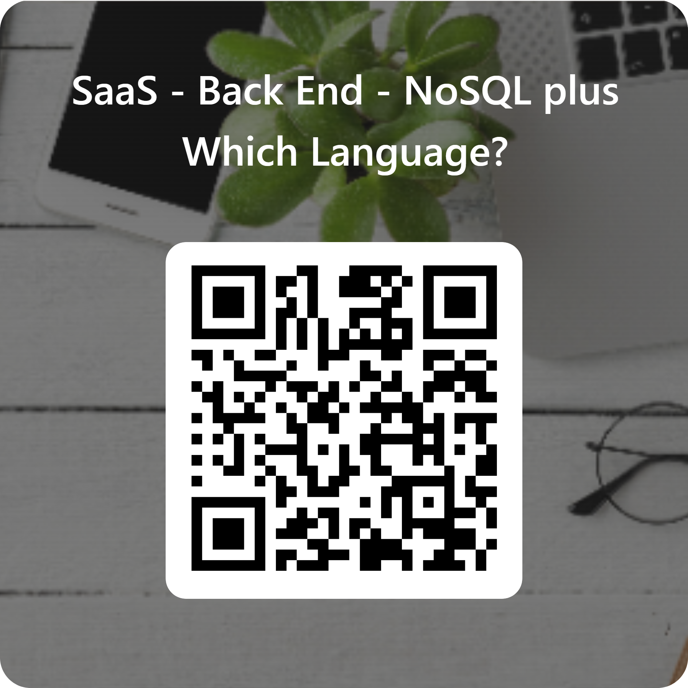

# Session 08 Overview

## Survey for ***TAFE*** Students only

- https://forms.office.com/r/yAvK5s1pj5

The link above is a quick survey to allow us to tailor the NoSQL section of this cluster to your preference as a class.

Please complete before end of Session 09.

## PEST Testing - Useful Resources

- [Laravel Testing with Pest: The Complete Guide for Beginners | by Abu Sayed | Medium](https://abu-sayed.medium.com/laravel-testing-with-pest-the-complete-guide-for-beginners-a0b6680cfd71)
- [Three useful tricks I learned with Pest testing in Laravel - DEV Community](https://dev.to/victoor/three-useful-tricks-i-learned-with-pest-testing-in-laravel-1icd)
- 

## Note

Remember that AI Generated Code is not 100% reliable, and as such you should check all code that is generated.

We **extremely strongly** advise that you write your test cases and your code by hand until such time as you are familiar with and able to explain your code without assistance from any AI or system such as Grammarly.

This session's notes were developed with the assistance of Mistral AI, and other resources. These include:

Mistral Conversation: 

