# MongoDB: Installing within Laragon

## Software as a Service - Back-End Development

### Session 09

Developed by Adrian Gould

---

```table-of-contents
title: # Contents
style: nestedList
minLevel: 0
maxLevel: 3
includeLinks: true
```

---

# The Process

- Download MongoDB Zip
- Download MongoDB Shell
- Download MongoDB Tools
- Un-compress Files
- Move into the required location within Laragon
- Activate MongoDB
- Update the Laragon paths
- Start MongoDB

# Downloads

Open the following link: https://www.mongodb.com/try/download/community

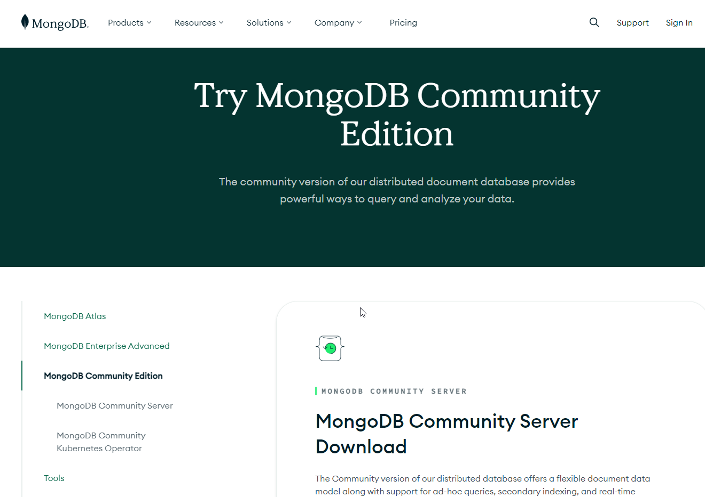


## Download the Community Server

Scroll down until the Server Download is visible:

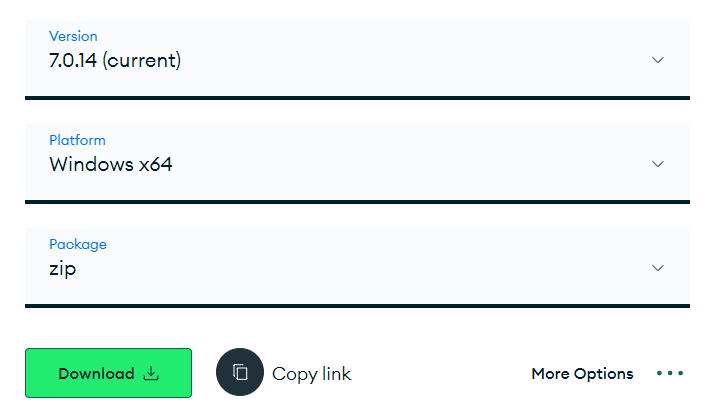

Make sure you change the Package to ZIP!

Click download - this will give you the most up to date version.

You may also or download version 7.0.14 directly using this link: https://fastdl.mongodb.org/windows/mongodb-windows-x86_64-7.0.14.zip)

## Download the MongoDB Shell

Whilst this is downloading, click on Tools.

Scroll down until the MongoDB Shell downloads are visible:

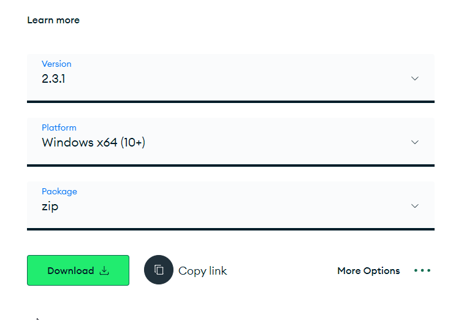

This will be a ZIP package, if not make sure it is.

Click Download to get the latest version of the shell.

You may also or download version 2.3.1 directly using this link: https://downloads.mongodb.com/compass/mongosh-2.3.1-win32-x64.zip)

Whilst this is downloading we can then grab the Tools...


## Download the MongoDB Tools

Whilst this is downloading, click on Tools.

Scroll down until the MongoDB Tools downloads are visible:

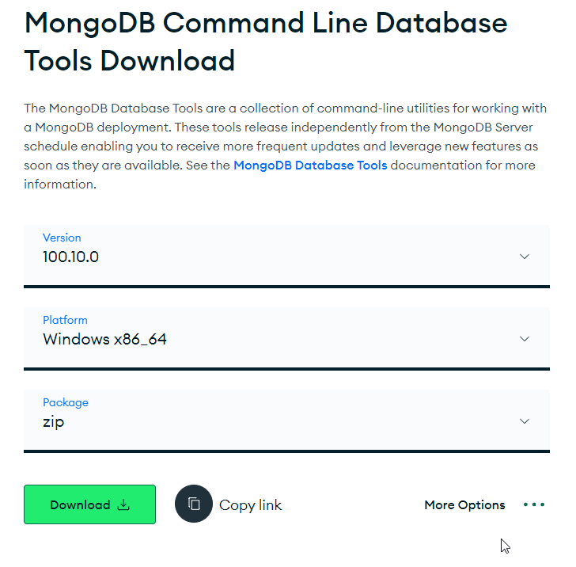

This will be a ZIP package, if not make sure it is.

Click Download to get the latest version of the shell.

You may also or download version 100.10.0 directly using this link: https://fastdl.mongodb.org/tools/db/mongodb-database-tools-windows-x86_64-100.10.0.zip)


# Uncompress Files

Once the downloads are complete you will want to uncompress the ZIPs into folders.

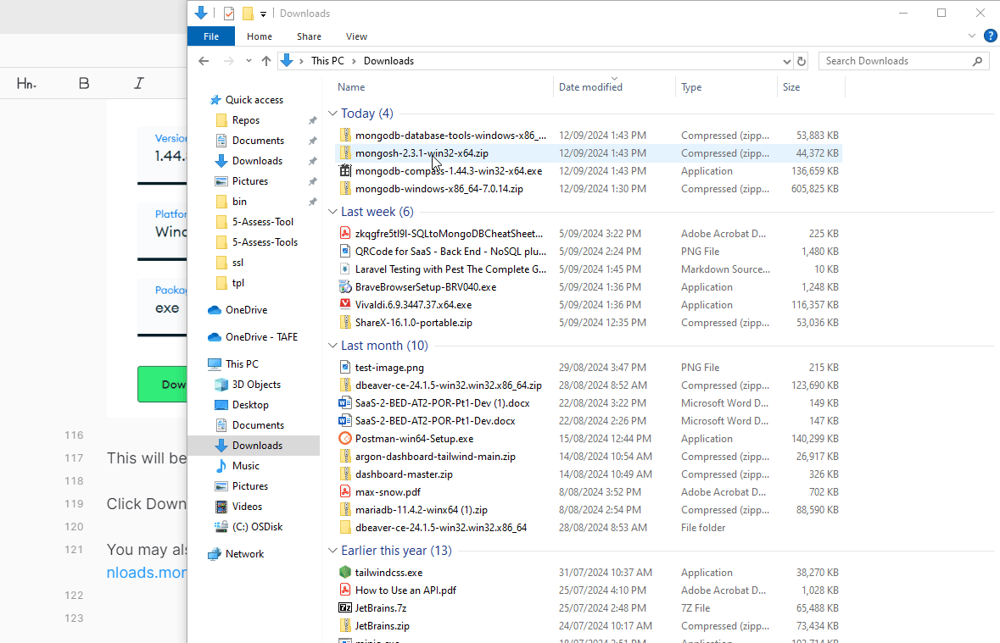

# Move to Correct Location

We need to move the files to a new folder `MongoDB` inside the `Laragon\bin` folder.

Open the Windows File Explorer <kbd>WIN</kbd>+<kbd>E</kbd>.

At TAFE enter the location `%programdata%\Laragon\bin` into the address bar

At home the default location is `C:\Laragon\bin`.

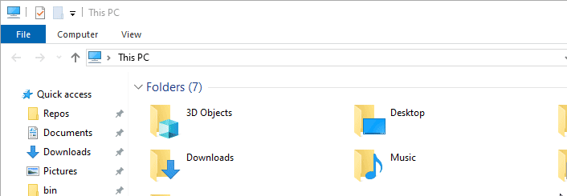

Click anywhere in the bin folder and press <kbd>CTRL</kbd>+<kbd>SHIFT</kbd>+<kbd>N</kbd> to create a new folder. Name this `MongoDB`.

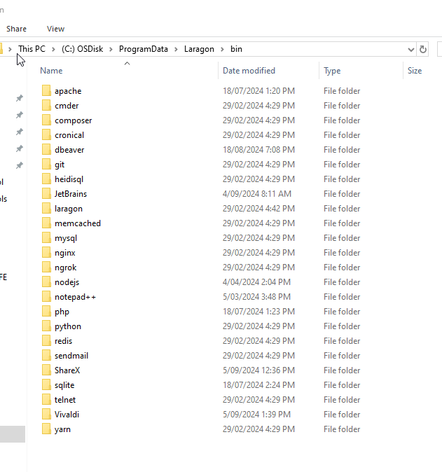

Double click to open this folder.

Open a second Windows File Explorer window (<kbd>WIN</kbd>+<kbd>E</kbd>), and arrange the two windows side by side (Click on first window and press <kbd>WIN</kbd>+<kbd>➡</kbd>, click on second window and press <kbd>WIN</kbd>+<kbd>⬅</kbd> .)

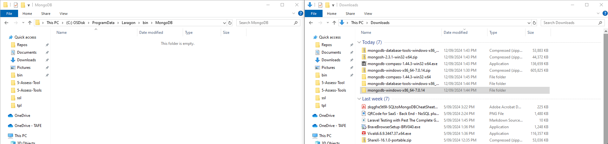

In the second File Explorer, open the MongoDB folder then drag and drop the folder within it to the MongoDB folder in the other File Explorer window.

## Rename the MongoDB folder

We will rename the MongoDB folder to make it shorter...

In the windows file explorer:
- Select the `mongodb-windows-x86_64-7.0.14` folder.
- Press <kbd>F2</kbd>
- Rename the folder to: `mongodb-windows-7.0.14`.

# Important: Update mongodb.conf file

The MongoDB Configuration file that is generated by Laragon will not work on MongoDB v6 and above.

Download this copy of the configuration file, and then move it into the `MongoDB/mongodb-windows-7.0.14` folder.

File: 

# Copy the MongoDB Tools and Shell 

We need to next copy the MongoDB Tools and MongoDB Shell files over to the `mongodb-windows-7.0.14\bin` folder.

If you have not done so, extract the files from the two compressed files:

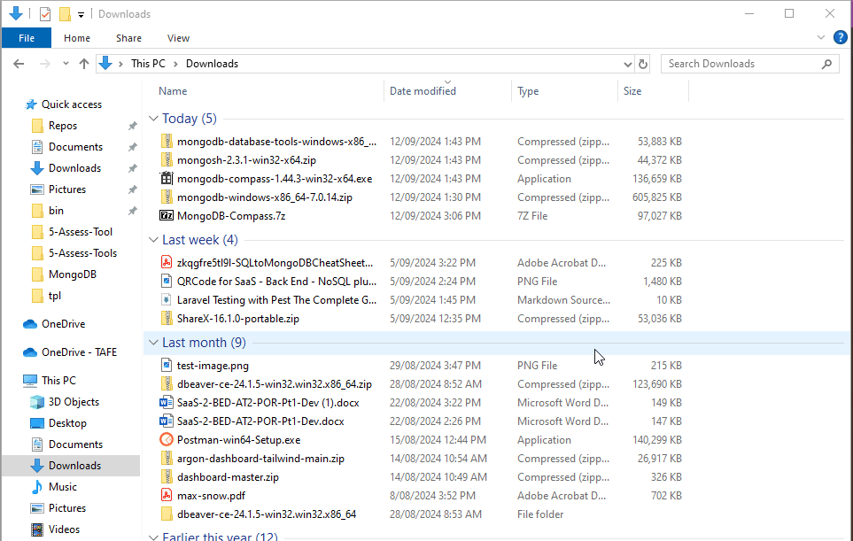

In the second File Explorer, open the `MongoDB-Windows-7.0.14\bin` folder.

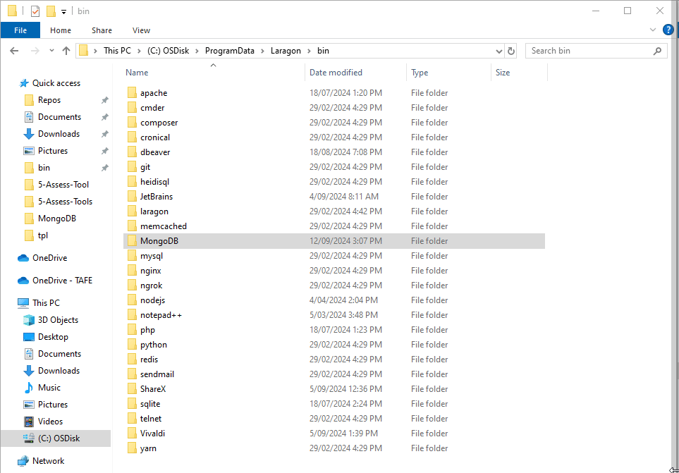

Return to the other File Explorer, and open the first of the two newly created folders (eg. MongoDB Shell)

Navigate into the bin folder inside this.

Now select all the files (<kbd>CTRL</kbd>+<kbd>A</kbd>) in this folder, and drag and drop them into the `Laragon\bin\MongoDB\mongodb-windows-7.0.14\bin` folder.

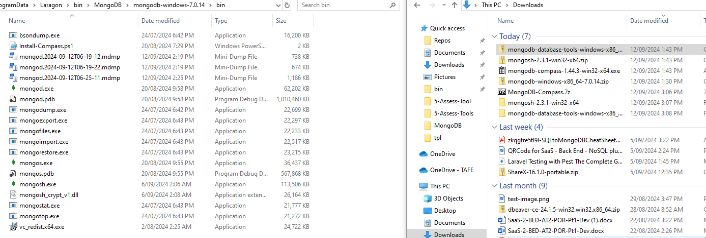

Repeat the steps for the second set of files (eg. the MongoDB Tools).

# MongoDB Compass UI

We need to do things slightly differently here.

Follow the appropriate steps for your own PC or at TAFE.

## MongoDB Compass - BYOD/Home PC

If you are using your own PC then you can download and install the MongoDB using the Executable download...

Scroll down until the MongoDB Compass downloads are visible:

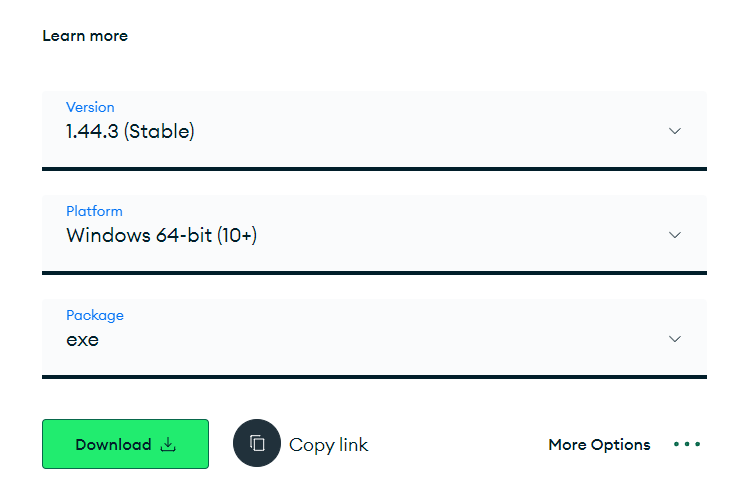

This will be an EXE package, if not make sure it is.

Click Download to get the latest version of the shell.

You may also or download version 1.44.3 directly using this link: https://downloads.mongodb.com/compass/mongodb-compass-1.44.3-win32-x64.exe)

Double click the EXE to install it.

You will now be able to open the application from the Start Menu.

## MongoDB Compass - TAFE

Do add Compass to the available application we will need to download the 7Z compressed file we have created and then extract the files.

After this we will move the folder to the Laragon\bin\MongoDB folder.

Download the 7Z compressed copy of MongoDB Compass version 1.44.3 from this location: 

Once downloaded, un-compress the file contents.

Once uncompressed move the new MongoDB-Compass folder into the `Laragon\bin\MongoDB` folder.

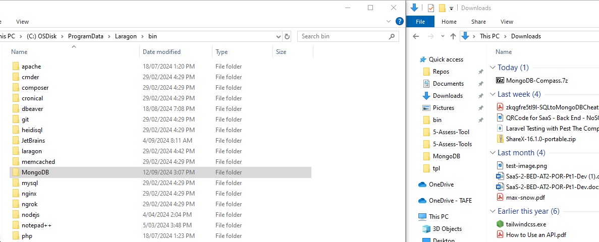


# Starting MongoDB in Laragon

We are now ready to start MongoDB in Laragon.

Open the Laragon UI, and click the settings Cog on the top right.

Navigate to the Services and Ports tab.

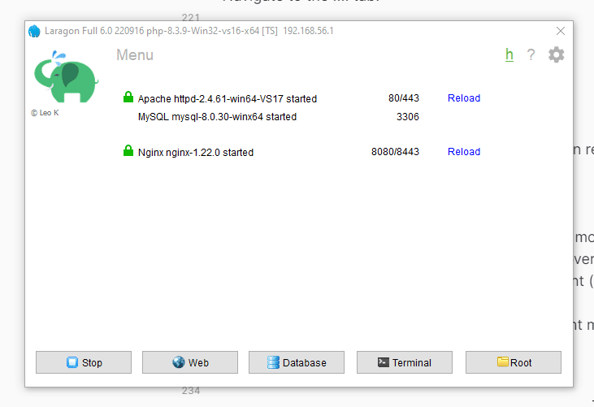

Tick the MongoDB option if it is not already ticked.

Close the Settings dialog.

In most cases this will stop all the services and then restart them, including MongoDB...


If not you can check MongoDB is available by right mouse clicking on the main Laragon screen. If you see MongoDB, hover over it, and then check that the version of MongoDB you installed is present (in our case 7.0.14).

You may also start/stop MongoDB by using the right mouse button menu, and hovering over MongoDB, then clicking the Stop (or start) option.


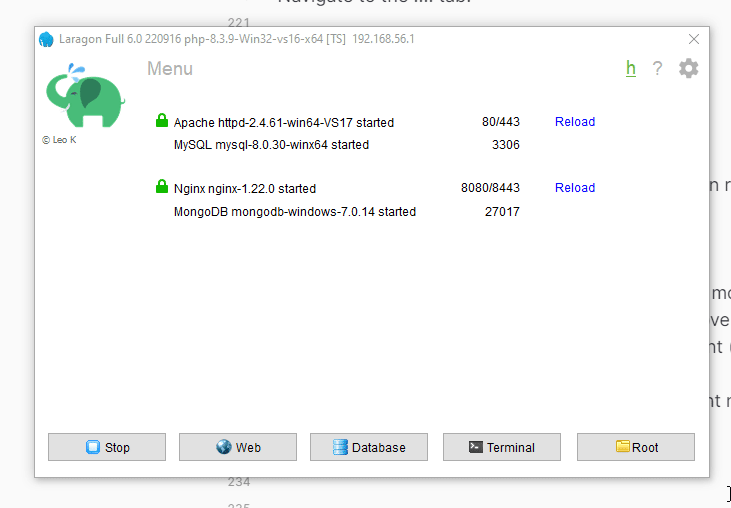


# END

Next up - [LINK TEXT](LINK)
