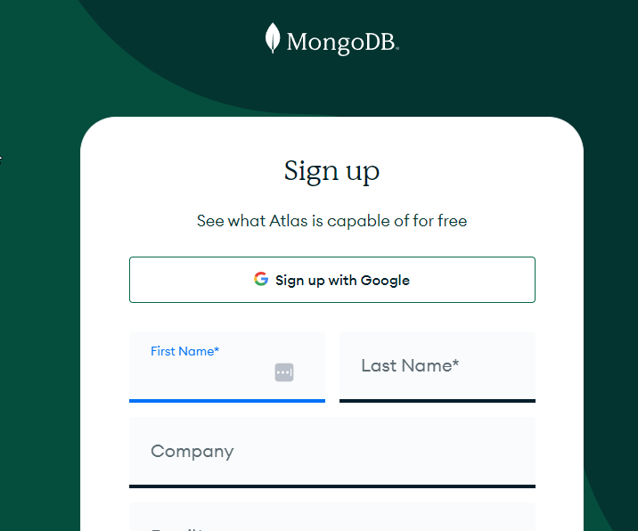
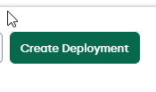
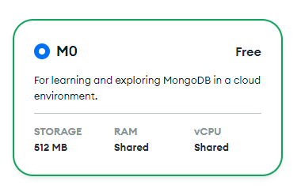
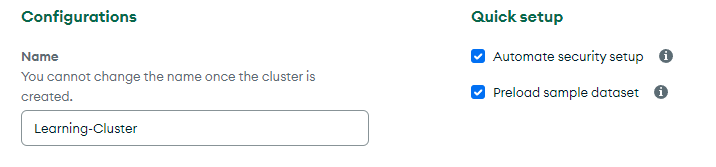
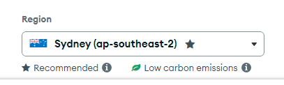
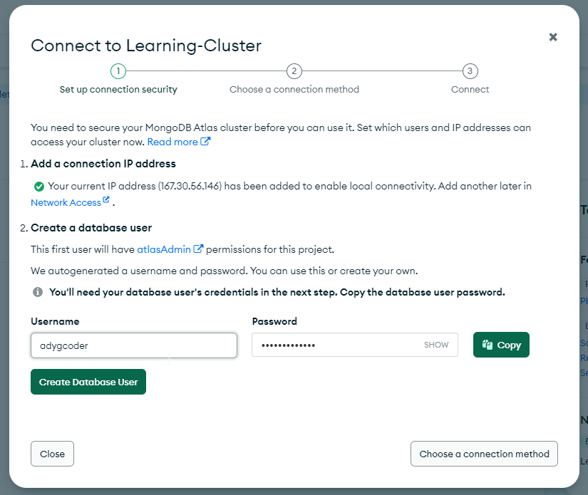
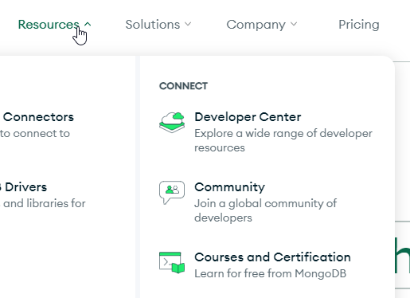
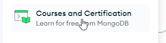
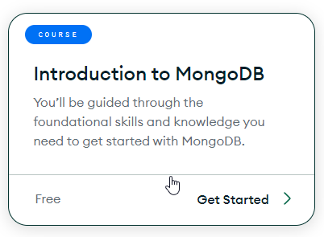

# Learning path for NoSQL using MongoDB

- Sign Up for Free MongoDB Atlas Account
- Complete the Introduction to MongoDB course

## SQL to MongoDB Cheat Sheet

Original download:
- https://learn.mongodb.com/learn/course/mongodb-sql-cheat-sheet/main/mongodb-sql-cheat-sheet
Copy contained with this repo:
- [Cheat Sheet version as of 5/9/2024](../assets/SQLtoMongoDBCheatSheet1.pdf)

## Signing Up

1) Head
   to [Introduction to MongoDB Course | MongoDB University](https://learn.mongodb.com/learning-paths/introduction-to-mongodb)
2) Create a FREE Atlas Account
   via: [MongoDB Atlas | MongoDB](https://www.mongodb.com/cloud/atlas/register)

3) Once you have created the free account, use teh create deployment option.

4) You will use the FREE level. 

5) Name your cluster - keep it TAFE appropriate

6) Use the region with Australia as the cloud location

7) You will need to add an IP Address, this is usually done automatically, plus you will need a username and password to use the MongoDB Atlas instance.

## Introduction to MongoDB Course

Open MongoDB's home page in new browser window.

Click on resources

Click on Courses and Certification

Click on [Introduction to MongoDB](https://learn.mongodb.com/learning-paths/introduction-to-mongodb)

Click on Register now

This will use the Atlas account to log you into the MongoDB University and thus allow your progress to be tracked.

## Learning Timeline

The following table outlines the timeline for completion of the course. Remember that some
of this is expected to be completed as part of your out-of-class activities.

You may find topics being covered in class that do not match this timeline. 

You will also be expected to complete some learning during our non-contact week.

| Session | Chapter                                               | Link                                                                                   | Duration (Mins) |
| ------- | ----------------------------------------------------- | -------------------------------------------------------------------------------------- | --------------- |
| 10      | Intro to MongoDB                                      | https://learn.mongodb.com/courses/start-here-introduction-to-mongodb                   | 15              |
| 10      | Getting Started with MongoDB Atlas                    | https://learn.mongodb.com/courses/getting-started-with-mongodb-atlas                   | 60              |
| 10      | MongoDB and the Document Model                        | https://learn.mongodb.com/courses/overview-of-mongodb-and-the-document-model           | 75              |
| 10-11   | Connecting to a MongoDB Database                      | https://learn.mongodb.com/courses/connecting-to-a-mongodb-database                     | 60              |
| 11      | MongoDB CRUD Operations: Insert and Find Documents    | https://learn.mongodb.com/courses/mongodb-crud-operations-insert-and-find-documents    | 105             |
| 11      | MongoDB CRUD Operations: Replace and Delete Documents | https://learn.mongodb.com/courses/mongodb-crud-operations-replace-and-delete-documents | 105             |
| 11      | MongoDB CRUD Operations: Modifying Query Results      | https://learn.mongodb.com/courses/mongodb-crud-operations-modifying-query-results      | 85              |
| 11-12   | MongoDB Aggregation                                   | https://learn.mongodb.com/courses/mongodb-aggregation                                  | 105             |
| 12      | MongoDB Indexes                                       | https://learn.mongodb.com/courses/mongodb-indexes                                      | 105             |
| 12      | MongoDB Atlas Search                                  | https://learn.mongodb.com/courses/mongodb-atlas-search                                 | 90              |
| 12      | MongoDB Data Modeling Intro                           | https://learn.mongodb.com/courses/introduction-to-mongodb-data-modeling                | 45              |
| 12      | MongoDB Transactions                                  | https://learn.mongodb.com/courses/mongodb-transactions                                 | 60              |

# Quick Links

### Session 09
- [Session 09 ReadMe](../Session-09/ReadMe.md)
- [S09 Exercises and Journal Entry](../Session-09/S09-Reflection-Exercises.md)

### Session 10
- [Session 10 ReadMe](../Session-10/ReadMe.md)
- [S09-NoSQL-Introduction](../Session-09/S09-NoSQL-Introduction.md)
- [S09-MongoDB-1-Introduction](../Session-09/S09-MongoDB-1-Introduction.md)
- [S09-MongoDB-2-Installing-Windows](../Session-09/S09-MongoDB-2-Installing-Windows.md)
- [S10-MongoDB-3](../Session-10/S10-MongoDB-3.md)
- [S10-MongoDB-3A](../Session-10/S10-MongoDB-3A.md)
- [S10 Exercises and Journal Entry](../Session-10/S10-Reflection-Exercises.md)

### Session 11
- [Sessi0n 11 ReadMe](../Session-11/ReadMe.md)
- [S11-MongoDB-4](../Session-11/S11-MongoDB-4.md)
- [S11 Exercises and Journal Entry](../Session-11/S11-Reflection-Exercises.md)

### Session 12
- [Session 12 ReadMe](../Session-12/ReadMe.md)
- [S12-MongoDB-5](../Session-12/S12-MongoDB-5.md)
- [S12-MongoDB-6](../Session-12/S12-MongoDB-6.md)
- [S12 Exercises and Journal Entry](../Session-12/S12-Reflection-Exercises.md)

### Session 13
- [Session 13 ReadMe](../Session-13/ReadMe.md)
- [S13-MongoDB-7](../Session-13/S13-MongoDB-7.md)
- [S13-MongoDB-8](../Session-13/S13-MongoDB-8.md)
- [S13-MongoDB-9](../Session-13/S13-MongoDB-9.md)
- [S13-MongoDB-10](../Session-13/S13-MongoDB-10.md)
- [S13-Reflection-Exercises](../Session-13/S13-Reflection-Exercises.md)

